## 3.2.1 About MakeCode

⚠️ **The following instructions are applied for Windows system (in Google Chrome or Microsoft Edge browser) but can also serve as a reference if you are using a different system.**

**MakeCode programming:**

Open the online version of Makecode: [https://makecode.microbit.org/](https://makecode.microbit.org/)

MakeCode:

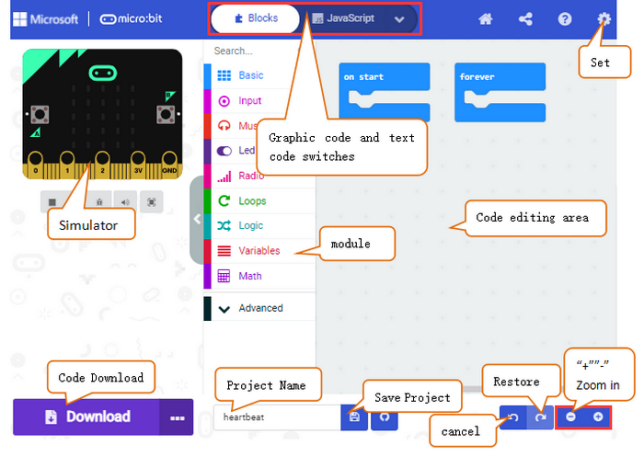

In the code editing area, there are always two blocks, “**on start**” and “**forever**”. **After powering on/resetting, codes in “on start” runs once, while those in “forever” runs in a loop.**

Click “**JS JavaScript**” to check JavaScript language.

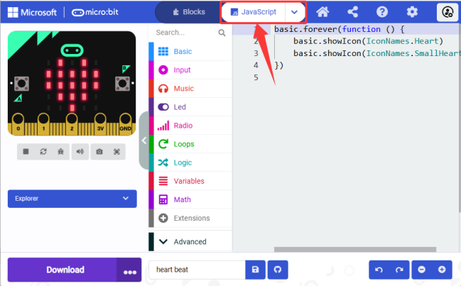

Click the arrow to switch to “**Python**” language.

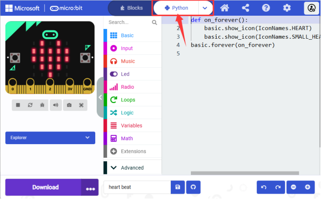

**Select the language of the interface:**

Detailed steps:

(1) Click settings:

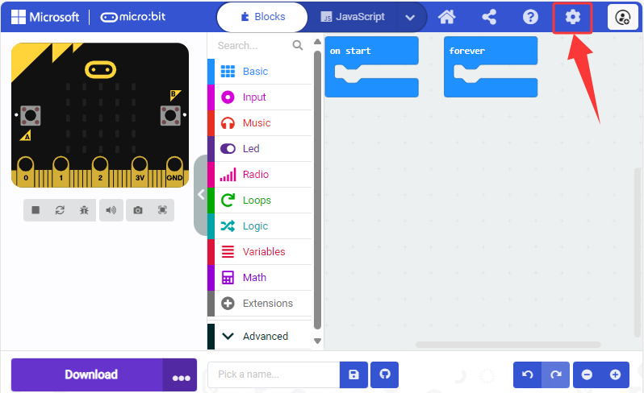

(2) Click “Language”:

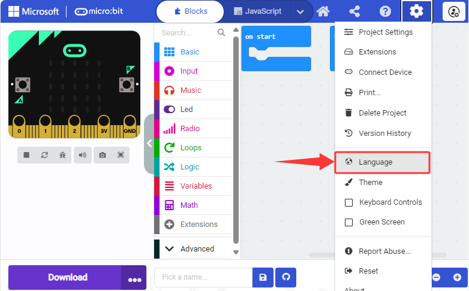

(3) Select a language you are familiar with. Here we set it to “English”.

## 3.2.2 MakeCode Extensions

### 3.2.2.1 Add an Extension

⚠️ **We provide you with hexadecimal code files(.hex) of each projects. You can directly import one to MakeCode or build code blocks manually. For the latter method, library files need to be added.**

⚠️ **Note:** Search this link in the extension page: `https://github.com/keyestudio/pxt-environment-kit-master`

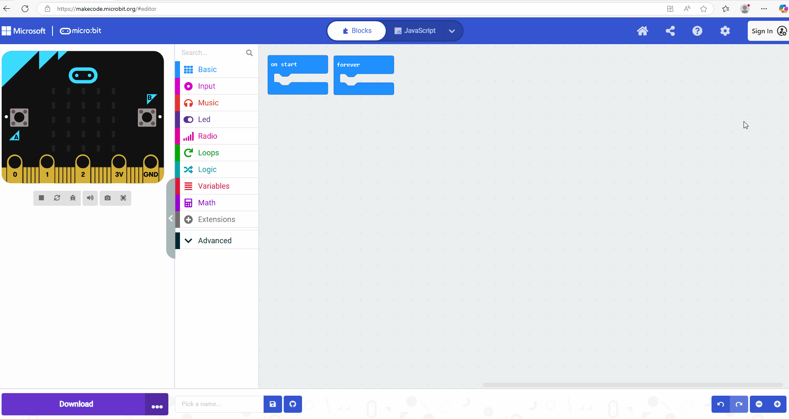

Detailed steps:

1\. Open MakeCode and click (settings) to enter “**Extensions**”.

Or click “**Extensions**” above the **Advanced**.

2\. Search for the key words or GitHub link of the extension you want to load.

3\. Here search for: `https://github.com/keyestudio/pxt-environment-kit-master`. Click  and you will see “**Environment-and-Science**”

4\. Load it. 

5\. Loaded:

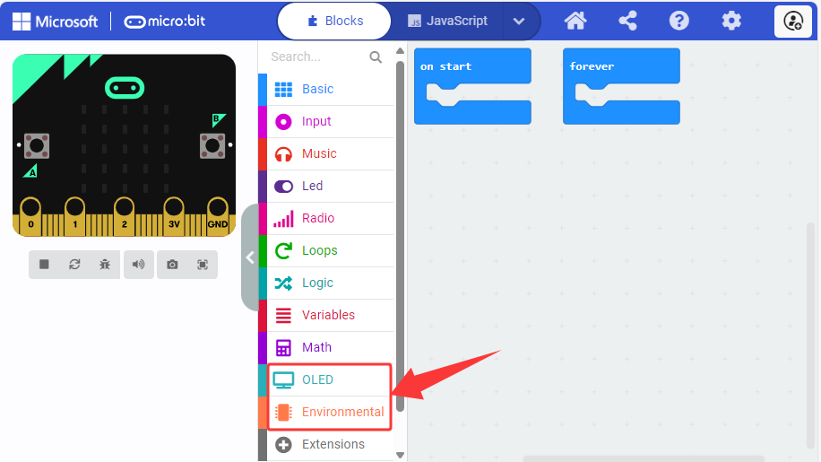

### 3.2.2.2 Update/Delete Extensions

⚠️ **Under normal circumstances, once extensions are added, there is no need to delete them. The following part is only for learning how to delete unnecessary extensions.**

Detailed step:

1\. Click “**JavaScript**” to switch to text code.

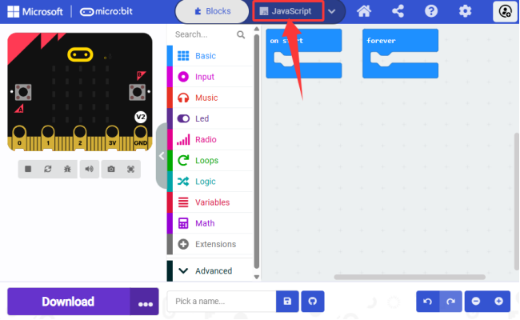

2\. Click “**Explorer**”.

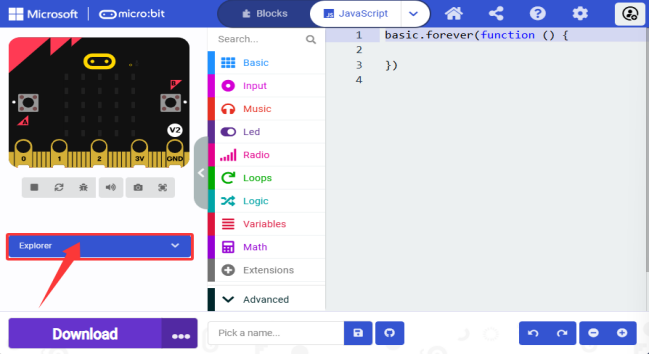

3\. Find “**Environment-and-Science**” and click  to delete it.

4\. “**Remove it**”.

## 3.2.3 MakeCode Code Download

### 3.2.3.1 Import Code

Here we take “**heatbeat**” project as an example to introduce how to import code to MakeCode.

Detailed steps:

1\. Connect the board to computer via USB cable.

If the red LED on the back of the board is on, that means the board is powered. When your computer communicates with the main board via the USB cable, the yellow LED on it will flashes. 

Then micro:bit board will appear on your computer as a driver named “MICROBIT”. Please note that it is not an ordinary USB disk as shown below.

2\. Open the MakeCode of Web version or Windows 10 APP for programming, and click “**Import**”.

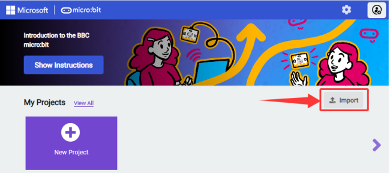

3\. “**Import File...**”

4\. “**Choose File**”.

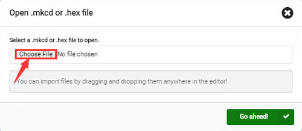

5\. Choose the code file you want to open. Here we choose “**heartbeat.hex**”.

6\. “**Go ahead √**” to import it to MakeCode.

In addition, you can also directly drag the file into MakeCode.

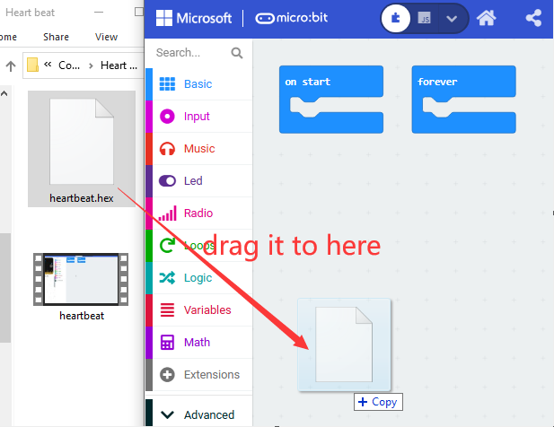

7\. Imported:

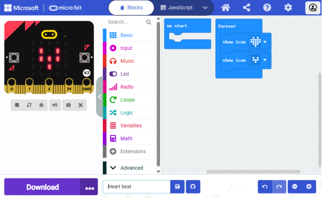

### 3.2.3.2 Download Code (WebUSB)

If WebUSB of **Google Chrome**/**Microsoft Edge** is enabled, you can access your micro USB hardware device directly through the online webpage. Therefore, you may just click “**Download**” to download the code to micro:bit board.

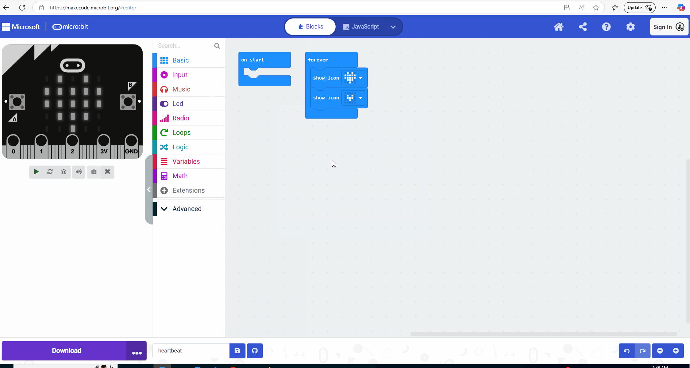

Detailed steps:

#### 3.2.3.2.1 Devices Pairing

1\. Connect the board to computer via USB cable.

2\. Click “**...**” and “**Connect device**”.

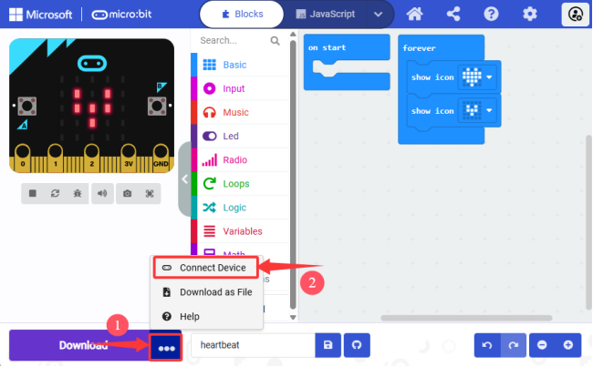

3\. “**Next**”.

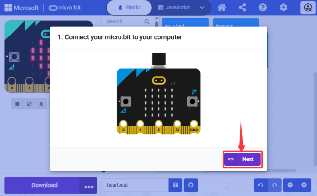

4\. “**Pair**”.

5\. Select to the corresponding “**device**”, and “**Connect**”.

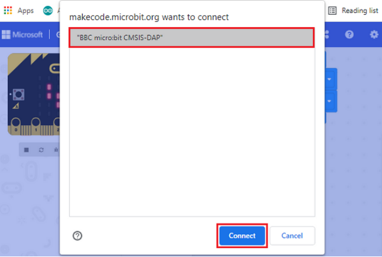

6\. “**Done**”.

#### 3.2.3.2.2 Download Program

After connection, click “**Download**” and it will change into .

⚠️ **ATTENTION:**

If there is no device to choose from, please refer to the following link for troubleshooting:

[https://makecode.microbit.org/device/usb/webusb/troubleshoot](https://makecode.microbit.org/device/usb/webusb/troubleshoot)

If your micro:bit board needs to update its firmware, please refer to:

[https://microbit.org/guide/firmware/](https://microbit.org/guide/firmware/)

### 3.2.3.3 Download Code (non-WebUSB)

1\. Connect the board to computer via USB cable.

If the red LED on the back of the board is on, that means the board is powered. When your computer communicates with the main board via the USB cable, the yellow LED on it will flashes. 

Then micro:bit board will appear on your computer as a driver named “MICROBIT”. Please note that it is not an ordinary USB disk as shown below.

2\. If you import the code on another browser, please follow:

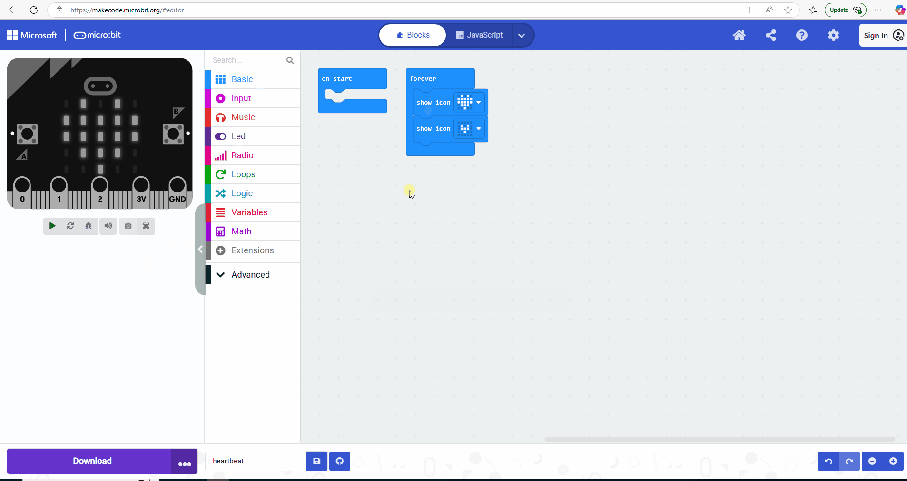

Detailed steps:

① Click “**Download**” to store a “**.hex**” file (a format that can be read by micro:bit). After that, copy and paste it to micro:bit board. 

For Windows, you can also select it to “**Send to → MICROBIT**” to copy “**.hex**” to micro:bit. During this process, the yellow indicator on the back of the board will flash. When done, the light stops flashing and remains on.

Or directly drag “**.hex**” into MICROBIT.

② After uploading the code to micro: bit board, the on-board 5 x 5 LED matrix shows  and  in a loop.

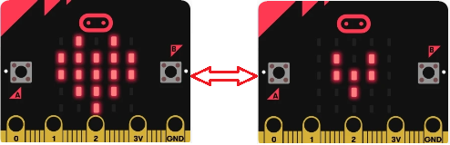

⚠️ **Tip 1:** For Windows 10 system, you can also choose MackCode Windows 10 APP. Click to [Get Windows 10 App](https://apps.microsoft.com/detail/9nmqdq2xzkwk?hl=en-gb&gl=CN) for programming, and then just click “**Download**” to save code in micro:bit board.

⚠️ **Tip 2:** Each time you program, the MICROBIT disk will automatically pop up and return, but the hexadecimal(**.hex**) file you have copied to it will not be displayed. The board only receives and runs the latest uploaded file(**.hex**) but will not store it!

