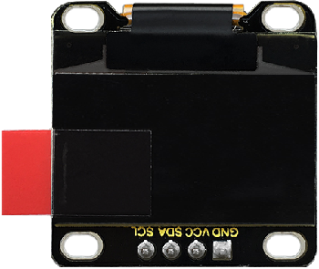
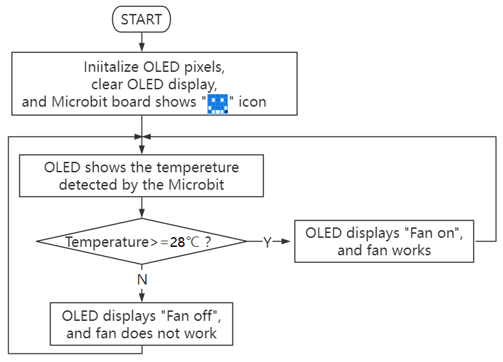
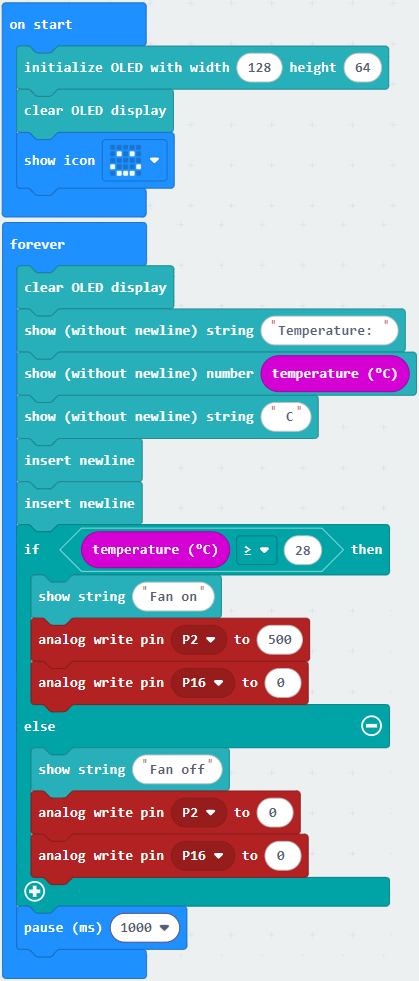
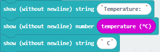
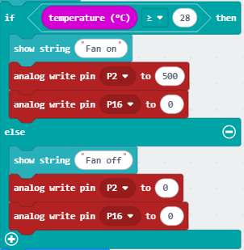
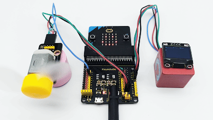

### 3.3.1 Smart Temperature Control Fan

#### 3.3.1.1 Overview

When the indoor temperature exceeds the pre-set standard value, the smart fan will turn on to cool down the room to a comfortable temperature. Besides, the OLED display will show the current indoor temperature and the operating status of the fan in real time, providing users with intuitive temperature control feedback.

#### 3.3.1.2 Component Knowledge

**Microbit Temperature Sensor**

The micro:bit main board is actually not equipped with a temperature sensor, but uses nNFR52833 chip for temperature detection. Therefore, the detected value is much closer to the temperature of the processor, so there maybe deviation from the ambient value.

Its detection range is -40 ~ 105℃.

**OLED Display**

OLED technology has significant advantages of rich color performance, high contrast and wide perspective, providing clear and vivid pictures, especially outstanding in black.

Each pixel of the OLED display emits light itself without backlight, so it consumes relatively low power. With small size(0.9 inches), high resolution(128*96 pixels) and low power consumption, it is very suitable for wearable devices.

⚠️ **Note:** In this project, the OLED display module connects the SDA interface to pin P20 and SCL to pin P19.

**Parameters:**

- Operating voltage: DC 3.3V-5V
- Working current: 30mA
- Interface: pin headers spacing 2.54mm
- Communication mode: I2C communication
- Internal drive chip: SSD1306
- Resolution: 128×64
- Viewing Angle: greater than 150°

**130 Motor**

There is a DC motor on the 130 motor module that works based on electromagnetic induction and Lorentz force. It mainly consists of a stator, a rotor(armature) and a commutator. The stator generates a fixed magnetic field, while the rotor, composed of coil windings, generates a magnetic field when energized. When current passes through the brushes and commutator and then enters the rotor coil, the rotor magnetic field interacts with the stator magnetic field, generating a Lorentz force that drives the rotor to rotate. During this rotation, the commutator switches the direction of the current, ensuring that the rotor is continuously subjected to a force in the same direction, thereby maintaining rotation. With electromagnetic induction and Lorentz force, DC motor converts electrical energy into mechanical one.

Due to its excellent speed regulation performance and large starting torque, DC motors are widely used in electric power tools, vehicles and household appliances.

The 130 motor can be speed-regulated by PWM. When in use, two pins need to be connected for control. It is suitable for application scenarios where the fan speed needs to be adjusted, such as computer cooling and industrial production. It is small, lightweight and easy to install, making it very practical.

**Schematic diagram:**

The HR1124S chip assists in driving the motor. However, the motor requires a large current and cannot be driven by a transistor, let alone directly by an IO port. As long as voltage is applied to both ends of the motor, it can be made to rotate. The rotation direction of the motor varies with different voltage directions. Within the rated voltage range, the higher the voltage is, the faster the motor will rotate. Conversely, the lower the voltage is, the slower the motor will rotate, or in some cases, it may not rotate at all. 

There are two control modes: by high and low level (controlling rotation and stopping), and by PWM (controlling rotational speed).

**Parameters:**

- Working voltage: DC 5V
- Operating current: (Max)400mA@5V
- Maximum power: 2W
- Rotation speed: (16000+10%) turn/min@5V

#### 3.3.1.3 Required Components

| |   | |
| :--: | :--: | :--: |
| micro:bit V2 main board ×1 | micro:bit shield ×1 |OLED display ×1 |
| | ||
|130 motor ×1| micro USB cable ×1 |4 pin wire ×2 |
| || |
|fan ×1|battery holder ×1|AA battery(**self-prepared**) ×6|

#### 3.3.1.4 Wiring Diagram

⚠️ **When wiring, please pay attention to the wire color.**

| 130 motor | wire color | micro:bit shield pin |micro:bit board pin |
| :--: | :--: | :--: | :--: |
| G | black | G | G |
| V | red | V2 | V |
| IN+ | blue | 2 | P2 |
| IN- | green | 16 | P16 |

| OLED display | wire color | micro:bit shield pin |micro:bit board pin |
| :--: | :--: | :--: | :--: |
| GND | black | G | G |
| VCC | red | V2 | V |
| SDA | blue | 20 | P20 |
| SCL | green | 19 | P19 |

#### 3.3.1.5 Code Flow

#### 3.3.1.6 Test Code

⚠️ **Note the threshold 28 in the if() condition can be modified according to the actual situation.**

**Complete code:**

⚠️ **Note that the code uses C instead of ℃, because ℃ will be garbled when displayed on OLED.**

**Brief explanation:**

① Initialize OLED pixels, clear the OLED, and the Microbit 5*5LED dot matrix shows .

② OLED shows the temperature value on one line.

③ Insert a new line.

④ Judgement statement: if()...else...

When the temperature detected by the sensor is greater than or equal to 28℃, the OLED displays “Fan on”, and the fan rotates. Otherwise, the OLED shows “Fan off” and the fan does not work.

⑤ Delay 1000ms(1s).

#### 3.3.1.7 Test Result

After wiring up and power on by micro USB cable, connect to external power(6 AA batteries) to ensure sufficient power supply.

For Windows 10 App, just click download. For browser, send the “.hex” file to the micro:bit board.

After uploading test code to micro:bit board, the on-board 5×5 LED matrix shows , and the OLED display reveals the temperature and fan state in real time.

When the temperature is above 28℃, the fan rotates. Otherwise, the fan will not work.

⚠️ **Note: The building blocks in the experiment are not included in this kit.**

(**Tip:** If no result is observed, please press the reset button of the micro:bit board.)

