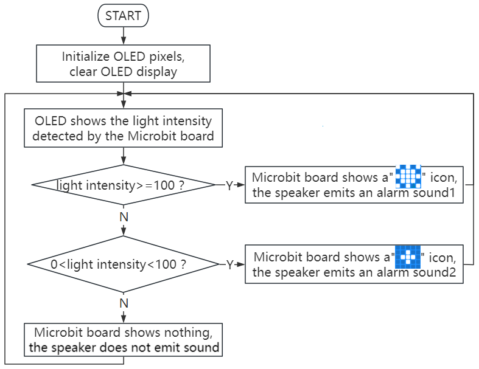
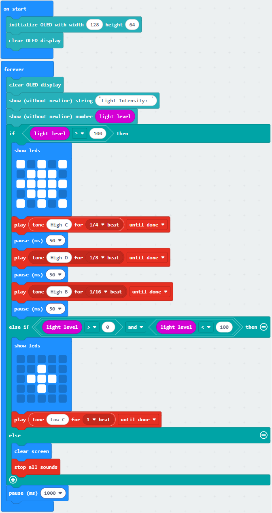
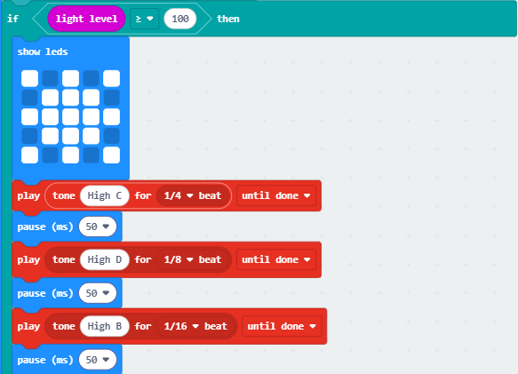
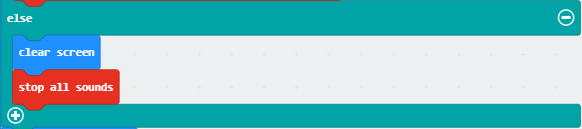

### 3.3.2 Light Intensity Detector

#### 3.3.2.1 Overview

The light intensity detector, also known as the illuminance meter or Lux meter, is a specialized instrument used to measure the total amount of light (i.e., illuminance) that shines on a surface. It works mainly based on the photoelectric effect.

In this project, the brightness detected by the light sensor will be displayed in real time on the OLED. When it exceeds a certain value, the speaker on the board will alarm to serve as a warning and reminder.

Light intensity detectors are widely used in almost all situations that require the quantification of “light”, such as outdoor and road lighting, indoor lighting design and acceptance, photography and video production, architecture and health, etc.

#### 3.3.2.2 Component Knowledge

**Microbit Light Sensor**

Since the micro:bit board does not contains its own photoresistor, the LED matrix will shoulder this job. The light signal will convert into input, and the voltage decay time is sampled so that the detected light intensity is a relative value. (**Note**: the light brightness is output to the serial port, and it is a relative value.)

**Microbit Speaker**

Micro: Bit board boasts an built-in speaker, which makes sound to the programs easier. It is also able to make sound such as utter giggles, greetings and yawning as well as all kinds of tones, notes and beats. For example, it can play the song *Ode to Joy*.

#### 3.3.2.3 Required Components

| |   | |
| :--: | :--: | :--: |
|    micro:bit V2 main board ×1    |        micro:bit shield ×1         |OLED display ×1 |
| |||
| micro USB cable ×1 |4 pin wire(black-red-blue-green) ×1 |battery holder ×1|
|| | |
|AA battery(**self-prepared**) ×6| | |

#### 3.3.2.4 Wiring Diagram

⚠️ **When wiring, please pay attention to the wire color.**

| OLED display | wire color | micro:bit shield pin | micro:bit board pin |
| :--: | :--: | :--: | :--: |
| GND | black | G | G |
| VCC | red | V2 | V |
| SDA | blue | 20 | P20 |
| SCL | green | 19 | P19 |

#### 3.3.2.5 Code Flow

#### 3.3.2.6 Test Code

⚠️ **Note the threshold in the “if()...else if()...” condition can be modified according to the actual situation.**

**Complete code:**

**Brief explanation:**

① Initialize OLED pixels, clear the OLED. 

② OLED shows the brightness value on one line.

③ Judgement statement: if()...else if()...else...

When the detected brightness is greater than or equal to 100, the 5×5LED matrix shows , and the speaker makes the alarm sound 1.

If the detected brightness is between 0 and 100, the 5×5LED matrix shows , and the speaker makes the alarm sound 2.

Otherwise, the 5×5LED matrix shows nothing and the speaker does not sound.

④ Delsy 1000ms(1s).

#### 3.3.2.7 Test Result

After wiring up and power on by micro USB cable, connect to external power(6 AA batteries) to ensure sufficient power supply.

For Windows 10 App, just click download. For browser, send the “.hex” file to the micro:bit board.

After uploading test code to micro:bit board, the OLED shows the brightness value detected by the light sensor in real time.

When the detected brightness is greater than 100, the 5×5 LED matrix shows , and the speaker makes the alarm sound 1 as a high-level warning. If the detected brightness is between 0 and 100, the 5×5 LED matrix shows , and the speaker makes the alarm sound 2 as a low-level warning. Otherwise, the 5×5LED matrix shows nothing and the speaker does not sound.

⚠️ **Note: The building blocks in the experiment are not included in this kit.**

(**Tip:** If no result is observed, please press the reset button of the micro:bit board.)

