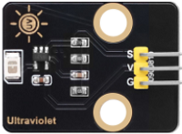
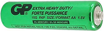
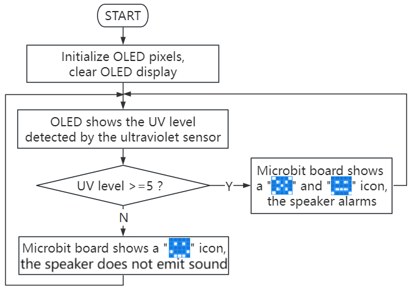
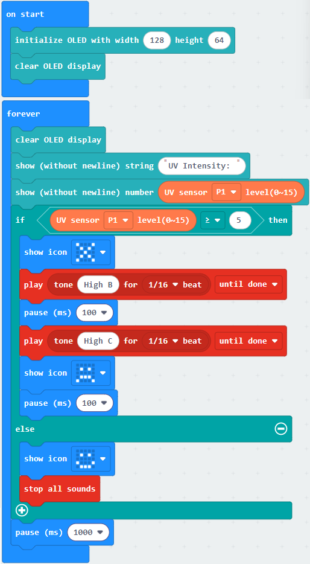
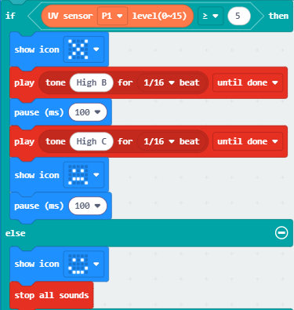

### 3.3.3 Solar Ultraviolet Detector

#### 3.3.3.1 Overview

The solar ultraviolet detector is a precision instrument used to measure the intensity of ultraviolet radiation from the sun. It detects ultraviolet(UV) radiation that is invisible to the human eye and quantify its intensity. Similar to light intensity detectors, they are also based on the photoelectric effect, but their core lies in the selective detection of ultraviolet rays.

In this project, the OLED will show the detected ultraviolet intensity in real time. When it exceeds a certain value, the speaker on the board will alarm, and the 5×5 LED matrix will display a pattern to serve as a warning.

The solar ultraviolet detector is widely used in almost all occasions that require the quantification of “ultraviolet light”, including tests of UV curing lamps and sunscreen products, ultraviolet phototherapy equipment, monitoring of ultraviolet sterilization lamps in water purification systems and air purification systems, etc.

#### 3.3.3.2 Component Knowledge

**Solar Ultraviolet Sensor**

The ultraviolet sensor is used to detect ultraviolet rays, which is mainly composed of G365S01M based on semiconductor photodiodes. It can convert the UV radiation intensity in the environment into an analog voltage signal that can be read by a single-chip microcomputer (such as a micro:bit board). Its schematic diagram is as follows:

Photoelectric conversion: When the ultraviolet photodiode inside the sensor is exposed to ultraviolet light, it generates an extremely weak current (proportional to the UV intensity).

Current amplification: This weak current is amplified by the internally integrated operational amplifier.

Signal output: The amplified signal directly outputs an analog voltage from a pin. The voltage value is usually between 0V and 1V (under 3.3V power supply). The stronger the UV intensity is, the higher the voltage will be.

**Parameters:**

- Operating voltage: DC 5V
- Peak response wavelength: 355nm (λmax)
- Peak responsivity (355nm) : 0.18A/W (Rmax)
- Spectral response range: 220~370nm
- UV/visible light responsivity ratio(Rmax/R400nm): > (VB)

**Micro:bit 5×5 LED Matrix**

The LED matrix of micro:bit board contains 25 LEDs in a grid. We can control a certain LED by integrating its position value into the test code. Theoretically, we can turn on many LEDs at the same time to show patterns, digits and scrolling characters.

#### 3.3.3.3 Required Components

| |   | |
| :--: | :--: | :--: |
|   micro:bit V2 main board ×1   |        micro:bit shield ×1         |OLED display ×1 |
|| ||
| ultraviolet sensor ×1 |micro USB cable×1|4 pin wire(black-red-blue-green) ×1 |
||||
|3 pin wire ×1 |battery holder ×1|AA battery(**self-prepared**) ×6|

#### 3.3.3.4 Wiring Diagram

⚠️ **When wiring, please pay attention to the wire color.**

| OLED display | wire color | micro:bit shield pin | micro:bit board pin |
| :--: | :--: | :--: | :--: |
| GND | black | G | G |
| VCC | red | V2 | V |
| SDA | blue | 20 | P20 |
| SCL | green | 19 | P19 |

|ultraviolet sensor| wire color | micro:bit shield pin | micro:bit board pin |
| :--: | :--: | :--: | :--: |
| G | black | G | G |
| V | red | V2 | V |
| S | yellow | 1 | P1 |

#### 3.3.3.5 Code Flow

#### 3.3.3.6 Test Code

⚠️ **Note the threshold 5 in the if() condition can be modified according to the actual situation.**

**Complete code:**

**Brief explanation:**

① Initialize OLED pixels, clear the OLED. 

② OLED shows the solar ultraviolet intensity on one line.

③ Judgement statement: if()...else...

When the detected ultraviolet intensity of sunlight is greater than or equal to 5, the 5×5LED matrix displays  and , and the speaker alarms. Or else, the matrix shows  and the speaker does not alarm.

④ Delay 1000ms(1s).

#### 3.3.3.7 Test Result

After wiring up and power on by micro USB cable, connect to external power(6 AA batteries) to ensure sufficient power supply.

For Windows 10 App, just click download. For browser, send the “.hex” file to the micro:bit board.

⚠️ **Note:** Test environment for ultraviolet sensor: Midday sunlight (10:00-14:00); Avoid shading; Directly face the sensor to the sun.

After uploading test code to micro:bit board, the OLED shows the detected ultraviolet intensity in real time.

When the detected ultraviolet intensity of sunlight is greater than or equal to 5, the 5×5LED matrix displays  and , and the speaker alarms. Or else, the matrix shows  and the speaker does not alarm.

⚠️ **Note: The building blocks in the experiment are not included in this kit.**

(**Tip:** If no result is observed, please press the reset button of the micro:bit board.)

