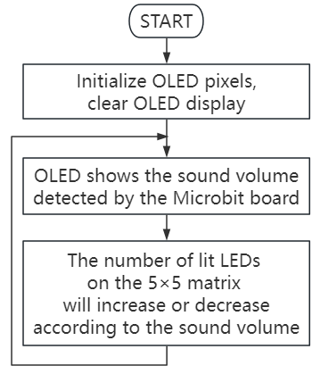
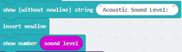
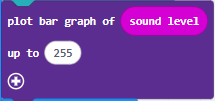
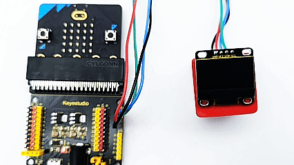

### 3.3.4 Smart Noise Tester

#### 3.3.4.1 Overview

The smart noise tester, also known as the sound level meter or decibel meter, is used to detect noise. Noise is classified into different levels, and the microphone on the micro:bit will detect its intensity in the environment in real time. According to the levels, micro:bit divides it into several grades.

In this project, the OLED display will show the current noise level in real time, and the 5×5LED matrix will light up/turn off some LED according to the noise level.

This kind of device has significantly lowered the technical threshold and cost of noise monitoring, so is widely applied to environment noise monitoring, occupational health and safety, construction sites, and entertainment venues, etc.

#### 3.3.4.2 Component Knowledge

**Micro:bit Microphone**

The micro:bit V2 board is built with a microphone which detects sounds and audio signals. The microphone is placed on the top of the board (the small hole, which is used for picking up ambient sound signals, and an LED indicator is next to the hole). The chip that controls and handles the microphone is located on the back of the board.

When using, simply place the micro:bit board face up.

When the board detects sound, the microphone LED indicator lights up.

#### 3.3.4.3 Required Components

| |   | |
| :--: | :--: | :--: |
|    micro:bit V2 main board ×1    |        micro:bit shield ×1         |OLED display ×1 |
| |||
| micro USB cable ×1 |4 pin wire ×1 |battery holder ×1|
|| | |
|AA battery(**self-prepared**) ×6| | |

#### 3.3.4.4 Wiring Diagram

⚠️ **When wiring, please pay attention to the wire color.**

| OLED display | wire color | micro:bit shield pin | micro:bit board pin |
| :--: | :--: | :--: | :--: |
| GND | black | G | G |
| VCC | red | V2 | V |
| SDA | blue | 20 | P20 |
| SCL | green | 19 | P19 |

#### 3.3.4.5 Code Flow

#### 3.3.4.6 Test Code

**Complete code:**

**Brief explanation:**

① Initialize OLED pixels, clear the OLED. 

② The OLED shows “Acoustic Sound Level: ”, and reveals the sound intensity in the next line.

③ Plot a bar graph based on the “value” and “maximum value”. If the “maximum value” is 0, the chart will adjust itself automatically. The number of lit LED on the 5×5LED matrix will increase when sound gets louder, like a bar graph. On the contrary, they will decrease.

#### 3.3.4.7 Test Result

After wiring up and power on by micro USB cable, connect to external power(6 AA batteries) to ensure sufficient power supply.

For Windows 10 App, just click download. For browser, send the “.hex” file to the micro:bit board.

After uploading test code to micro:bit board, the OLED shows the sound values in real time.

Make noise towards the microphone on the micro:bit board, the number of lit LED on the 5×5LED matrix will increase or decrease according to the sound volume.

⚠️ **Note: The building blocks in the experiment are not included in this kit.**

(**Tip:** If no result is observed, please press the reset button of the micro:bit board.)

