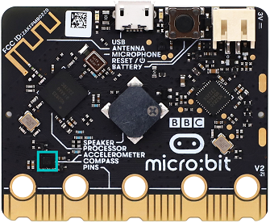
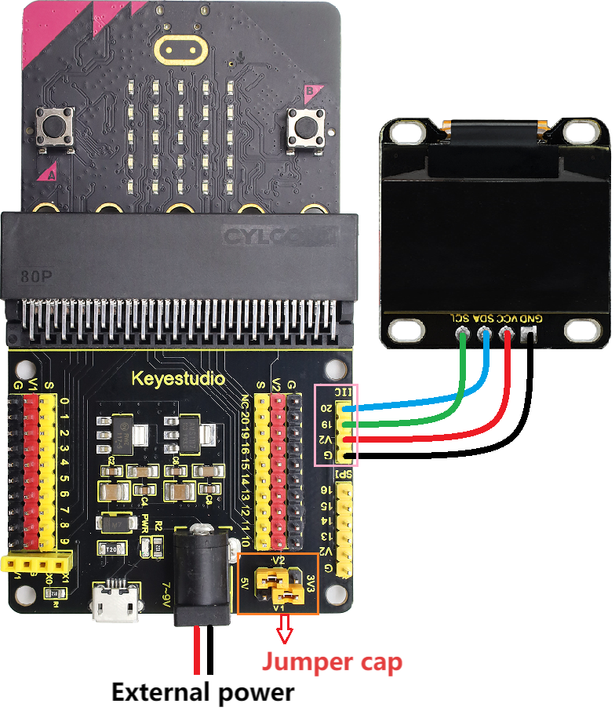
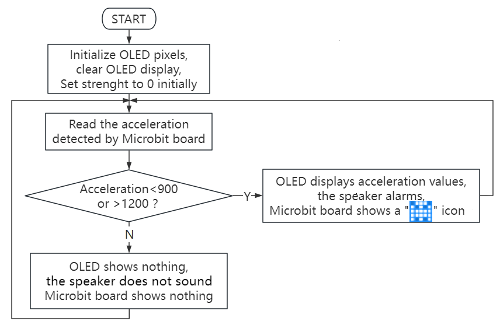
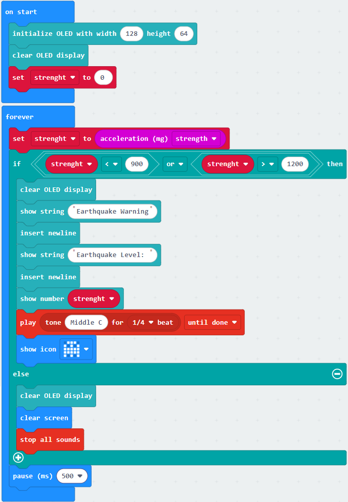
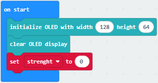
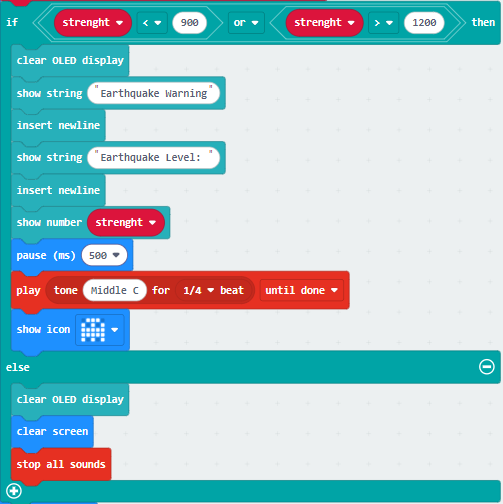

### 3.3.5 Earthquake Detection Alarm

#### 3.3.5.1 Overview

An earthquake detection alarm is a device that triggers an audible and visual alarm by detecting earthquake waves or mechanical vibrations. It is mainly used for early warning of earthquake risks.

In this project, the OLED display will show the values detected by the micro:bit accelerometer in real time. When tilting or slight shaking is detected, the speaker will sound, and the 5×5 LED matrix will display an alarm pattern for warning and reminding.

These devices (specifically referring to earthquake early warning receiving terminals) are widely used in schools, families, public places, and geological disaster monitoring areas. Their core value lies in “racing against time”.

#### 3.3.5.2 Component Knowledge

**Microbit Accelerometer**

The LSM303AGR is an ultra-low power high-performance accelerometer integrated into the micro:bit board, and it is mainly used for three-dimensional (X-axis, Y-axis, Z-axis) motion detection. It integrates a digital linear accelerometer and magnetometer to achieve precise attitude measurement ‌. The core features of this sensor include:

Communication interface: It supports I2C serial bus interface (compatible with standard, fast mode, fast mode plus and high-speed mode, with maximum rates up to 100kHz, 400kHz, 1MHz and 3.4MHz) and SPI serial standard interface, facilitating connection with microcontrollers or other peripherals.

Resolution: It can be configured as 8-bit, 10-bit or 12-bit output, depending on the working mode (for example: 8-bit in low-power mode and 12-bit in high-resolution mode) ‌.

Range setting: The acceleration range can be programmed as ±2g, ±4g, ±8g or ±16g, meeting the sensitivity requirements of different application scenarios.

The X, Y, and Z directions corresponding to the accelerometer are shown below:

#### 3.3.5.3 Required Components

| || |
| :--: | :--: | :--: |
|    micro:bit V2 main board ×1    |        micro:bit shield ×1         |OLED display ×1 |
| |||
| micro USB cable ×1 |4 pin wire(black-red-blue-green) ×1 |battery holder ×1|
|| | |
|AA battery(**self-prepared**) ×6| | |

#### 3.3.5.4 Wiring Diagram

⚠️ **When wiring, please pay attention to the wire color.**

| OLED display | wire color | micro:bit shield pin | micro:bit board pin |
| :--: | :--: | :--: | :--: |
| GND | black | G | G |
| VCC | red | V2 | V |
| SDA | blue | 20 | P20 |
| SCL | green | 19 | P19 |

#### 3.3.5.5 Code Flow

#### 3.3.5.6 Test Code

⚠️ **Note the threshold 900 and 1200 in the if() condition can be modified according to the actual situation.**

**Complete code:**

**Brief explanation:**

① Initialize OLED pixels, clear the OLED. Set the initial value of variable strength to 0.

② Assign the acceleration read by micro:bit to the strength.

③ Judgement statement: if()...else...

When the detected acceleration value is less than 900 or greater than 1200, the OLED displays the string and the value, and the 5×5 LED matrix shows , and the speaker alarms. Or else, the OLED and 5×5 LED matrix shows nothing and the speaker does not sound.

#### 3.3.5.7 Test Result

After wiring up and power on by micro USB cable, connect to external power(6 AA batteries) to ensure sufficient power supply.

For Windows 10 App, just click download. For browser, send the “.hex” file to the micro:bit board.

After uploading test code to micro:bit board. Tilt or slightly shake the micro:bit board. When the detected acceleration value is less than 900 or greater than 1200, the OLED displays the string and the value, and the 5×5 LED matrix shows , and the speaker alarms. Or else, the OLED and 5×5 LED matrix shows nothing and the speaker does not sound.

⚠️ **Note: The building blocks in the experiment are not included in this kit.**

(**Tip:** If no result is observed, please press the reset button of the micro:bit board.)

