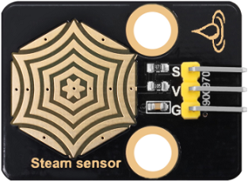
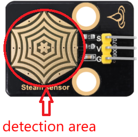
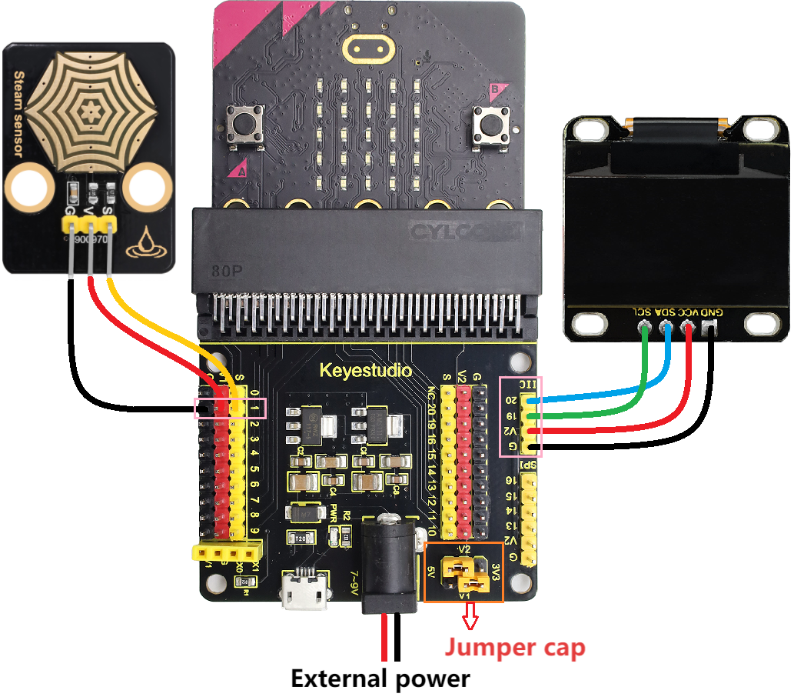
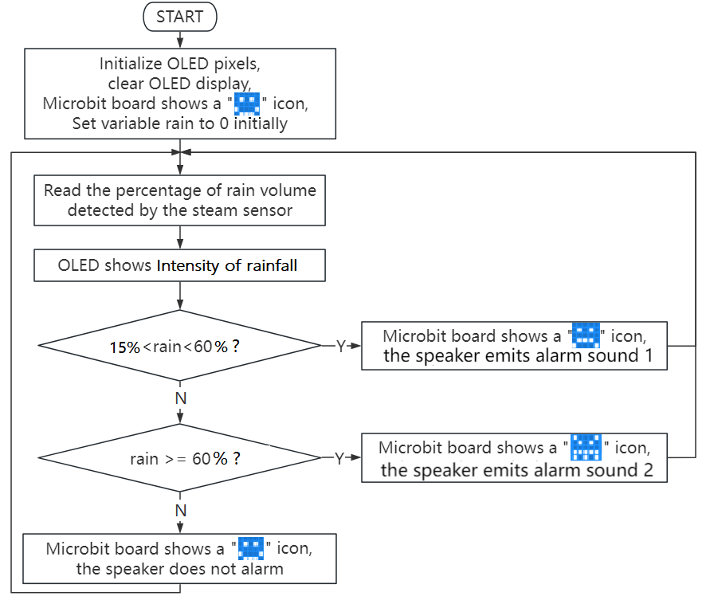
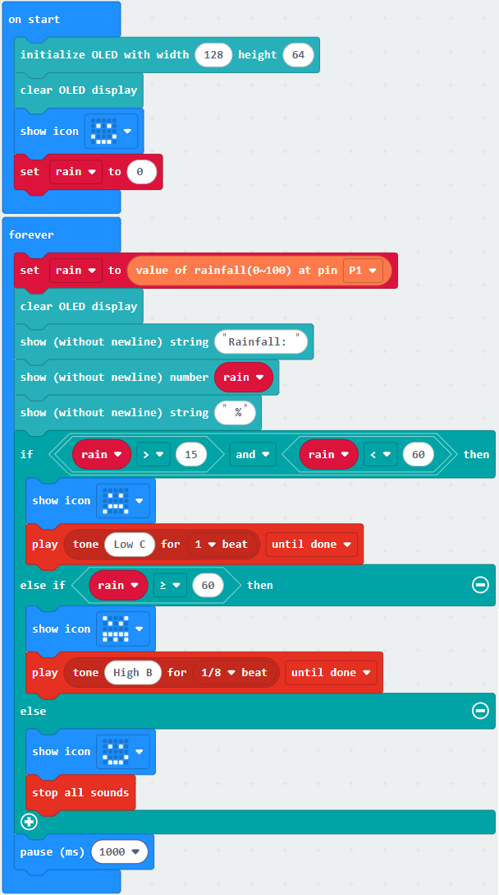
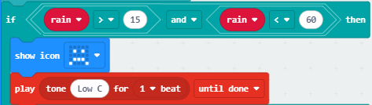
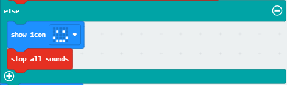

### 3.3.6 Rainwater Monitoring

#### 3.3.6.1 Overview

When the steam sensor detects rain, it sends a signal to the micro:bit board to trigger various actions. For instance, the micro:bit speaker can emit an alarm to alert users that it is raining, and the current amount of rain will be displayed in real time on the OLED. This is particularly useful in outdoor weather or environment, enabling users to take necessary preventive measures. In addition, a rainwater monitoring system, including steam sensor, OLED display and micro:bit board, can detect leaks in roofs or buildings to prevent damage caused by water intrusion. 

Overall, it is a multi-functional and effective tool that can detect the presence of rainwater in various applications.

#### 3.3.6.2 Component Knowledge

**Steam Sensor**

The steam sensor can detect the presence of water so is typically employed in rainwater detection systems. When rainwater comes into contact with the conductive pad(detection area) on the sensor, it will send a signal to the development board (micro:bit, etc.) to trigger various actions. The more water there is in the detection area, the greater the analog value will be.

**Schematic diagram:**

It detects the amount of water by the exposed parallel lines on the circuit board. The more water there is, the more wires will be connected. As the contact area for conduction increases, the voltage output at pin 2 of the sensing area will gradually rise, and the greater the analog value detected at the signal terminal S will be. In addition to water, it can also detect water vapor in the air.

**Parameters:**

- Operating voltage: DC 3.3V~5V
- Operating current: (Max)1.5mA@5V
- Maximum power: 0.075W
- Signal type: Analog signal

#### 3.3.6.3 Required Components

| |   | |
| :--: | :--: | :--: |
|   micro:bit V2 main board ×1   |        micro:bit shield ×1         |OLED display ×1 |
|| ||
| steam sensor ×1 |micro USB cable ×1|4 pin wire(black-red-blue-green) ×1 |
||||
|3 pin wire ×1 |battery holder ×1|AA battery(**self-prepared**) ×6|

#### 3.3.6.4 Wiring Diagram

⚠️ **When wiring, please pay attention to the wire color.**

| OLED display | wire color | micro:bit shield pin | micro:bit board pin |
| :--: | :--: | :--: | :--: |
| GND | black | G | G |
| VCC | red | V2 | V |
| SDA | blue | 20 | P20 |
| SCL | green | 19 | P19 |

|steam sensor| wire color | micro:bit shield pin | micro:bit board pin |
| :--: | :--: | :--: | :--: |
| G | black | G | G |
| V | red | V1 | V |
| S | yellow | 1 | P1 |

#### 3.3.6.5 Code Flow

#### 3.3.6.6 Test Code

⚠️ **Note the threshold in the “if()...else if()...” condition can be modified according to the actual situation.**

**Complete code:**

**Brief explanation:**

① Initialize OLED pixels, clear the OLED. Set the initial value of variable rain to 0, and the 5×5LED matrix shows .

② Assign the rain volume read by the steam sensor to the rain, and the OLED shows the rain volume in one line.

③ Judgement statement: if()...else if()...else...

When the detected rain volume is greater than 15% but less than 60%, the 5×5LED matrix displays  and the speaker plays C3 flat tone as a warning.

If the detected rain volume is greater than or equal to 60%, the 5×5LED matrix shows , and the speaker plays B5 sharp tone as a warning.

Otherwise, the 5×5LED shows  with the speaker being quiet.

④ Delay 1000ms(1s).

#### 3.3.6.7 Test Result

After wiring up and power on by micro USB cable, connect to external power(6 AA batteries) to ensure sufficient power supply.

For Windows 10 App, just click download. For browser, send the “.hex” file to the micro:bit board.

After uploading test code to micro:bit board, the OLED shows the detected rain volume in real time.(**For example: Use a damp hand to touch the detection area of the steam sensor to simulate rain falling**)

When the detected rain volume is greater than 15% but less than 60%, the 5×5 LED matrix displays  and the speaker plays C3 flat tone as a warning. If the detected rain volume is greater than or equal to 60%, the 5×5 LED matrix shows , and the speaker plays B5 sharp tone as a warning. Otherwise, when the detected rain volume is less than 15%, the 5×5 LED shows  with the speaker being quiet.

⚠️ **Note: The building blocks in the experiment are not included in this kit.**

(**Tip:** If no result is observed, please press the reset button of the micro:bit board.)

