### 3.3.7 Temperature and Humidity Regulation

#### 3.3.7.1 Overview

In this project, we will introduce how to build a temperature and humidity regulation system with a micro:bit board, XHT11 temperature and humidity sensor, 130 motor, atomization module and OLED display.

The system measures ambient temperature and humidity by XHT11 sensor, and adjust them by controlling the rotation of the fan and the spray of water mist by the atomization module as needed. When the temperature or humidity exceeds the set threshold, it will turn on the fan and spray water mist from atomization module. Meanwhile, the OLED display will show the current temperature and humidity in real time. 

Since it can regulate the temperature and humidity, it is widely applied to projects that need to control the temperature and humidity.

#### 3.3.7.2 Component Knowledge

**XHT11 Temperature and Humidity Sensor**

XHT11 temperature and humidity sensor outputs digital signals. It acquires and converts analog signals, and senses temperature and humidity to ensure its excellent long-term stability and high reliability. Besides, it contains a high-precision resistive humidity sensor and a resistive thermosensitive temperature sensor, and is connected to an 8-bit high-performance single-chip microcomputer.

**XHT11 communication mode:**

The XHT11 adopts a simplified single-bus communication. A single bus means there is only one data line, so data exchange and control in the system are all accomplished here.

- Single-bus data bit transmission definition:

  - Single-bus data format: 40 bits of data are transmitted at a time, with the higher bits coming out first.
  - 8-bit humidity integer + 8-bit humidity decimal + 8-bit temperature integer + 8-bit temperature decimal + 8-bit parity bit. **Note the decimal part of the humidity is 0**.
  
- Parity bit data definition:
  
  - 8-bit humidity integer + 8-bit humidity decimal + 8-bit temperature integer + 8-bit temperature decimal. The 8-bit parity bit is the last 8 bits of the result.

Data time series diagram:

After the host (MCU) sends a start signal once, the XHT11 switches from low-power mode to high-speed mode. Once the host’s start signal ends, the XHT11 sends a response signal, outputs 40-bit data, and performs a signal acquisition. The signal transmission is shown below.

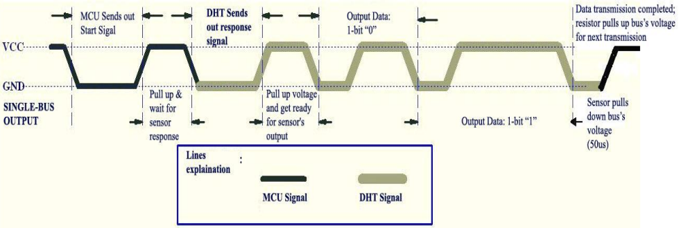

⚠️ **Note:** The temperature and humidity data read by the host from XHT11 is always the previous measurement value. If the interval between two measurements is long, please read it twice consecutively and take the second obtained value as the real-time value.

**Schematic diagram:**

**Parameters:**

- Operating voltage: DC 3.3V~5V 
- Operating current: (Max)2.5mA@5V
- Maximum power: 0.0125W
- Temperature range: -25 ~ +60°C (±2℃)
- Humidity range: 5 ~ 95%R (accuracy of ±5%RH at around 25 ° C)
- Output signal: Digital bidirectional single bus

**Atomization Module**

The atomization module is composed of a driver and an atomization sheet, which atomizes water. It can be controlled by a single-chip microcomputer or manual buttons.

**Working principle:** The atomization module generally adopts ultrasonic technology to generate water mist. It contains a piezoelectric ceramic plate, which begins to vibrate when a high-frequency voltage is applied through it. Vibration gathers small water droplets on the surface of water, which are then dispersed to form fine water mists.

**Water mist quality:** This module can effectively convert water into tiny water particles, usually within 1 to 5 microns. This fine mist is more likely to evaporate and diffuse in the air, thereby acting as an effective humidifier.

⚠️ **Attention:**

**1. After turning on, the atomization sheet should be placed in water. If it is left in the air for a long time, the sheet will get hot and be burned out.**

**2. Gently place the atomization sheet on the water surface. If it is submerged in water, it will not generate water mist.**

**Parameters:**

- Operating voltage: DC 5V
- Installation hole: diameter of 4.8mm, spacing of 16mm
- Dimensions: 31mm in length, 23mm in width, and 8mm in height
- Weight: 4.5g
- Operating temperature: -25°C to +60°C
- Module interface: 3-pin curved pins, spacing of 2.54
- Atomization sheet interface: PH2.0 female end
- Function: used to transform water into fine water mist and release it into the air

**Atomization sheet dimensions:**

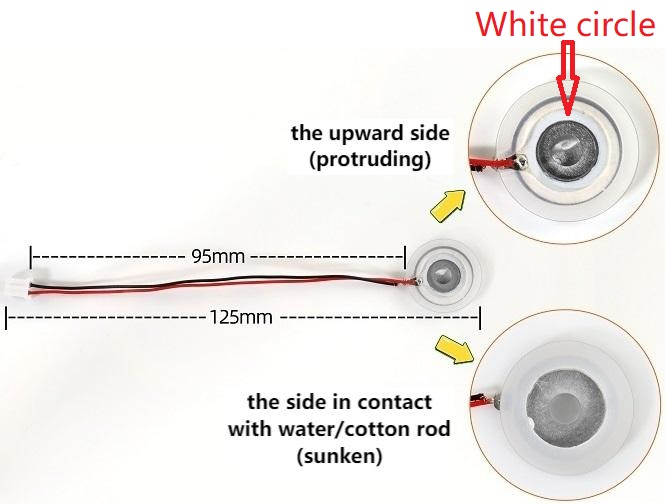

⚠️ **Note: Do not pull the wire on the sheet as much as possible, otherwise its solder welding point may fall off.**

**Install the cotton rod:**

1. Soak the cotton rod completely in water (find a high capacity container to cover the entire rod with water, and soak it for more than 5 minutes to ensure that it fully absorbs the water).

2. Install the atomization sheet inside the plastic bracket. Note the direction of the sheet. Place its wire in the groove of the bracket.

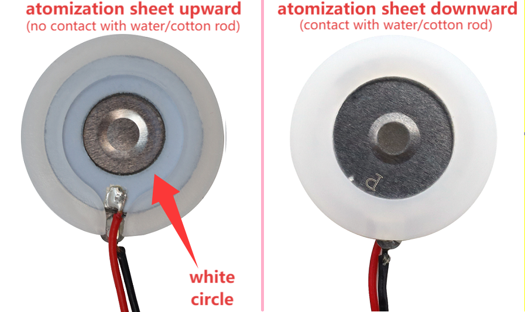

3. Close the other side of the plastic bracket.

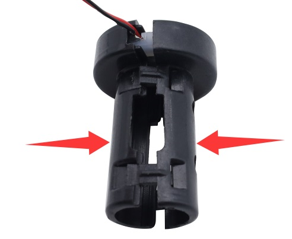

4. Insert the cotton rod into the middle of the bracket. It must be inserted all the way to the bottom till touch the atomization sheet.

5. Connect the atomization sheet to the PH2.0 female terminal of the module, as shown below.

6. Immerse the cotton rod into water again for over 3 minutes. The water should cover the rod as much as possible, but no water should overflow. Press the black button on the module, and you can see the it starts spraying.

⚠️ **Attention: The atomization sheet should not work for a long time, and each operation should not exceed 10 seconds. It is best to stop for 1 to 2 minutes until the cotton rod is full of water before continuing to work. Otherwise, it may be burned out.**

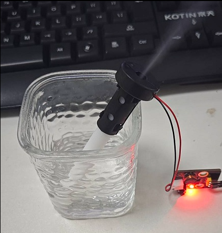

**Instructions for use of atomization module:**

There are two control modes for it: by buttons and by MCU programming.

**Button control:** Press the button to turn on the atomization module. Press the button again to turn it off.

**MCU programming control:** Simulate the pressing of a button. It outputs high under normal conditions and low when pressed. Release the button and it outputs a high level again.

Therefore, when using MCU, we only need to input a brief low-level to the module, like pressing the button. We can control the start or pause time of the atomization module by adjusting the time of the high level.

#### 3.3.7.3 Required Components

| |   | |
| :--: | :--: | :--: |
|   micro:bit V2 main board ×1   |        micro:bit shield ×1         |atomization module ×1|
|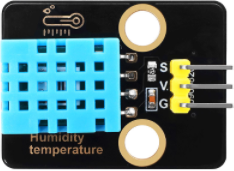|| |
|XHT11 temperature and humidity sensor ×1|OLED display ×1 |130 motor ×1|
| |||
| micro USB cable ×1 |4 pin wire(black-red-blue-green) ×2 |3 pin wire ×2 |
| || |
|fan ×1|battery holder ×1|AA battery(**self-prepared**) ×6|

#### 3.3.7.4 Wiring Diagram

⚠️ **When wiring, please pay attention to the wire color.**

| 130 motor | wire color | micro:bit shield pin | micro:bit board pin |
| :--: | :--: | :--: | :--: |
| G | black | G | G |
| V | red | V2 | V |
| IN+ | blue | 2 | P2 |
| IN- | green | 13 | P13 |

| OLED display | wire color | micro:bit shield pin | micro:bit board pin |
| :--: | :--: | :--: | :--: |
| GND | black | G | G |
| VCC | red | V2 | V |
| SDA | blue | 20 | P20 |
| SCL | green | 19 | P19 |

| atomization module | wire color | micro:bit shield pin | micro:bit board pin |
| :--: | :--: | :--: | :--: |
| G | black | G | G |
| V | red | V2 | V |
| S | yellow | 16 | P16 |

| XHT11 temperature and humidity sensor | wire color | micro:bit shield pin | micro:bit board pin |
| :--: | :--: | :--: | :--: |
| G | black | G | G |
| V | red | V1 | V |
| S | yellow | 0 | P0 |

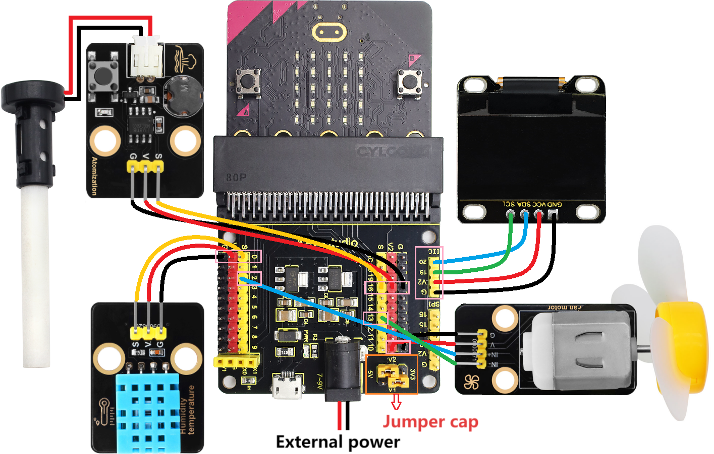

#### 3.3.7.5 Code Flow

#### 3.3.7.6 Test Code

⚠️ **Note the threshold 30 and 70 in the if() condition can be modified according to the actual situation.**

**Complete code:**

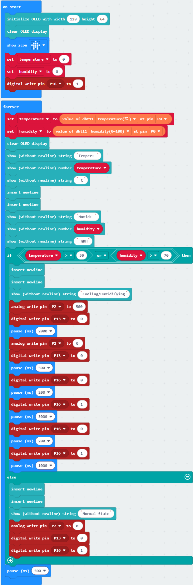

**Brief explanation:**

① Initialize OLED pixels, clear the OLED. The 5×5 LED matrix shows . Define two variables temperature and humidity, and set their initial values to 0, and turn off the atomization module.

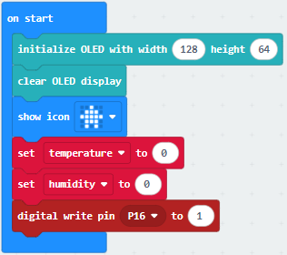

② Assign the temperature value read by the XHT11 sensor to the variable temperature, and the humidity value  to the variable humidity.

③ The OLED shows the temperature and humidity value detected by the XHT11 sensor.

④ Judgment statement: if()...else...

If the detected temperature is above 30℃ or the humidity is above 70%RH, the fan will stop after rotating for 2 seconds. Then the atomization module works and sprays water mist to regulate the ambient temperature and humidity. Meanwhile, the OLED shows “Cooling/Humidifying”.

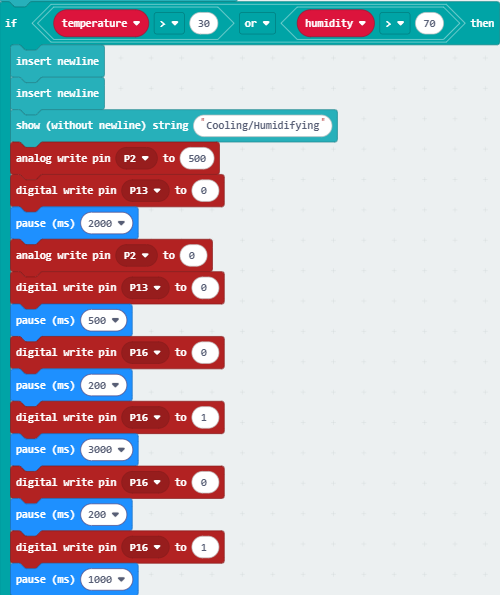

Otherwise, the fan and the atomization module will not work, and the OLED displays “Normal State”.

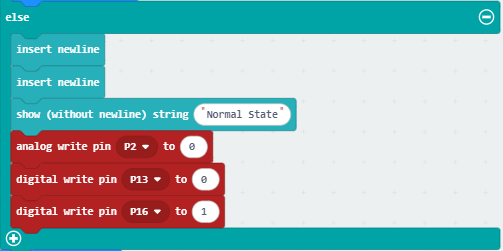

⑤ Delay 500ms(0.5s)

#### 3.3.7.7 Test Result

After wiring up and power on by micro USB cable, connect to external power(6 AA batteries) to ensure sufficient power supply.

For Windows 10 App, just click download. For browser, send the “.hex” file to the micro:bit board.

After uploading test code to micro:bit board, the OLED shows the temperature and humidity value detected by the XHT11 sensor in real time.

If the detected temperature is above 30℃ or the humidity is above 70%RH, the fan will stop after rotating for 2 seconds. Then the atomization module works and sprays water mist to regulate the ambient temperature and humidity. Meanwhile, the OLED shows “Cooling/Humidifying”. Otherwise, the fan and the atomization module will not work, and the OLED displays “Normal State”.

⚠️ **Note: The building blocks in the experiment are not included in this kit.**

(**Tip:** If no result is observed, please press the reset button of the micro:bit board.)

