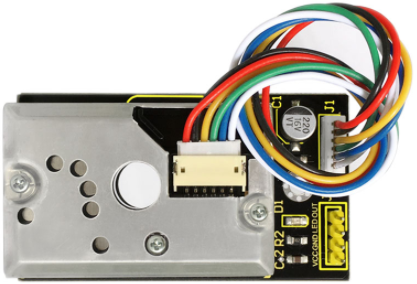
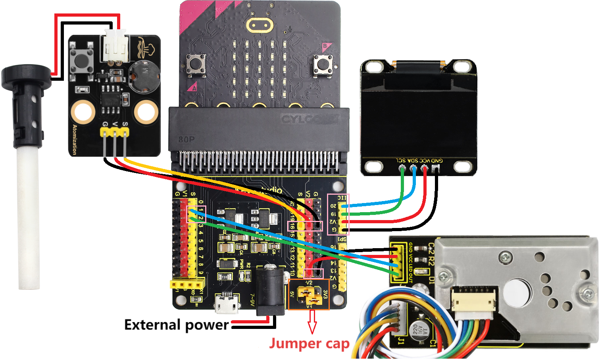
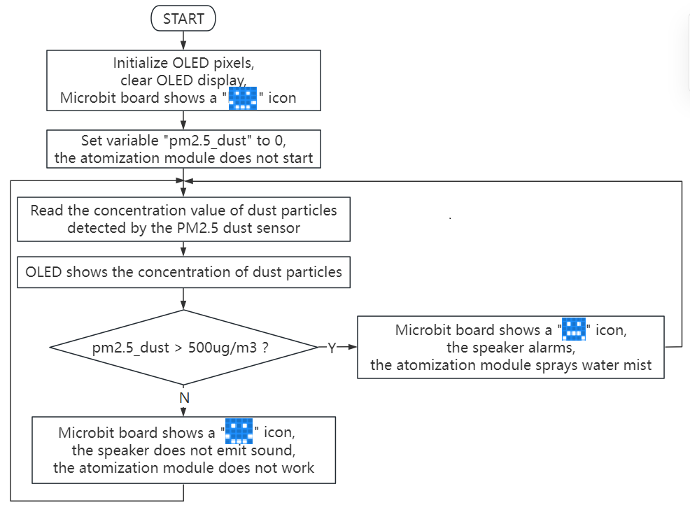
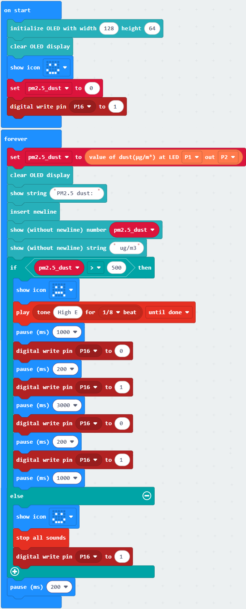
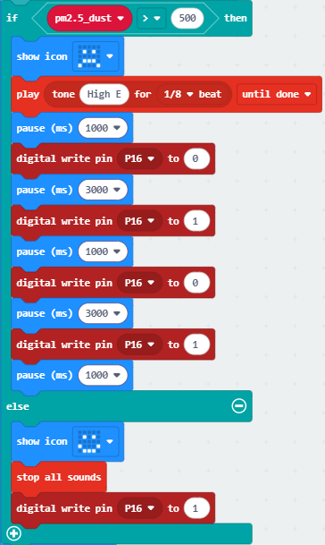

### 3.3.8 PM2.5 Dust Detection

#### 3.3.8.1 Overview

In PM2.5 dust detection, a laser dust meter is used to measure the concentration of PM2.5 in the air. It can continuously monitor the dust concentration while collecting particulate matter and analyzing its components. Particulate matter with an aerodynamic diameter of less than 2.5 micrometers, is what we call PM2.5. If its particle size reduces, the absorption rate of the respiratory system will increase.

In this project, we will build a PM2.5 dust detection system with a micro:bit board, PM2.5 dust sensor, OLED display, atomization module and the on-board speaker. The PM2.5 dust sensor detects PM2.5 particles in the air, and the OLED shows the detected PM2.5 value in real time. When the value reaches a threshold, the speaker alarms, and the atomization module sprays water mist to reduce dust.

#### 3.3.8.2 Component Knowledge

**PM2.5 Dust Sensor**

The PM2.5 dust sensor comes with a GP2Y1014AU0F chip to effectively detect extremely fine particles with a diameter greater than 0.8μm, like cigarette smoke. It also equipped with an infrared LED and a phototransistor arranged diagonally to detect the reflected light of dust in the air. It features ultra-low power consumption (maximum 20mA, typical 11mA), and its analog voltage output varies linearly with the dust density, so it is widely applied in air purifiers, air conditioning air monitors, PM2.5 detectors, etc.

⚠️ **Note: PM2.5 dust sensor with GP2Y1014AU0F chip requires at least 30 seconds to 2 minutes of power-on preheating time to obtains relatively accurate readings.**

**Parameters:**

- Power supply voltage: DC 5 ~ 7V
- Operating current: 20mA(Max)
- Minimum particle detection value: 0.8μm
- Sensitivity: 0.5V/(0.1mg/m³)
- Voltage in clean air: 0.9V (typical)
- Operating temperature: -10℃~65℃

#### 3.3.8.3 Required Components

| |||
| :--: | :--: | :--: |
|   micro:bit V2 main board ×1    |        micro:bit shield ×1         |atomization module ×1|
||| |
|PM2.5 dust sensor ×1|OLED display ×1 |AA battery(**self-prepared**) ×6|
| |||
|4 pin wire(red-black-blue-green) ×1|4 pin wire(black-red-blue-green) ×1 |3 pin wire ×1 |
|| |  |
|battery holder ×1| micro USB cable ×1 |  |

#### 3.3.8.4 Wiring Diagram

⚠️ **When wiring, please pay attention to the wire color.**

| PM2.5 dust sensor | wire color | micro:bit shield pin | micro:bit board pin |
| :--: | :--: | :--: | :--: |
| VCC | red | V2 | V |
| GND | black | G  | G |
| LED | blue | 1  | P1 |
| OUT | green | 2  | P2 |

| OLED display | wire color | micro:bit shield pin | micro:bit board pin |
| :--: | :--: | :--: | :--: |
| GND | black | G  | G |
| VCC | red | V2 | V |
| SDA | blue | 20 | P20 |
| SCL | green | 19 | P19 |

| Atomization module | wire color | micro:bit shield pin | micro:bit board pin |
| :--: | :--: | :--: | :--: |
| G | black | G  | G |
| V | red | V2 | V |
| S | yellow | 16 | P16 |

#### 3.3.8.5 Code Flow

#### 3.3.8.6 Test Code

⚠️ **Note the threshold 500 in the if() condition can be modified according to the actual situation.**

**Complete code:**

**Brief explanation:**

① Initialize OLED pixels, clear the OLED. The 5×5LED matrix shows . Set the initial value of pm2.5_dust to 0, and set the atomization module initially off.

② Assign the concentration of dust particles read by the PM2.5 dust sensor to pm2.5_dust.

③ The OLED shows the concentration of dust particles read by the PM2.5 dust sensor

④ Judgement statement: if()...else...

When the detected concentration of PM2.5 dust particles exceeds 500ug/m³, the 5×5LED matrix shows , and the speaker alarms. After 1 second, the atomization module sprays water mist. 

Otherwise, the 5×5LED shows , the speaker does not alarm, and the atomization module does not work.

⑤ Delay 200ms(0.2s).

#### 3.3.8.7 Test Result

After wiring up and power on by micro USB cable, connect to external power(6 AA batteries) to ensure sufficient power supply.

For Windows 10 App, just click download. For browser, send the “.hex” file to the micro:bit board.

After uploading test code to micro:bit board, sweep the floor indoors / light matches / burn a small amount of paper safely to produce obvious PM2.5 dust particles, and they will be detected by the PM2.5 dust sensor and then its concentration will be shown on the OLED in real time.

When the detected concentration of PM2.5 dust particles exceeds 500ug/m³, the 5×5LED matrix shows , and the speaker alarms. After 1 second, the atomization module sprays water mist. Otherwise, the 5×5LED shows , the speaker does not alarm, and the atomization module does not work.

|Detected values on OLED| Air quality |
| :--: | :--: |
|0-75 | Excellent |
|75-150 | Great |
|150-300 | Good |
|300-1050 | Normal |
|1050-3000| Poor |
|3000 + | Very poor |

⚠️ **Note: The building blocks in the experiment are not included in this kit.**

(**Tip:** If no result is observed, please press the reset button of the micro:bit board.)

