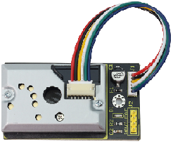
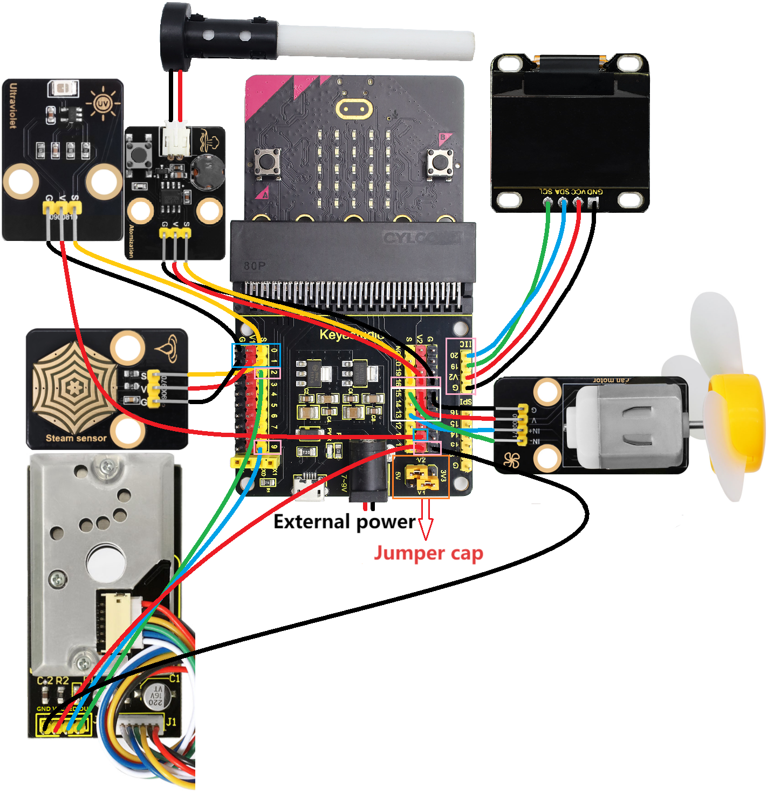
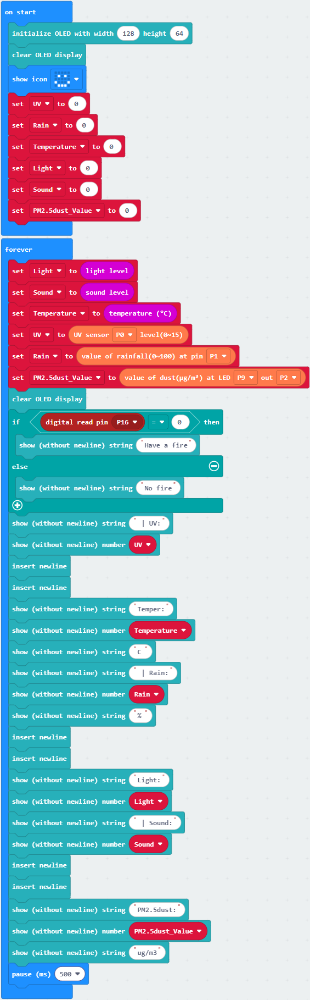

### 3.3.9 Micro:bit Multi-sensor OLED Monitoring Platform

#### 3.3.9.1 Overview

In this project, we take the micro:bit board as a core processing unit to read the values of its built-in sensors (including light sensor, temperature sensor, microphone) as well as external sensors (like PM2.5 dust sensor, steam sensor and solar ultraviolet sensor), and then these values will be displayed in real time on the OLED through I2C interface. 

At the same time, the rotation of the fan on the 130 motor module can be controlled by pressing button A on the Micro:bit board, and the water mist spraying from the atomization module can be controlled by pressing button B on the Micro:bit board.

#### 3.3.9.2 Required Components

| |  ||
| :--: | :--: | :--: |
| micro:bit V2 board ×1 | micro:bit shield ×1 |OLED display ×1 |
| |||
| PM2.5 dust sensor ×1 |motor ×1 |steam sensor ×1 |
||| |
|ultraviolet sensor ×1|battery holder ×1|AA battery(**self-prepared**) ×6|
| |||
| micro USB cable ×1|4 pin wire ×3 |3 pin wire ×3 |
| |  |  | 
|atomization module ×1|fan ×1|  |

#### 3.3.9.3 Wiring Diagram

⚠️ **When wiring, please pay attention to the wire color.**

|ultraviolet sensor| wire color | micro:bit shield pin |micro:bit board pin |
| :--: | :--: | :--: | :--: |
| G | black | G | G |
| V | red | V2 | V |
| S | yellow | 0 | P0 |

|steam sensor| wire color | micro:bit shield pin |micro:bit board pin |
| :--: | :--: | :--: | :--: |
| G | black | G | G |
| V | red | V1 | V |
| S | yellow | 1 | P1 |

| PM2.5 dust sensor | wire color | micro:bit shield pin |micro:bit board pin |
| :--: | :--: | :--: | :--: |
| GND | black | G | G |
| VCC | red | V2 | V |
| LED | blue | 9 | P9 |
| OUT | green | 2 | P2 |

| atomization module | wire color | micro:bit shield pin |micro:bit board pin |
| :--: | :--: | :--: | :--: |
| G | black | G | G |
| V | red | V2 | V |
| S | yellow | 16 | P16 |

| motor | wire color | micro:bit shield pin |micro:bit board pin |
| :--: | :--: | :--: | :--: |
|  G  | black | G | G |
|  V  | red | V2 | V |
| IN+ | blue | 13 | P13 |
| IN- | green | 15 | P15 |

| OLED display | wire color | micro:bit shield pin |micro:bit board pin |
| :--: | :--: | :--: | :--: |
| GND | black | G | G |
| VCC | red | V2 | V |
| SDA | blue | 20 | P20 |
| SCL | green | 19 | P19 |

#### 3.3.9.4 Code Flow

#### 3.3.9.5 Test Code

**Complete code:**

**Brief explanation:**

① Initialize OLED pixels, clear the OLED. The 5×5LED matrix shows . Define the initial values of variables UV, Rain, Temperature, Light, Sound and pm2.5_dust to 0.

② Read the values of light intensity, sound volume, temperature, ultraviolet, rain volume and PM2.5 dust concentration.

③ Judgement statement: if()...else...

Press the button A on the micro:bit board, and the motor will drive the fan to work. Otherwise, the fan will not rotate.

④ Judgement statement: if()...else...

Press the button B on the micro:bit board, and the atomization module will spray water mist. Otherwise, it will not work.

⑤ Display the values of ultraviolet, temperature, rain volume, light intensity, sound volume and PM2.5 dust concentration on the OLED.

#### 3.3.9.6 Test Result

After wiring up and power on by micro USB cable, connect to external power(6 AA batteries) to ensure sufficient power supply.

For Windows 10 App, just click download. For browser, send the “.hex” file to the micro:bit board.

After uploading test code to micro:bit board, read the values of its built-in sensors (including light sensor, temperature sensor, microphone) as well as external sensors (like PM2.5 dust sensor, steam sensor and solar ultraviolet sensor), and then it can display the light intensity, temperature, noise intensity, rainfall intensity, ultraviolet intensity of sunlight and PM2.5 dust concentration in real time and intuitively through the OLED display screen with I2C interface.

Blow air (or make a very loud noise) into the microphone on the Microbit board (⚠️ **special reminder: Blowing air has a more obvious effect**), and the OLED display will show  the intensity of the air blowing (or noise)

When button A on the micro: bit board is pressed, the fan on the motor module rotates. When button B on the board is pressed, the atomization module sprays water mist.

⚠️ Special reminder: Sometimes the external power supply voltage may be insufficient. In such cases, it might be necessary to press the button twice on the micro: bit board before the fan starts to rotate or the misting module begins to spray water mist.

⚠️ **Note: The building blocks in the experiment are not included in this kit.**

(**Tip:** If no result is observed, please press the reset button of the micro:bit board.)

