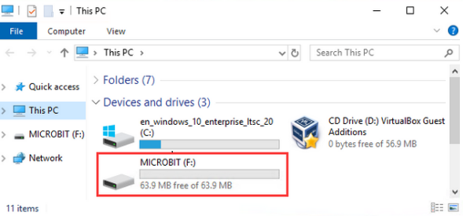
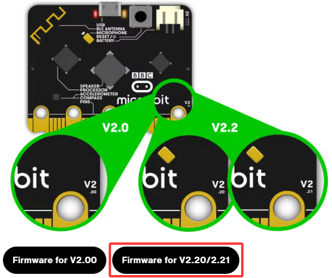

## Troubleshooting

Code fails to download to Micro:bit and MAINTENANCE driver appears.

#### 1. Problem

Recently, many users encounter the issue that Micro:bit board doesn’t respond when download code.

If the way you operate is correct, maybe you accidentally press the reset button and enter the Maintenance mode or the firmware is lost due to mis-operation.

Plug in Micro:bit board, the “**MAINTENANCE**” drive appears, which means the program can’t be downloaded. 

MAINTENANCE is shown as below:

#### 2. Solution

(1). Download the **.hex file** from this page to your computer.

Download the latest micro:bit firmware-0255: [https://www.microbit.org/get-started/user-guide/firmware/](https://www.microbit.org/get-started/user-guide/firmware/)

**Note:** If you do not want to download from this website, we also provide it in our tutorial.

(2). After the latest firmware(Firmware for V2.20_V2.21.hex) is downloaded, then drag it into the “MAINTENANCE” to make Micro:bit back to normal mode. Please select different firmware according to the model of the Micro:bit board. Here, Firmware for V2.20_V2.21 is taken as an example.

#### 3. Avoid to Enter “MAINTENANCE”

(1) Make sure the reset button is **not** pressed when plugging the board by USB cable. Many beginners accidentally press the reset button when plugging in the USB cable, so then the firmware flashing mode is enabled (**a common mistake made by beginners**).

(2) Do not unplug the cable suddenly during downloading program, otherwise, the firmware will be lost and micro:bit will enter “MAINTENANCE” mode.

(3) In the experiment, wrong wiring also cause a short circuit or firmware lost.

#### 4. Download with WebUSB

Having trouble pairing the Micro: bit with WebUSB (/ device/usb/webusb)?

**Step 1: Check cable**

Make sure that your micro:bit is connected to your computer with a micro USB cable. You should see a MICROBIT drive appear in Windows Explorer when it’s connected.

If you can see the MICROBIT, please go to step 2. 

If you can’t:

- Make sure that the USB cable is working. Does the cable works on another computer? If not, find a different cable to use. Some cables may only provide a power connection and don’t actually transfer data.
- Try another USB port on your computer. 
- Is the cable good but you still can’t see the MICROBIT drive? Hmm, you might have a problem with your micro:bit. Try the additional steps described in the [falut finding](https://support.microbit.org/support/solutions/articles/19000024000-fault-finding-with-a-micro-bit) at microbit.org.
- If this doesn’t help, you can create a [support ticket](https://support.microbit.org/support/tickets/new) to notify the Micro:bit Foundation of the problem. If you do so, skip the rest of these steps.

**Step 2: Check firmware version**

It’s possible that the firmware version on the micro:bit needs an update. Let’s check:

① Go to the MICROBIT drive.

② Open the DETAILS.TXT file.

③ Search for relevant information of interface versions and the boot loader in the file.

If the version is 0234, 0241, 0243, you need to update the firmware on your micro:bit. Go to Step 3 and follow the upgrade instructions.

If the version is 0249, 0257 or higher, you have the right firmware, just go to step 4.

**Step 3: Update firmware**

① Disconnect the USB cable and the external power from the micro:bit board.

② Re-connect the USB cable after pressing and holding the reset button. Once you insert the cable, you can release the reset button. You should now see MAINTENANCE (instead of the MICROBIT) drive. Also, a yellow LED indicator will stay on. 

③. Download firmware .hex file: [https://microbit.org/guide/firmware/](https://microbit.org/guide/firmware/). Please select different firmware according to the model of the Micro:bit board. Here, Firmware for V2.20_V2.21 is taken as an example.

④ Drag the .hex file into the **MAINTENANCE** drive.

⑤ The yellow LED will flash while the .hex file is copying. After that, the LED will go off and the micro:bit resets. The MAINTENANCE drive now changes to MICROBIT.

⑥ The upgrade is complete! You can open the DETAILS.TXT file to check the firmware version that matches the one of the .hex file you copied.

If you want to know more about connecting the board, MAINTENANCE Mode, and upgrading the firmware, please refer to [Firmware guide](https://microbit.org/guide/firmware/).

**Step 4: Check version of Browser**

WebUSB may require you to update your browser. Check that your browser version matches one of these: Android, Chrome OS, Linux, macOS and Windows 10 Chrome 65+.

**Step 5: Pair device**

Once you’ve updated the firmware, open the Chrome Browser, go to the editor and click on Pair Device in settings. 

See [WebUSB](https://microbit.org/get-started/user-guide/web-usb/) (/ device / usb / webusb) for pairing instructions.

