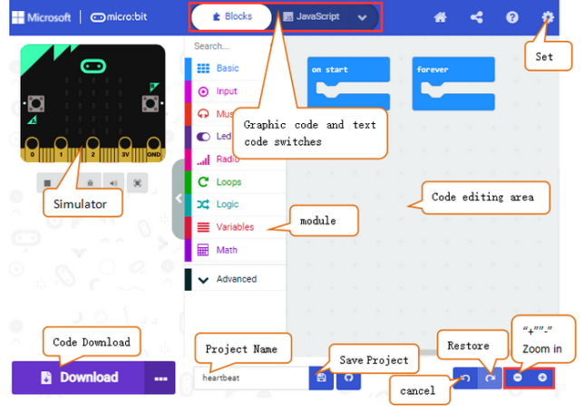
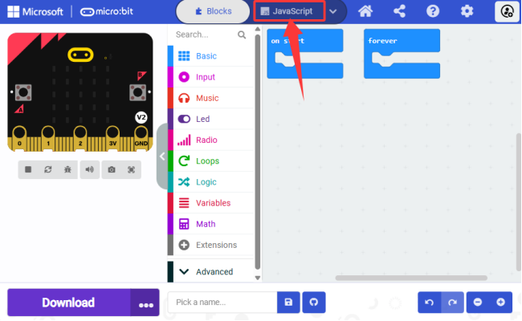
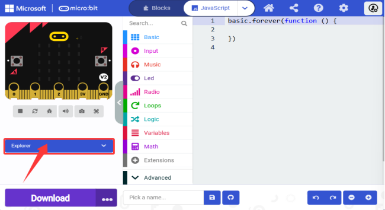
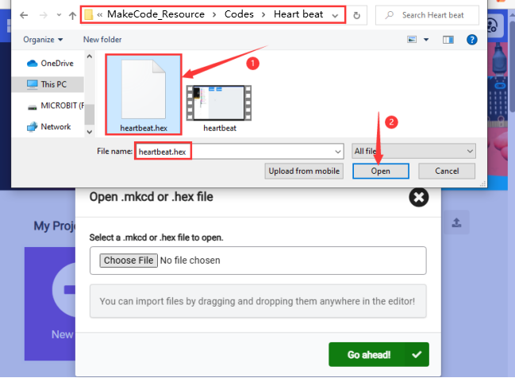
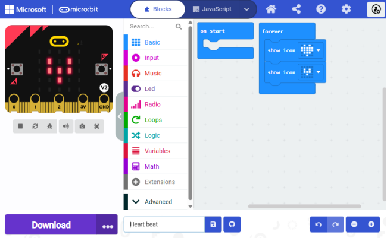

## 3.2.1 MakeCode介绍

⚠️ **特别提醒：以下的步骤说明是基于Windows操作系统，如果你使用其他的操作系统，可以将其作为参考。同时，以下案例是在 Google Chrome浏览器 或 Microsoft Edge浏览器 中演示的。**

**MakeCode编程环境：**

打开MakeCode在线版本: [https://makecode.microbit.org/](https://makecode.microbit.org/)

MakeCode 编译器如下:

在代码编辑区中，有两个固定的代码块 “**on start**” 和 “**forever**”。 **上电或复位后，“on start”代码块中的代码将仅执行一次；并且“forever”代码块中的代码将循环执行。**

点击 “**JS JavaScript**”，你可以看到对应的JavaScript语言代码程序，如下图：

你还可以点击下拉按钮选择 “**Python**”，可以看到对应的Python语言代码程序，如下图：

**界面语言的切换：**

第一步：点击右上角的设置按钮。

第二步：在下拉菜单中选择 “Language”。

第三步：在弹出的对话框中，选择你需要的界面语言。

## 3.2.2 MakeCode扩展库

### 3.2.2.1 添加MakeCode扩展库

⚠️ **特别提醒：我们为每个项目实验提供十六进制代码文件（**.hex**）。十六进制代码文件包含运行项目所需的所有内容，你可以直接将其导入MakeCode编辑器中使用，也可以手动拖动代码块来创建每个项目实验的代码。如果选择通过手动拖动代码块来创建项目代码，则需要添加库文件。**

1\. 打开MakeCode，先单击右上角的图标（设置），再点击 “**Extensions**”。

或者单击 Advanced 上面的 “**Extensions**”。

2\. 你可以选择关键词搜索或者输入GitHub链接来搜索扩展库。

3\. 在页面的搜索框输入链接：`https://github.com/keyestudio/pxt-environment-kit-master`，接着点击搜索图标，然后单击选中库文件 “**Environment-and-Science**”。

4\. 等待添加。

5\. 添加成功：

### 3.2.2.2 更新或删除扩展库

⚠️ **特别提醒：一般情况下，添加好库文件是不需要再删除它们的，除非是再不需要它们。这部分内容仅供学习怎样来删除不需要的库文件。**

1\. 单击 “**JavaScript**” 按钮切换到文本代码。

2\. 单击左边的 “**Explorer**”。

3\. 在扩展列表中找到 “**Environment-and-Science**” 扩展库文件，单击垃圾箱图标以删除 “**Environment-and-Science**” 扩展库文件。

4\. 选择单击 “**Remove it**” 即可删除。

其他库的删除方法类似，可以参照。

## 3.2.3 MakeCode示例代码下载

### 3.2.3.1 在MakeCode中导入代码

接下来，我们以 “**heatbeat**” 项目为例，介绍如何在MakeCode编辑器中导入示例代码。

1\. 通过micro USB线将 micro:bit 主板连接到电脑上。

不管是使用外接电源还是连接到电脑上的micro USB数据线供电，micro:bit主板背后的红色LED指示灯亮起来，说明显示micro:bit 主板有电了。在micro:bit主板上，当你的电脑通过micro USB与micro:bit主板通信时，黄色LED指示灯会闪烁。同时，micro:bit主板连接到电脑时，你的电脑上将显示为一个名为 ' MICROBIT ' 的驱动器。但请注意，它不是普通的USB磁盘！

2\. 打开Web版本的MakeCode编辑器或Windows10 APP版本的MakeCode编辑器，单击 “**Import**” 。

3\. 在弹出的对话框中，单击 “**Import File...**”。

4\. 单击 “**Choose File**” ，导航到你下载的示例代码所保存的位置。

5\. 打开我们提供的示例代码 “**heartbeat.hex**” 。

6\. 单击 “**Go ahead √**” 进入 MakeCode 编译器。

除了上述将提供的示例代码文件直接导入到Makecode编译器中的方法之外，也可以将我们提供的示例代码文件直接拖入到Makecode编译器中的代码编辑区，如下图所示：

7\. 示例代码成功加载。

### 3.2.3.2 下载示例代码(WebUSB功能)

如果使用 **Google Chrome**  或  **Microsoft Edge** 的WebUSB功能，该功能允许你直接通过网页访问你的micro USB硬件设备。可以通过单击 “**Download**” 按钮将示例代码快速下载到micro:bit主板。

除了参照上面的动图演示，也可以参照下面的说明来进行配对装置，下载代码至micro:bit主板。

#### 3.2.3.2.1 配对装置

1\. 用micro USB线连接电脑和micro:bit主板。

2\. 单击 “**Download**” 后面的 “**...**” ，然后单击 “**Connect device**”。

3\. 然后继续单击 “**Next**” 按钮。

4\. 再继续单击 “**Pair**” 按钮。

5\. 在弹出窗口中选中对应的 “**设备**” ，然后单击 “**Connect**” 按钮。 

6\. 单击 “**Done**” ，设备连接成功。

#### 3.2.3.2.2 下载程序

设备连接成功后，单击 “**Download**” 按钮，示例代码将直接下载到micro:bit主板，如果示例代码成功下载到micro:bit主板上，下载按钮  会变成 。

⚠️ **特别提醒：**

如果弹出窗口中没有设备，请参考以下链接中的内容进行故障排插：

[https://makecode.microbit.org/device/usb/webusb/troubleshoot](https://makecode.microbit.org/device/usb/webusb/troubleshoot)

如果你的micro:bit主板需要更新micro:bit的固件，请参考以下链接中的内容：

[https://microbit.org/guide/firmware/](https://microbit.org/guide/firmware/)

### 3.2.3.3 下载示例代码(非WebUSB功能)

1\. 通过micro USB线将micro:bit 主板连接到电脑。

不管是使用外接电源还是连接到电脑上的micro USB数据线供电，micro:bit主板背后的红色LED指示灯亮起来，说明显示micro:bit 主板有电了。在micro:bit主板上，当你的电脑通过micro USB与micro:bit主板通信时，黄色LED指示灯会闪烁。如果micro:bit主板连接到电脑时，你的电脑上将显示为一个名为 ' MICROBIT ' 的驱动器。但请注意，它不是普通的USB磁盘！

2\. 如果是使用其他浏览器编写程序或导入示例代码，请按照以下步骤将代码上传到micro:bit主板上：

除了参照上面的动图演示，也可以参照下面的说明来下载代码至micro:bit主板。
 
① 单击编辑器中的 “**Download**” 按钮。 这将下载一个 “**.hex**” (十六进制)文件，该文件是micro:bit主板可以读取的格式文件。十六进制文件下载后，将其复制到你的micro:bit 主板，就像将文件复制到USB驱动器一样。 在Windows上，你还可以右键单击并选择 “**发送到→MICROBIT**” 将 “**.hex**” 文件拷贝到micro:bit主板。“**.hex**” 文件拷贝到micro:bit 主板过程中，micro:bit主板背面的黄色信号灯会闪烁，当拷贝完成后黄色信号灯停止闪烁，保持长亮。

也可以将 “**.hex**” 文件直接拖入MICROBIT磁盘中。

② 将示例代码程序上传micro: bit主板后，通过micro USB线连接到电脑上给micro: bit主板供电，可以看到micro: bit主板上的 5 x 5 LED点阵屏先显示图案，再显示图案。循环进行！

⚠️ **特别提醒：** 如果你的电脑是Windows 10操作系统，你也可以使用Windows 10 APP编程，这与在浏览器上编程完全相同。使用 Windows 10 App [Get Windows 10 App](https://apps.microsoft.com/detail/9nmqdq2xzkwk?hl=en-gb&gl=CN)(Click)编程，则只需单击 “**Download**” 按钮，该示例代码将直接下载到micro:bit主板，而无需任何其它操作。

⚠️ **特别提醒：** 每次编程时，MICROBIT磁盘都会自动弹出并返回，但是你已经拷贝到MICROBIT磁盘的十六进制（**.hex**）文件将不会被显示。 micro:bit主板只能接收并运行最新上传的十六进制（**.hex**）文件，不会存储任何其他文件！

