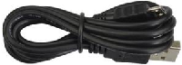

### 3.3.1 智能温控风扇 

#### 3.3.1.1 简介

当室内温度超过预设标准值时，智能温控风扇会自动启动，调节室内温度至舒适范围。OLED显示屏会实时显示当前室内温度以及风扇的运行状态，为用户提供直观的温控信息反馈。

#### 3.3.1.2 元件知识

**Microbit温度传感器**

micro:bit主板上并没有温度传感器，它使用nRF52833应用处理器内置的温度传感器进行温度检测，所以检测的温度更接近处理器的温度，可能与周围环境温度存在一定的误差。传感器检测范围为：-40℃~105℃。

**OLED显示屏**

OLED技术可以提供丰富的色彩表现、高对比度、广视角等优点。画面清晰生动，黑色表现尤其出色。OLED屏幕每个像素自发光，无需背光源，功耗相对较低。0.9寸OLED屏幕凭借其小尺寸、高分辨率(128*96像素)、低功耗等特点，非常适合嵌入式及可穿戴设备领域的应用。

⚠️ **特别提醒：** 我们这款OLED显示屏的SDA接口是接到Micro:bit主板上的引脚P20，SCL接口接到Micro:bit主板上的引脚P19。

**模块参数：**

- 工作电压：DC 3.3V-5V
- 工作电流：30mA
- 接口：间距为2.54mm的排针接口
- 通信方式：I2C通信
- 内部驱动芯片：SSD1306
- 分辨率：128×64
- 可视角度：大于150°

**130电机模块**

130电机模块上有个直流电机，直流电机的工作原理是基于电磁感应和洛伦兹力。其核心结构包括定子、转子和换向器。定子产生固定磁场，转子（电枢）由线圈绕组组成，通电后产生磁场。当电流通过电刷和换向器进入转子线圈时，转子磁场与定子磁场相互作用，产生洛伦兹力，推动转子旋转。换向器在转子旋转时切换电流方向，确保转子持续受到同方向的力，从而维持旋转。通过电磁感应和洛伦兹力的作用，直流电机将电能转换为机械能，实现能量转换。由于其调速性能好、启动扭矩大，直流电机广泛应用于电动工具、电动汽车和家用电器等领域。

130电机模块是一种可以通过PWM调速的模块，使用时需要接两个引脚进行控制。该模块适用于需要调节风扇速度的应用场景，例如电脑散热、工业生产等。它小巧轻便、安装简单，是一种十分实用的模块。

**原理图：**

HR1124S芯片的作用是助于驱动电机，而电机所需电流较大，无法用三极管驱动更无法直接用IO口驱动。让电机转动起来的方法很简单，给电机两端添加电压即可。不同电压方向电机转向也不相同，在额度电压内，电压越大，电机转动得越快；反之电压越低，电机转动得越慢，甚至无法转动。控制方式有两种：一种是高低电平控制（控制转动和停止），一种是PWM控制（控制转速）。

**参数：**

- 工作电压: DC 5V
- 工作电流: (Max)400mA@5V
- 最大功率: 2W
- 转速: (16000+10%) 转/分@5V

#### 3.3.1.3 所需组件

| |   | | 
| :--: | :--: | :--: |
| micro:bit V2 主板 ×1 | micro:bit传感器扩展板 ×1 |OLED显示屏 ×1 |
| | ||
|130电机模块 ×1| micro USB 线 ×1|4 pin 线材(黑红蓝绿) ×2 |
| || |
|风扇叶 ×1|电池盒 ×1|AA电池(**自备**) ×6|

#### 3.3.1.4 接线图

⚠️ **特别注意：接线时，请注意区分线材颜色。**

| 130电机模块 | 线材颜色 | micro:bit传感器扩展板引脚 |micro:bit主板引脚 |
| :--: | :--: | :--: | :--: |
| G | 黑线 | G | G |
| V | 红线 | V2 | V |
| IN+ | 蓝线 | 2 | P2 |
| IN- | 绿线 | 16 | P16 |

| OLED显示屏 | 线材颜色 | micro:bit传感器扩展板引脚 |micro:bit主板引脚 |
| :--: | :--: | :--: | :--: |
| GND | 黑线 | G | G |
| VCC | 红线 | V2 | V |
| SDA | 蓝线 | 20 | P20 |
| SCL | 绿线 | 19 | P19 |

#### 3.3.1.5 代码流程图

#### 3.3.1.6 实验代码

⚠️ **特别注意：下面示例代码中，if()条件中的阈值 33 可以根据实际情况加以修改的。**

**完整代码：**

**简单说明：**

① 初始化OLED显示屏的像素，OLED清屏和Microbit主板上的5*5LED点阵显示图案。

② OLED显示屏的整行显示温度。

③ 插入新的一行

④ 这是if()...else...的判断语句。

当温度传感器检测到的温度大于等于33℃时，OLED显示字符串 “Fan on”，风扇转动；否则，OLED显示字符串 “Fan off”，风扇不转动。

⑤ 延时1000ms(即：1s)。

#### 3.3.1.7 实验结果

按照接线图接好线，利用micro USB数据线上电，同时还需要外接电源(6个AA电池安装到电池盒，保证电源充足)。

下载示例代码，使用Windows 10 App下载示例代码只需单击 “下载” 按钮即可；使用浏览器下载示例代码则需要将下载的 “.hex” 文件发送到micro:bit主板。

将示例代码传成功下载到micro:bit主板后，Microbit主板上的5×5LED点阵显示图案，同时OLED显示屏会实时显示温度和风扇的状态。

当温度高于33℃时，风扇转动；否则，风扇不转。

⚠️ **特别提醒：代码中使用C代替℃，是因为℃在OLED显示屏中显示时会乱码。**

