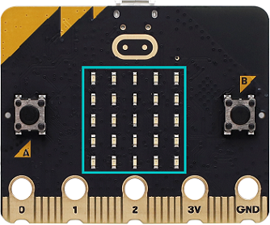
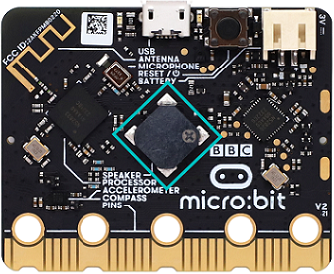
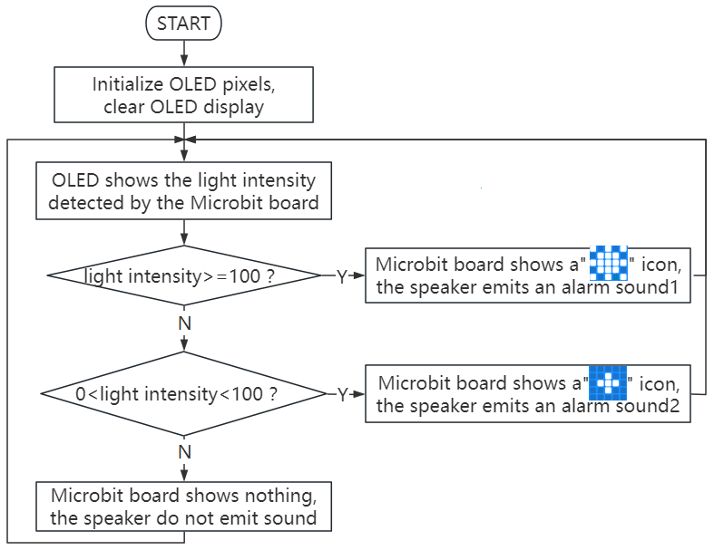
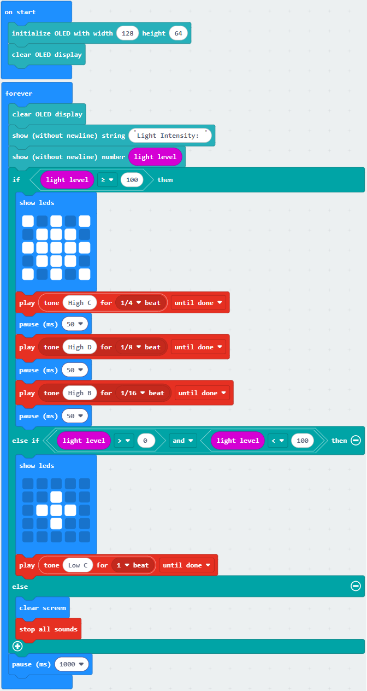
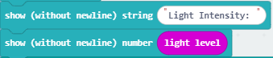
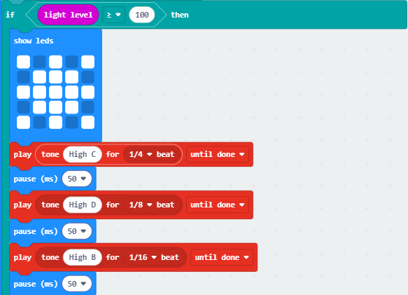
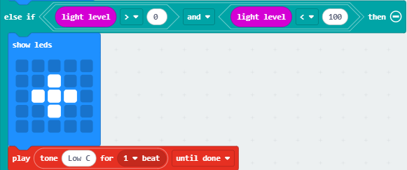
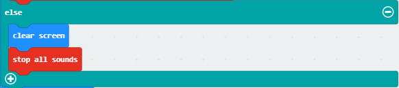

### 3.3.2 光照强度检测仪 

#### 3.3.2.1 简介

光照强度检测仪，也叫照度计、勒克斯计（Lux Meter），是一种用于测量照射在表面上的光的总量（即照度）的专用仪器。光照强度检测仪的工作原理主要基于光电效应。

本项目实验是OLED显示屏上会实时显示会实时显示Microbit光敏传感器检测的光线亮度级别值，并且光线亮度级别值超过一定值时，Microbit主板的扬声器发出警报声，起到警示提醒作用。

光照强度检测仪的应用极其广泛，几乎所有需要定量化“光”的场合都会用到它，例如：户外与道路照明、室内照明设计与验收、摄影与影视制作和建筑与健康 等等。

#### 3.3.2.2 元件知识

**Microbit光线传感器**

micro:bit主板并不自带光敏传感器，它对外界光照强度的检测是通过LED屏幕屏进行的。LED屏幕被用来感知周围的光，并反复地将光照强度转换成值输入，并采样电压衰减时间，这样检测出来的光照强度是一个相对值。（**注意：** 将光线亮度级别输出至串口，输出的是一个相对值。）

**Microbit扬声器**

micro:bit主板有内置扬声器，这使得在你的项目中添加声音变得非常容易。你可以用扬声器发出咯咯笑、问候你、打哈欠或悲伤等等，还可以编写一首歌曲，你的micro:bit主板可以通过编程制作各种各样的声音——从单个音符、音调和节拍到你自己的音乐作品，例如：歌曲《欢乐颂》，让扬声器播放出来。

#### 3.3.2.3 所需组件

| |   | | 
| :--: | :--: | :--: |
| micro:bit主板 *1 | micro:bit传感器扩展板 *1 |OLED显示屏 *1 |
| |||
| micro USB 线 *1|4 pin 线材 *1 |电池盒 *1|
|| | |
|AA电池(**自备**) *6| | |

#### 3.3.2.4 接线图

⚠️ **特别注意：接线时，请注意区分线材颜色。**

| OLED显示屏 | 线材颜色 | micro:bit传感器扩展板引脚 |micro:bit主板引脚 |
| :--: | :--: | :--: | :--: |
| GND | 黑线 | G | G |
| VCC | 红线 | V2 | V |
| SDA | 蓝线 | 20 | P20 |
| SCL | 绿线 | 19 | P19 |

#### 3.3.2.5 代码流程图

#### 3.3.2.6 实验代码

⚠️ **特别注意：下面示例代码中，if...else if...判断语句中的阈值是可以根据实际情况加以修改的**

**完整代码：**

**简单说明：**

① 初始化OLED显示屏的像素，OLED清屏。

② OLED显示屏的整行显示光线亮度。

③ 这是if()...else if()...else的判断语句。

如果检测到的光线亮度大于等于100时，Microbit主板上的5*5LED点阵显示""图案，同时Microbit主板上的扬声器发出警报声1。

否则如果检测到的光线亮度大于0小于100时，Microbit主板上的5*5LED点阵显示""图案，同时Microbit主板上的扬声器发出警报声2。

否则，Microbit主板上的5*5LED点阵不显示任何图案，扬声器也不发声。

④ 延时1000ms(即：1s)。

#### 3.3.2.7 实验结果

下载代码，使用Windows 10 App下载代码只需单击 “下载” 按钮即可，使用浏览器下载代码则需要将下载的 “hex” 文件发送到micro:bit主板。

示例代码成功下载到micro:bit主板之后，利用micro USB数据线上电，同时还需要外接电源(6个AA电池安装到电池盒，保证电源充足)。

OLED显示屏上会实时显示Microbit光线传感器检测的光线亮度，当光线亮度超过100时，Microbit主板上的5×5LED点阵显示""图案，同时扬声器发出警报声1，起到高级别警示提醒作用；当光线亮度大于0小于100时，Microbit主板上的5×5LED点阵显示""图案，同时扬声器发出警报声2，起到低级别警示提醒作用；否则，Microbit主板上的5*5LED点阵不显示任何图案，扬声器也不发声

