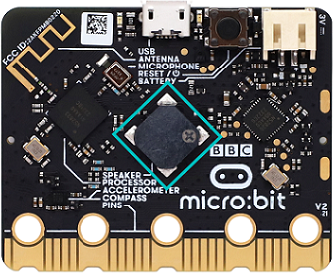

### 3.3.3 太阳光紫外线检测仪 

#### 3.3.3.1 简介

太阳光紫外线检测仪是一种用于测量太阳光紫外线辐射强度的精密仪器。它的核心是探测人眼不可见的紫外线（UV）辐射，并将其强度量化。与光照强度检测仪类似，紫外线检测仪也基于光电效应，但其核心在于选择性探测紫外线。

本项目实验是OLED显示屏上会实时显示太阳光紫外线检测到的紫外线强度，并且紫外线强度超过一定值时，microbit主板的扬声器发出警报，同时microbit点阵显示提示图案，起到警示提醒作用。

太阳光紫外线检测仪的应用极其广泛，几乎所有需要定量化“紫外光”的场合都会用到它，例如：检测UV固化灯的强度、防晒品测试、紫外线光疗设备、紫外线杀菌灯水净化系统监测和空气净化系统监测 等等。

#### 3.3.3.2 元件知识

**太阳紫外线传感器**

太阳紫外线传感器是用于检测紫外线，其核心元件是基于半导体光电二极管的G365S01M。它的核心功能是将环境中的UV辐射强度，转换成一个可被单片机（如Micro:bit主板）读取的模拟电压信号。其原理图如下：

光电转换：传感器内部的紫外光电二极管在受到紫外线照射时，会产生一个极其微弱的电流（与UV强度成正比）。

电流放大：这个微弱电流被内部集成的运算放大器放大。

信号输出：放大后的信号直接从一个引脚输出模拟电压。电压值通常在0V到1V之间（在3.3V供电下），UV强度越强，电压越高。

**参数：**

- 模块工作电压: DC 5V
- 峰值响应波长：355nm (λmax)
- 峰值响应度(355nm)：0.18A/W (Rmax)
- 光谱响应范围：220~370nm
- UV/可见光的响应度比(Rmax/R400nm)：> (VB)

**Microbit LED点阵**

micro:bit主板的LED点阵共由25个发光二极管组成，即可以通过设置坐标点来实现对LED屏幕中某一个LED的控制。也可以轻松地实现LED屏幕显示图案、数字等。

#### 3.3.3.3 所需组件

| |   | | 
| :--: | :--: | :--: |
| micro:bit主板 *1 | micro:bit传感器扩展板 *1 |OLED显示屏 *1 |
|| ||
| 太阳紫外线传感器 *1|micro USB 线 *1|4 pin 线材 *1 |
||||
|3 pin 线材 *1 |电池盒 *1|AA电池(**自备**) *6| 

#### 3.3.3.4 接线图

⚠️ **特别注意：接线时，请注意区分线材颜色。**

| OLED显示屏 | 线材颜色 | micro:bit传感器扩展板引脚 |micro:bit主板引脚 |
| :--: | :--: | :--: | :--: |
| GND | 黑线 | G | G |
| VCC | 红线 | V2 | V |
| SDA | 蓝线 | 20 | P20 |
| SCL | 绿线 | 19 | P19 |

|太阳紫外线传感器| 线材颜色 | micro:bit传感器扩展板引脚 |micro:bit主板引脚 |
| :--: | :--: | :--: | :--: |
| G | 黑线 | G | G |
| V | 红线 | V2 | V |
| S | 黄线 | 1 | P1 |

#### 3.3.3.5 代码流程图

#### 3.3.3.6 实验代码

**特别注意：下面示例代码中，if条件中的阈值 5 可以根据实际情况加以修改的**

**完整代码：**

**简单说明：**

① 初始化OLED显示屏的像素，OLED清屏。

② OLED显示屏的整行显示太阳光紫外线强度。

③ 这是if()...else...的判断语句。

当检测到的太阳光紫外线强度大于等于5时，Microbit主板上的5×5LED点阵显示图案 和，同时扬声器发出警报声；否则，Microbit主板上的5×5LED点阵显示图案，同时扬声器不发声。

④ 延时1000ms(即：1s)。

#### 3.3.3.7 实验结果

下载代码，使用Windows 10 App下载代码只需单击 “下载” 按钮即可，使用浏览器下载代码则需要将下载的 “hex” 文件发送到micro:bit主板。

示例代码成功下载到micro:bit主板之后，利用micro USB数据线上电，同时还需要外接电源(6个AA电池安装到电池盒，保证电源充足)。

OLED显示屏上会实时显示太阳光紫外线传感器检测到的太阳光紫外线强度，当检测到的太阳光紫外线强度大于等于5时，Microbit主板上的5×5LED点阵显示图案 和，同时扬声器发出警报声，起到警示提醒作用；否则，Microbit主板上的5×5LED点阵显示图案，同时扬声器不发声。

