### 3.3.4 智能噪音测试仪 

#### 3.3.4.1 简介

智能噪音测试仪，也称为智能声级计或分贝仪，具有噪音检测功能。

将噪音分为不同的等级，micro:bit的内置麦克风会实时检测环境中的噪音强度。根据噪音强度的高低，micro:bit将其划分为若干个等级。

在本项目实验中，OLED显示屏上会实时显示当前噪音的等级信息，让用户直观地了解噪音的大小。同时，microbit主板上的5×5LED点阵屏也会根据噪音等级，5×5LED点阵屏点亮的LED灯也会增多或减少的效果。

智能噪音测试仪大大降低了噪音监测的技术门槛和成本，使其应用变得非常广泛，例如：环境噪音监测、职业健康与安全、建筑工地和娱乐活动场所 等等。

#### 3.3.4.2 元件知识

**Microbit麦克风**

micro:bit V2主板上集成了一个高质量的数字麦克风，可以用于检测声音和音频信号，位于主板的正面上方。用于控制和处理麦克风的芯片位于主板的背面。

麦克风的位置可以通过观察板子正面上方的一个小圆孔来识别。这个小孔就是麦克风的收音口，方便捕捉周围的声音信号，使用时只需将 micro:bit V2主板正面朝上放置即可。小孔旁边紧挨着麦克风LED指示灯。

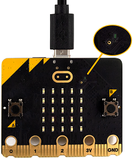

当micro:bit V2主板在麦克风测量声音级别时，麦克风LED指示灯就会亮起来。

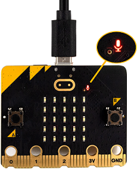

#### 3.3.4.3 所需组件

| | 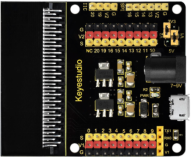  |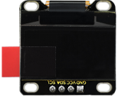 | 
| :--: | :--: | :--: |
| micro:bit V2 主板 ×1 | micro:bit传感器扩展板 ×1 |OLED显示屏 ×1 |
|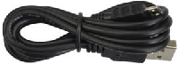 |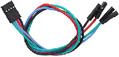|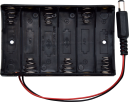|
| micro USB 线 ×1|4 pin 线材(黑红蓝绿) ×1 |电池盒 ×1|
|| | |
|AA电池(**自备**) ×6| | |

#### 3.3.4.4 接线图

⚠️ **特别注意：接线时，请注意区分线材颜色。**

| OLED显示屏 | 线材颜色 | micro:bit传感器扩展板引脚 |micro:bit主板引脚 |
| :--: | :--: | :--: | :--: |
| GND | 黑线 | G | G |
| VCC | 红线 | V2 | V |
| SDA | 蓝线 | 20 | P20 |
| SCL | 绿线 | 19 | P19 |

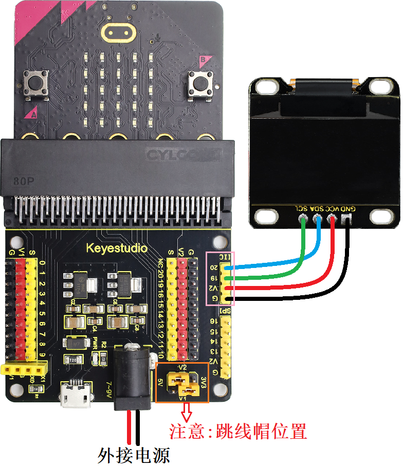

#### 3.3.4.5 代码流程图

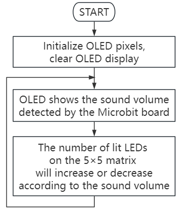

#### 3.3.4.6 实验代码

**完整代码：**

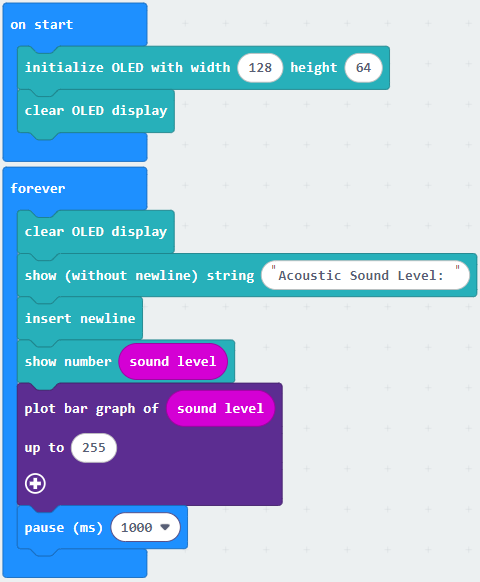

**简单说明：**

① 初始化OLED显示屏的像素，OLED清屏。

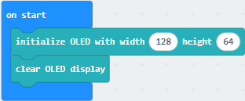

② OLED显示屏的一行显示字符串“Acoustic Sound Level: ”，插入新的一行，再显示噪音强度。

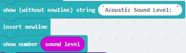

③ 根据“值”和“最大值”的数值显示一个垂直条形图。如果“最大值”为 0，则图表会自动调整。Microbit主板上的5×5LED点阵屏会根据噪音强弱的变化而变化，当噪音变强时，5×5LED点阵屏上点亮的LED灯个数也会增多，形成垂直条形图；反之，5×5LED点阵屏上点亮的LED灯会减少。

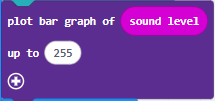

#### 3.3.4.7 实验结果

按照接线图接好线，利用micro USB数据线上电，同时还需要外接电源(6个AA电池安装到电池盒，保证电源充足)。

下载示例代码，使用Windows 10 App下载示例代码只需单击 “下载” 按钮即可；使用浏览器下载示例代码则需要将下载的 “.hex” 文件发送到micro:bit主板。

将示例代码传成功下载到micro:bit主板后，OLED显示屏会实时显示当前噪音强度相关信息，让用户直观地了解噪音的大小。

同时，Microbit主板上的5×5LED点阵屏也会根据噪音强度，5×5LED点阵屏上点亮的LED灯个数也会逐渐增多或减少，达到提醒噪音强度的效果。

