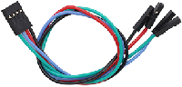
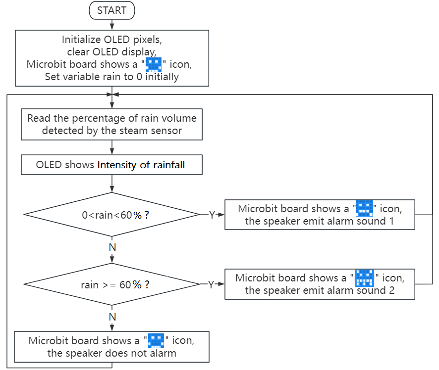

### 3.3.6 雨水监测

#### 3.3.6.1 简介

当水滴传感器检测到雨水时，它会向Micro:bit主板发送一个信号，可以触发各种动作。例如，可以用Micro:bit扬声器发出警报声，提醒用户正在下雨，同时在OLED显示屏上会实时显示当前雨水量。这一功能对户外天气或环境特别有用，使用户能够采取必要的预防措施。

此外，使用水滴传感器、OLED显示屏和Micro:bit主板的雨水监测系统也可用于检测屋顶或建筑物的漏水情况，帮助防止水入侵造成的损害。总的来说，水滴传感器是一个多功能的有效工具，可以在各种应用中检测雨水的存在。

#### 3.3.6.2 元件知识

**水滴传感器**

水滴传感器是一种可用于检测水存在的传感器，它通常用于雨水检测系统。当雨水接触到传感器上的导电垫（检测区）时，它会向开发板(例如：Micro:bit主板等)发送信号，以触发各种动作。检测区上的水量越多，模拟值越大。

**原理图：**

水滴传感器通过电路板上裸露的印刷平行线检测水量的大小。水量越多，就会有更多的导线被联通，随着导电的接触面积增大，雨滴感应区 2 脚输出的电压就会逐步上升。信号端 S 检测到的模拟值就越大。除了可以检测水量的大小，它还可以检测空气中的水蒸气。

**参数：**

- 工作电压: DC 3.3V~5V
- 工作电流: (Max)1.5mA@5V
- 最大功率: 0.075W
- 信号类型: 模拟信号

#### 3.3.6.3 所需组件

| |   | | 
| :--: | :--: | :--: |
| micro:bit主板 ×1 | micro:bit传感器扩展板 ×1 |OLED显示屏 ×1 |
|| ||
| 水滴传感器 ×1|micro USB 线 ×1|4 pin 线材(黑红蓝绿) ×1 |
||||
|3 pin 线材 ×1 |电池盒 ×1|AA电池(**自备**) ×6| 

#### 3.3.6.4 接线图

⚠️ **特别注意：接线时，请注意区分线材颜色。**

| OLED显示屏 | 线材颜色 | micro:bit传感器扩展板引脚 |micro:bit主板引脚 |
| :--: | :--: | :--: | :--: |
| GND | 黑线 | G | G |
| VCC | 红线 | V2 | V |
| SDA | 蓝线 | 20 | P20 |
| SCL | 绿线 | 19 | P19 |

|水滴传感器| 线材颜色 | micro:bit传感器扩展板引脚 |micro:bit主板引脚 |
| :--: | :--: | :--: | :--: |
| G | 黑线 | G | G |
| V | 红线 | V1 | V |
| S | 黄线 | 1 | P1 |

#### 3.3.6.5 代码流程图

#### 3.3.6.6 实验代码

⚠️ **特别注意：下面示例代码中，if()...else if()...判断语句中的阈值是可以根据实际情况加以修改的**

**完整代码：**

**简单说明：**

① 初始化OLED显示屏的像素，OLED清屏，定义变量rain的初始值为0和Microbit主板上的5×5LED点阵屏显示图案。

② 将水滴传感器读取的雨水量强度赋给于变量rain，同时OLED显示屏的整行显示雨水量强度。

③ 这是if()...else if()...else...的判断语句。

如果检测到的雨水量强度大于0小于60%时，Microbit主板上的5×5LED点阵屏显示图案，同时Microbit主板上的扬声器发出C3低音警报声。

否则如果检测到的雨水量强度大于等于60%时，Microbit主板上的5×5LED点阵屏显示图案，同时Microbit主板上的扬声器发出B5高音警报声。

否则，Microbit主板上的5×5LED点阵屏显示图案，扬声器也不发声。

④ 延时1000ms(即：1s)。

#### 3.3.6.7 实验结果

下载代码，使用Windows 10 App下载代码只需单击 “下载” 按钮即可，使用浏览器下载代码则需要将下载的 “hex” 文件发送到micro:bit主板。

示例代码成功下载到micro:bit主板之后，利用micro USB数据线上电，同时还需要外接电源(6个AA电池安装到电池盒，保证电源充足)。

OLED显示屏上会实时显示水滴传感器检测到的雨水量强度，当检测到的雨水量强度大于0小于60%时，Microbit主板上的5×5LED点阵屏显示图案，同时Microbit主板上的扬声器发出低音警报声。当检测到的雨水量强度大于等于60%时，Microbit主板上的5×5LED点阵屏显示图案，同时Microbit主板上的扬声器发出高音警报声。当未检测到任何雨水量时，Microbit主板上的5×5LED点阵屏显示图案，扬声器也不发声。

