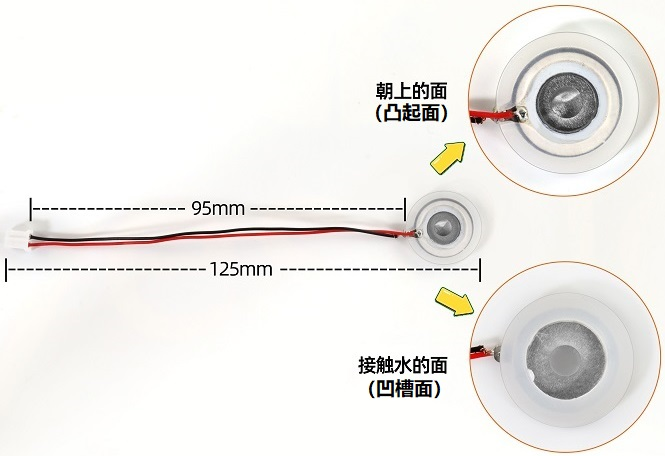
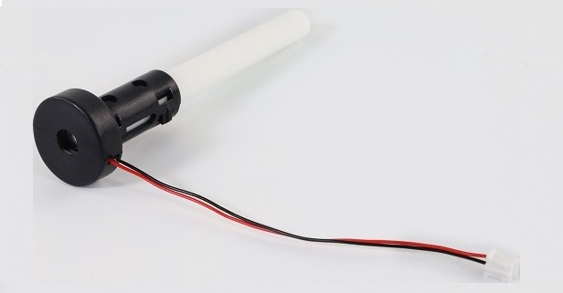

### 3.3.7 空气温湿度调节

#### 3.3.7.1 简介

本教程介绍如何使用Micro:bit主板、XHT11温湿度传感器、130电机模块、雾化模块和OLED显示屏，构建一个空气温湿度调节系统。

该系统的XHT11温湿度传感器能够测量环境中的温度和湿度，并根据需求控制风扇降温降湿和控制雾化模块喷出水雾增湿的效果。当温度超过设定阈值时，系统会自动开启风扇，将环境温度降至设定值以下；同时开启雾化模块喷出水雾来增湿，将环境湿度增大。同时，OLED显示屏会实时显示当前温度和湿度值。该系统能够实现自动调节环境温湿度的功能，对于需要控制环境温湿度的项目具有很好的应用价值。

#### 3.3.7.2 元件知识

**XHT11温湿度传感器**

XHT11温湿度传感器是一种数字信号输出的温湿度传感器。它利用特殊的模拟信号采集、转换技术和温度、温湿度传感技术，确保传感器拥有良好的长时间稳定性，和较高的可靠性。该传感器内部包含高精度的电阻式湿度传感器件，和电阻式热敏测温传感器件，并与一个8位的性能高的单片机相连接。

**XHT11通信方式：**

XHT11 器件采用简化的单总线通信。单总线即只有一根数据线，系统中的数据交换、控制均由单总线完成。

- 单总线传送数据位定义：

  - 单总线数据格式：一次传送 40 位数据，高位先出。

  - 8bit 湿度整数数据 + 8bit 湿度小数数据 + 8bit 温度整数数据 + 8bit 温度小数数据 + 8bit 校验位。**注：其中湿度小数部分为 0**。

- 校验位数据定义：
  
  - 8bit 湿度整数数据 + 8bit 湿度小数数据 + 8bit 温度整数数据 + 8bit 温度小数数据。8bit 校验位等于所得结果的末 8 位。

数据时序图如下：

用户主机（MCU）发送一次开始信号后，XHT11 从低功耗模式转换到高速模式，待主机开始信号结束后，XHT11 发送响应信号，送出 40bit 的数据，并触发一次信采集。信号发送如图所示:

⚠️ **注意:** 主机从 XHT11 读取的温湿度数据总是前一次的测量值，如两次测间隔时间很长，请连续读两次以第二次获得的值为实时温湿度值。

**原理图：**

**参数：**

- 工作电压: DC 3.3V~5V 
- 工作电流: (Max)2.5mA@5V
- 最大功率: 0.0125W
- 温度范围: -25 ~ +60°C (±2℃)
- 湿度范围: 5 ~ 95%RH（25C°左右精度为±5%RH）
- 输出信号: 数字双向单总线

**雾化模块**

雾化模块是由驱动模块和雾化片组成，主要作用是把水雾化加湿。可用单片机控制或手动按键控制。

**工作原理：** 加湿器雾化模块通常使用超声波技术来产生水雾。它包含一个压电陶瓷片，当通过其施加高频电压时，它开始振动。振动引起水的表面形成小水滴并其击散形成微细的水雾。

**水雾质量：** 加湿器雾化模块可以有效地将水分转化为微小的水粒子，通常在1至5微米的范围内。这种微细的水雾更容易在空气中蒸发和扩散，从而提供更有效的加湿效果。

⚠️ **特别注意：**

**1、开启开关后雾化片要放水里，长时间放空气中，雾化片会发烫烧毁。**

**2、将雾化片轻放于水面之上，若将整个雾化片放入水中，会导致雾化片无法成功产生水雾。**

**规格参数：**

- 工作电压：DC 3.3 ~ 5V
- 安装孔参数：孔径4.8mm，孔距16mm
- 模块尺寸：长31mm，宽23mm，高8mm
- 重量：4.5 g
- 工作温度范围：-25°C 到 +60°C
- 模块接口：3pin 2.54间距 弯排针
- 雾化片接口：PH2.0母端
- 实现功能：用于将水转化为微细的水雾，并将其释放到空气中

**雾化片尺寸图:**

**加装湿棉棒：**

安装加湿棉棒步骤：

将雾化片安装至塑料支架内部，注意雾化片的方向。雾化片的连接线放置在塑料支架凹槽处。

将另一边塑料支架装上。

将棉棒插入塑料支架中间。

雾化片接到模块的PH2.0母端，下图所示位置。

安装完成。

⚠️ **特别注意： 由于棉棒吸水需要时间，为了避免模块上电后棉棒未吸满水导致雾化片烧坏，请先将棉棒插入水中，待吸满水后再上传代码进行实验。**

**雾化模块使用说明:**

此雾化模块有两种控制模式：按键自动控制和单片机编程控制。

**按键自动控制：** 按下按键，开启雾化模块。再次按下按键，关闭雾化模块。

**单片机编程控制：** 模拟按键按下。按键在正常状态下输出高电平，当按键按下时，输出低电平；松开按键，再次输出高电平。

所以，使用单片机编程控制时，仅需输入一个短暂的低电平到雾化模块，即可模拟按键被按下；接着输入高电平，通过控制高电平的时间来控制雾化模块开启或暂停的时间。

⚠️ **特别注意： 由于棉棒吸水需要时间，为了避免模块上电后棉棒未吸满水导致雾化片烧坏，请先将棉棒插入水中，待吸满水后再上传代码进行实验。并且由于棉棒吸水的速率较慢，长时间工作后可能会导致雾化片每工作一段时间就会停止2~3秒，待棉棒吸水充足后又继续工作。**

#### 3.3.7.3 所需组件

| |   | | 
| :--: | :--: | :--: |
| micro:bit主板 *1 | micro:bit传感器扩展板 *1 |雾化模块 *1|
||| |
|XHT11温湿度传感器 *1|OLED显示屏 *1 |130电机模块 *1|
| |||
| micro USB 线 *1|4 pin 线材 *2 |3 pin 线材 *2 |
| || |
|风扇叶 *1|电池盒 *1|AA电池(**自备**) *6|

#### 3.3.7.4 接线图

⚠️ **特别注意：接线时，请注意区分线材颜色。**

| 130电机模块 | 线材颜色 | micro:bit传感器扩展板引脚 |micro:bit主板引脚 |
| :--: | :--: | :--: | :--: |
| G | 黑线 | G | G |
| V | 红线 | V2 | V |
| IN+ | 蓝线 | 2 | P2 |
| IN- | 绿线 | 13 | P13 |

| OLED显示屏 | 线材颜色 | micro:bit传感器扩展板引脚 |micro:bit主板引脚 |
| :--: | :--: | :--: | :--: |
| GND | 黑线 | G | G |
| VCC | 红线 | V2 | V |
| SDA | 蓝线 | 20 | P20 |
| SCL | 绿线 | 19 | P19 |

| 雾化模块 | 线材颜色 | micro:bit传感器扩展板引脚 |micro:bit主板引脚 |
| :--: | :--: | :--: | :--: |
| G | 黑线 | G | G |
| V | 红线 | V2 | V |
| S | 黄线 | 16 | P16 |

| XHT11温湿度传感器 | 线材颜色 | micro:bit传感器扩展板引脚 |micro:bit主板引脚 |
| :--: | :--: | :--: | :--: |
| G | 黑线 | G | G |
| V | 红线 | V1 | V |
| S | 黄线 | 0 | P0 |

#### 3.3.7.5 实验代码

⚠️ **特别注意：下面示例代码中，if...else if判断语句中的阈值是可以根据实际情况加以修改的**

**完整代码：**

**简单说明：**

① 初始化OLED显示屏的像素，OLED清屏，Microbit主板上的5×5LED点阵显示图案，定义两个变量temperature与humidity的初始值均为0 和 雾化模块不工作。

② 将XHT11温湿度传感器读取的温度值赋给于变量temperature，湿度值赋给于变量humidity。

③ OLED显示屏显示XHT11温湿度传感器检测到的温度和湿度。

④ 这是if()...else...的判断语句。

如果检测到的温度大于30或者湿度大于70时，风扇转动2秒后停止；然后雾化模块工作，喷出水雾；起到降温或降湿的效果。同时OLED显示屏还显示“Cooling/Humidifying”。

否则，风扇不转动，雾化模块也不启动。同时OLED显示屏还显示“Normal State”。

⑤ 延时500ms(即：0.5s)。

#### 3.3.7.6 实验结果

下载代码，使用Windows 10 App下载代码只需单击 “下载” 按钮即可，使用浏览器下载代码则需要将下载的 “hex” 文件发送到micro:bit主板。

将示例代码下载到micro:bit主板后，利用micro USB数据线上电，同时还需要外接电源(6个AA电池安装到电池盒，保证电源充足)。OLED显示屏实时显示XHT11温湿度传感器检测到的当前温度和湿度，当检测到的温度大于30或者湿度大于70时，风扇转动2秒后停止；然后雾化模块工作，喷出水雾，起到降温或降湿的效果，同时OLED显示屏还显示“Cooling/Humidifying”；否则，风扇不转动，雾化模块也不启动。同时OLED显示屏还显示“Normal State”。

