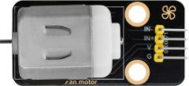

### 3.3.9 火灾检测报警

#### 3.3.9.1 简介

火灾检测报警‌，是预防家庭火灾的重要设备。它的主要作用是在探测到火源时触发报警，从而提醒人们采取措施防止火灾的发生或扩散。

在本项目教程中，将介绍如何使用Micro:bit主板、火焰传感器、130电机模块和Micro:bit主板上的扬声器与点阵，构建一个火灾检测报警系统。火焰传感器检测有火源时，Micro:bit主板上的扬声器发出警报，同时Micro:bit主板上的点阵显示提示图案，然后启动风扇转动，达到灭火的效果。

#### 3.3.9.2 元件知识

**火焰传感器**

火焰传感器上有一个远红外火焰探头，起着非常重要的作用，它可以检测火焰或者波长在760纳米～1100纳米范围内的光源，它的探测角度为60度左右，它对火焰光谱特别灵敏并且灵敏度可调，性能稳定，是救火机器人必备部件。该传感器有两个信号输出端，分别可输出数字信号与模拟信号。

此外，通过旋转电位器可以调整火焰传感器的灵敏度。上电后，传感器上的一个指示灯亮绿灯，并且还可以通过调节蓝色的电位器(**使用一字螺丝刀调节**)，使模块上另一个指示灯介于不亮与亮之间的临界点时，灵敏度最高。

**原理图：**

**参数：**

- 工作电压: DC 3.3V~5V
- 工作电流: 1.2mA
- 最大功率: 0.006W
- 输出信号：模拟信号和数字信号
- 工作温度：-10°C ~ +50°C

#### 3.3.9.3 所需组件

| |   || 
| :--: | :--: | :--: |
| micro:bit主板 *1 | micro:bit传感器扩展板 *1 |火焰传感器 *1 |
| | ||
|130电机模块 *1| micro USB 线 *1|4 pin 线材 *2 |
| || |
|风扇叶 *1|电池盒 *1|AA电池(**自备**) *6|

#### 3.3.9.4 接线图

⚠️ **特别注意：接线时，请注意区分线材颜色。**

| OLED显示屏 | 线材颜色 | micro:bit传感器扩展板引脚 |micro:bit主板引脚 |
| :--: | :--: | :--: | :--: |
| GND | 黑线 | G | G |
| VCC | 红线 | V2 | V |
| SDA | 蓝线 | 20 | P20 |
| SCL | 绿线 | 19 | P19 |

| 130电机模块 | 线材颜色 | micro:bit传感器扩展板引脚 |micro:bit主板引脚 |
| :--: | :--: | :--: | :--: |
| G | 黑线 | G | G |
| V | 红线 | V2 | V |
| IN+ | 蓝线 | 2 | P2 |
| IN- | 绿线 | 16 | P16 |

| 火焰传感器 | 线材颜色 | micro:bit传感器扩展板引脚 |micro:bit主板引脚 |
| :--: | :--: | :--: | :--: |
| G | 黑线 | G | G |
| V | 红线 | V1 | V |
| D | 蓝线 | 9 | P9 |
| A | 绿线 | 2 | P2 |

#### 3.3.9.5 实验代码

**完整代码：**

**简单说明：**

① 初始化OLED显示屏的像素，OLED清屏和定义变量fire_value的初始值为0。

② 将火焰传感器读取的火焰强度值赋给于变量fire_value。

③ 这是if()...else...的判断语句。

当火焰传感器检测到火焰时，OLED显示字符串 “Have a fire” 和火焰强度，Microbit主板上的5×5LED点阵显示图案，扬声器发出警报声，1s时间后启动风扇转动；否则，OLED显示字符串 “No fire”，Microbit主板上的5×5LED点阵显示图案，扬声器不发声，风扇不转动。

#### 3.3.9.6 实验结果

下载代码，使用Windows 10 App下载代码只需单击 “下载” 按钮即可，使用浏览器下载代码则需要将下载的 “hex” 文件发送到micro:bit主板。

将示例代码下载到micro:bit主板后，利用micro USB数据线上电，同时还需要外接电源(6个AA电池安装到电池盒，保证电源充足)。当火焰传感器检测到火焰(可以使用打火机打火)时，OLED显示字符串 “Have a fire” 和火焰强度，Microbit主板上的5×5LED点阵显示图案，扬声器发出警报声，1s时间后启动风扇转动，达到灭火的效果；否则，OLED显示字符串 “No fire”，Microbit主板上的5×5LED点阵显示图案，扬声器不发声，风扇不转动。

