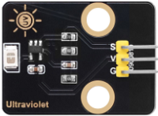
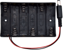
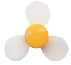
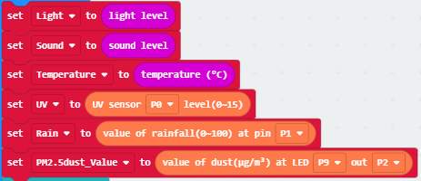
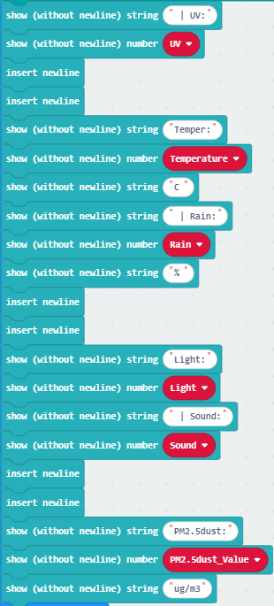

### 3.3.9 基于Micro:bit的多传感器OLED监控平台

#### 3.3.9.1 简介

在本项目实验中，利用Micro:bit主板作为核心处理单元，读取其内置传感器(例如：Micro:bit光线传感器，Micro:bit温度传感器和Micro:bit麦克风)及外接传感器(例如：PM2.5粉尘传感器、水滴传感器、火焰传感器和太阳光紫外线传感器)的数据，并通过I2C接口的OLED显示屏进行实时、直观的显示。

#### 3.3.9.2 所需组件

| |  || 
| :--: | :--: | :--: |
| micro:bit V2 主板 ×1 | micro:bit传感器扩展板 ×1 |OLED显示屏 ×1 |
| |||
| PM2.5粉尘传感器 ×1|电机模块 ×1 |水滴传感器 ×1 |
||| |
|太阳紫外线传感器 ×1|电池盒 ×1|AA电池(**自备**) ×6|
| |||
|4 pin 线材(红黑蓝绿) ×1|4 pin 线材(黑红蓝绿) ×2 |3 pin 线材 ×3 |
| | |  |
| micro USB 线 ×1|雾化模块 ×1|风扇叶 ×1|

#### 3.3.9.3 接线图

⚠️ **特别注意：接线时，请注意区分线材颜色。**

|太阳紫外线传感器| 线材颜色 | micro:bit传感器扩展板引脚 |micro:bit主板引脚 |
| :--: | :--: | :--: | :--: |
| G | 黑线 | G | G |
| V | 红线 | V2 | V |
| S | 黄线 | 0 | P0 |

|水滴传感器| 线材颜色 | micro:bit传感器扩展板引脚 |micro:bit主板引脚 |
| :--: | :--: | :--: | :--: |
| G | 黑线 | G | G |
| V | 红线 | V1 | V |
| S | 黄线 | 1 | P1 |

| PM2.5粉尘传感器 | 线材颜色 | micro:bit传感器扩展板引脚 |micro:bit主板引脚 |
| :--: | :--: | :--: | :--: |
| VCC | 红线 | V2 | V |
| GND | 黑线 | G | G |
| LED | 蓝线 | 9 | P9 |
| OUT | 绿线 | 2 | P2 |

| 雾化模块 | 线材颜色 | micro:bit传感器扩展板引脚 |micro:bit主板引脚 |
| :--: | :--: | :--: | :--: |
| G | 黑线 | G | G |
| V | 红线 | V2 | V |
| D | 黄线 | 16 | P16 |

| 电机模块 | 线材颜色 | micro:bit传感器扩展板引脚 |micro:bit主板引脚 |
| :--: | :--: | :--: | :--: |
|  G  | 黑线 | G | G |
|  V  | 红线 | V2 | V |
| IN+ | 蓝线 | 13 | P13 |
| IN- | 绿线 | 15 | P15 |

| OLED显示屏 | 线材颜色 | micro:bit传感器扩展板引脚 |micro:bit主板引脚 |
| :--: | :--: | :--: | :--: |
| GND | 黑线 | G | G |
| VCC | 红线 | V2 | V |
| SDA | 蓝线 | 20 | P20 |
| SCL | 绿线 | 19 | P19 |

#### 3.3.9.4 代码流程图

#### 3.3.9.5 实验代码

**完整代码：**

**简单说明：**

① 初始化OLED显示屏的像素，OLED清屏，Microbit主板上的5×5LED点阵显示图案，定义变量UV、Rain、Temperature、Light、Sound与pm2.5_dust的初始值为0。

② 读取光线强度，噪音强度，温度，太阳光紫外线强度，雨水量强度和PM2.5粉尘浓度值。

③ 这是if()...else...的判断语句。

当Microbit主板上的按键A时，电机模块上的风扇转动；否则，风扇不转动。

④ 这也是if()...else...的判断语句。

当Microbit主板上的按键B时，雾化模块工作，喷出水雾；否则，雾化模块不工作。

⑤ OLED显示屏显示太阳光紫外线强度，温度，雨水量强度，光线强度，噪音强度和PM2.5粉尘浓度。

#### 3.3.9.6 实验结果

按照接线图接好线，利用micro USB数据线上电，同时还需要外接电源(6个AA电池安装到电池盒，保证电源充足)。

下载示例代码，使用Windows 10 App下载示例代码只需单击 “下载” 按钮即可；使用浏览器下载示例代码则需要将下载的 “.hex” 文件发送到micro:bit主板。

将示例代码传成功下载到micro:bit主板后，读取Micro:bit主板内置传感器(例如：Micro:bit光线传感器，Micro:bit温度传感器和Micro:bit麦克风)及外接传感器(例如：PM2.5粉尘传感器、水滴传感器、火焰传感器和太阳光紫外线传感器)检测到的相关数据，并通过I2C接口的OLED显示屏进行实时、直观的显示。

