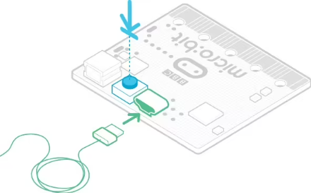

## 故障排除

关于Microbit无法下载程序，盘符显示MAINTENANCE的解决方法

#### 1. 问题现象：

很多新用户最近遇到，刚买到的Micro:bit主板插上Micro USB线连接到计算机上，点击 “**下载**” ，代码程序下载不进去，Micro:bit主板没有反应。

如果用户的软件操作没有问题的话，可能是自己不小心按着Micro:bit主板背面上的复位键进入了Micro:bit刷固件模式或者可能是自己的一些误操作导致Micro:bit主板丢失了固件。
所谓的刷固件模式：插上Micro:bit主板，显示多了一个盘符“MAINTENANCE”，进入了刷固件模式后，是无法进行正常的代码程序下载的。

 #### 2. 解决办法：

（1）从此页面将十六进制文件（.hex）下载到您的计算机上。 

下载最新的micro:bit固件-0255的链接：[https://www.microbit.org/get-started/user-guide/firmware/](https://www.microbit.org/get-started/user-guide/firmware/)

（注意：你可以点击上述链接下载最新固件-0255十六进制文件；如果你不下载，在相应的文件夹中也有我们事前下载好的最新固件-0255十六进制文件）

（2）按照下图操作，直接将下载好的最新固件-Firmware for V2.20_V2.21十六进制文件拖到 “MAINTENANCE”，即可将Micro:bit主板恢复到正常模式。(特别提醒：根据Micro:bit主板的型号选择不同的固件，这里是以固件-Firmware for V2.20_V2.21为例。)

#### 3. 如何避免进入“MAINTENANCE”：

（1）Micro:bit主板插入Micro USB线时，不要按着Micro:bit主板背面上的复位键，再插Micro USB线。

 很多新手不小心按着Micro:bit主板背面上的复位键插上Micro USB线就进入了刷固件模式。（新手常犯的错误）

（2）在micro:bit程序下载过程中，不要突然拔掉，这可能导致固件丢失，micro:bit主板就会进入刷固件模式了。

（3）在实验过程中，接线接错，导致短路，也有可能导致micro:bit固件丢失，新手操作一定要注意。

#### 4. 使用 WebUSB 进行下载的故障排除:

Micro：bit与WebUSB（/ device / usb / webusb）配对时遇到问题？让我们尝试找出原因。

**步骤1: 检查你的micro USB线**

确保使用micro USB线将micro：bit连接到电脑。 连接后，您应该会在Windows资源管理器中看到一个MICROBIT 驱动器。 

如果可以看到MICROBIT驱动器，请转到步骤2。如果看不到该驱动器，请执行以下操作：

确保micro USB线正常工作。micro USB线是否在另一台电脑上工作？如果不是，请查找其他micro USB线。某些micro USB线可能仅提供电源连接，实际上并未传输数据。在电脑上尝试另一个USB端口。 USB线是否正常，但是您仍然看不到MICROBIT 驱动器？ 嗯，您的micro：bit可能有问题。尝试在microbit.org上的故障查找页面中（[https://support.microbit.org/support/solutions/articles/19000024000-fault-finding-with-a-micro-bit](https://support.microbit.org/support/solutions/articles/19000024000-fault-finding-with-a-micro-bit)）描述的其他步骤。如果这样做没有帮助，您可以创建支持通知单（[https://support.microbit.org/support/tickets/new](https://support.microbit.org/support/tickets/new)）将问题通知Micro：bit基金会。 跳过其余步骤。

**步骤2: 检查您的固件版本**

micro：bit上的固件版本可能需要更新，让我们检查： 

1. 找到 **MICROBIT** 驱动。 

2. 打开 DETAILS.TXT 文件。

3. 在文件中查找接口版本行和引导装载程序行等相关信息。

如果版本为0234、0241、0243，则需要更新固件（/设备/固件）在您的micro：bit上。转到步骤3，然后按照升级说明进行操作。

如果版本是0249、0257或更高版本，则您具有正确的固件，请转到步骤4。

**步骤3: 升级固件**

将您的micro：bit进入维护模式。为此，请从micro：bit主板上拔下micro USB线，然后在按住复位按钮的同时重新连接micro USB线。 插入micro USB线后，可以释放复位按钮。 现在，您应该像以前一样看到一个MAINTENANCE驱动器，而不是MICROBIT驱动器。 同样，黄色的LED指示灯将在重置按钮旁边保持点亮。

（1）下载 firmware .hex file ([https://microbit.org/guide/firmware/](https://microbit.org/guide/firmware/))。(特别提醒：根据Micro:bit主板的型号选择不同的固件，这里是以固件-Firmware for V2.20_V2.21为例。)

（2）将固件.hex文件拖放到 **MAINTENANCE** 驱动器上。

（3）复制.hex文件时，黄色LED指示灯将闪烁。复制完成后，LED会熄灭，并且micro：bit会重置。现在，MAINTENANCE驱动器会变回MICROBIT。 

（4）升级完成！ 您可以打开 DETAILS.TXT 文件进行检查并查看固件版本已更改为与您复制的HEX文件的版本相匹配。

如果您想了解有关连接板，维护模式和升级固件的更多信息，请在固件指南请在固件指南（[https://microbit.org/guide/firmware/](https://microbit.org/guide/firmware/)）中进行阅读。

**步骤4: 检查您的浏览器版本**

WebUSB是一项相当新的功能，可能需要您更新浏览器。 检查您的浏览器版本是否符合以下条件之一： 适用于Android，Chrome操作系统，Linux，macOS和Windows 10的Chrome 65+。 

**步骤5: 配对装置**

更新固件后，打开Chrome浏览器，转到编辑器，然后点击齿轮菜单中的“配对设备”。 有关配对说明，请参见WebUSB（/ device / usb / webusb），对应的链接：[https://microbit.org/get-started/user-guide/web-usb/](https://microbit.org/get-started/user-guide/web-usb/) 。

享受快速下载！

