## 4.2.1 MU on Windows

Click “**This PC**” to check “**Properties**” to know whether your system is 32 bit or 64 bit.

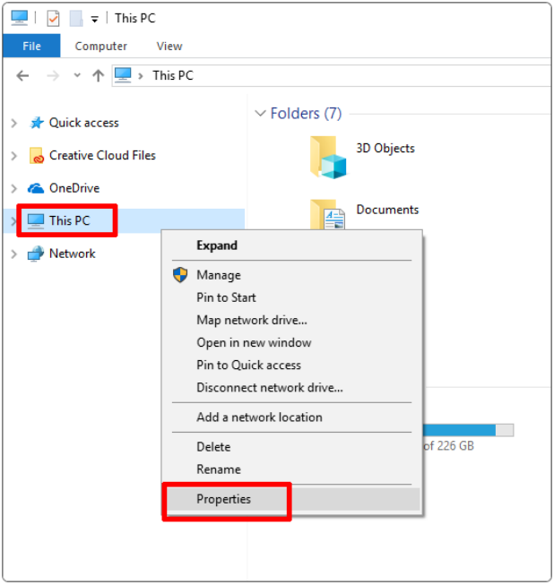

The system type can be seen: 64-bit

⚠️ **Note:** MU no longer supports 32-bit Windows. The currently recommended version is MU 1.2.0. So please update to this version on your computer.

### 4.2.1.1 Download MU

[Click to download the MU on Windows](https://codewith.mu/en/download).

### 4.2.1.2 Install MU

**Step 1-Run the installation program:**

Find the installer you just downloaded (it may be in your download folder) and click to open it.

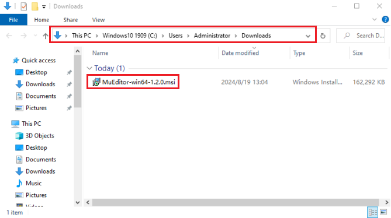

A warning message will be popped up on Windows Defender. Click “**More info**”.

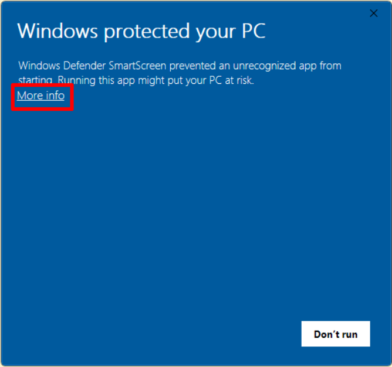

The message will change to provide more information about the installer, and display a “**Run anyway**” button. Click the button.

**Step 2-License agreement:**

Check the license, tick the accept box, and click “**Install**”.

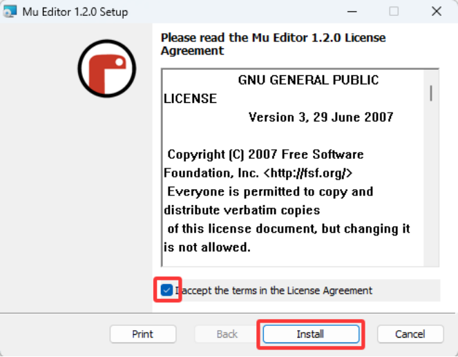

**Step 3-Installation:**

When MU is installed on your computer, it takes a few seconds.

**Step 4-Complete:**

After installed, click “**Finish**”.

**Step 5-Start the MU:**

Directly click MU to enter it, or search it to open. At the first start, this may take a few seconds.

MU main interface:

[How to install MU on windows?](https://codewith.mu/en/howto/1.2/install_windows) 

## 4.2.2 MU on MacOSX

### 4.2.2.1 Download MU

[Click to download the MU on MacOS](https://codewith.mu/en/download).

### 4.2.2.2 Install MU

[How to install MU on MacOS?](https://codewith.mu/en/howto/1.2/install_macos) 

## 4.2.3 MU on Linux

### 4.2.3.1 Download MU

[Click to download the MU on Linux](https://codewith.mu/en/download).

### 4.2.3.2 Install MU

[How to install MU on Linux?](https://codewith.mu/en/howto/1.2/install_linux) 

## 4.3 Settings and Toolbar

⚠️ **Note:** Here we demonstrate how to use it on Windows system (as a reference for MacOSX and Linux).

Set “**Mode**” to BBC micro:bit when used for the first time.

Open MU, click the “**Mode**” to select “**BBC micro：bit**”, and then click “**OK**”.

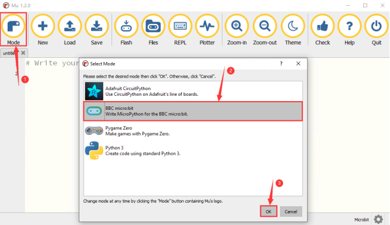

Please refer to the [official introduction and tutorials for the MU operations](https://codewith.mu/en/tutorials/1.1/start).

For more tutorials about MU, please visit: [https://codewith.mu/en/tutorials/](https://codewith.mu/en/tutorials/)

## 4.4 Import Library on MU

⚠️ **Note:** Before importing a library file, you need to upload a .py code (empty code is also acceptable) to the micro:bit board . Here, we import an empty code.

1\. Connect the micro:bit board to the computer via a micro USB cable, open the Mu editor, click “**New**” to create a .py code(empty), and then click the “**Flash**” to upload the empty code to the board.

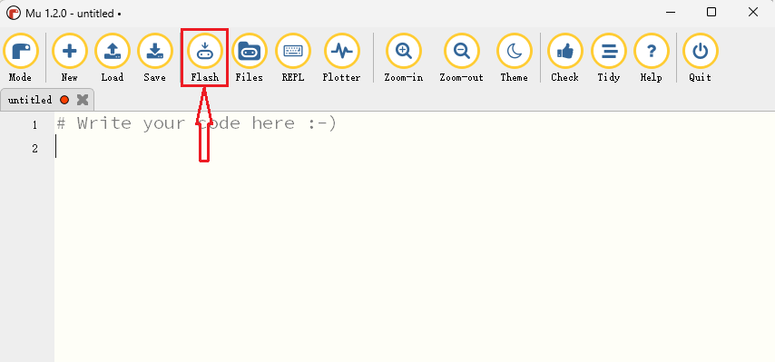

In this tutorial, OLED display and XHT11 temperature and humidity sensor require libraries. So we need to import “**oled_ssd1306\.py**” and “**DHT11\.py**”.

The default directory for saving files in MU is “**mu_code**”, which is located in the root directory of the user directory. 

Reference: [https://codewith.mu/en/tutorials/1.0/files](https://codewith.mu/en/tutorials/1.0/files).

**2\. Import libraries:**

2.1\. Double-click to open the C drive of your computer. Search for "**mu_code**” on the C drive of your computer and find the "**mu_code**” folder.

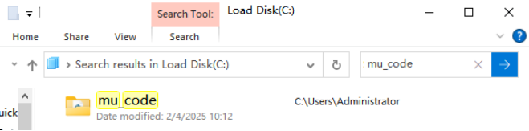

2.2\. Open “**mu_code**”.

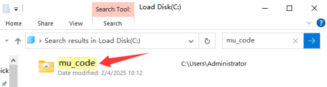

2.3\. Copy and paste the library files “**oled_ssd1306\.py**” and “**DHT11\.py**” from the “**Libraries**” folder to the “**mu_code**” directory at the following path.

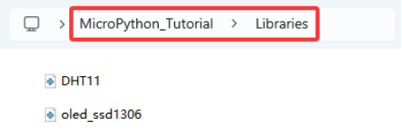

2.4\. In “**mu_code**”, you then can see “**oled_ssd1306\.py**” and “**DHT11\.py**”:

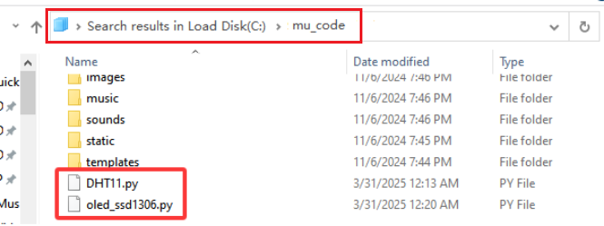

2.5\. Open MU and click “**Files**”. Drag “**DHT11\.py**” to the micro:bit.

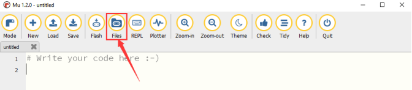

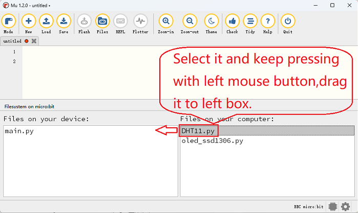

2.6\. And you can see “**DHT11\.py**” in the left box:

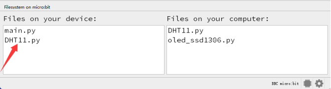

2.7\. Similarly, import “**oled_ssd1306\.py**”.

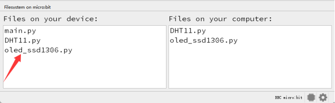

2.8\. After adding the library files “**oled_ssd1306\.py**” and “**DHT11\.py**” , click the “**Files**” button again.

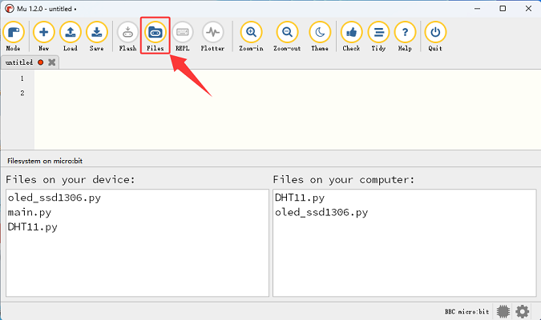

⚠️ **Note: After importing libraries, click “**Flash**” to download the .py code file to micro:bit board. If the on-board 5*5 LED matrix shows the error, you need to re-load these libraries.**

## 4.5 Load Code to MU

Here we take “**heartbeat\.py**” in the folder “**Heart beat**” as an example.

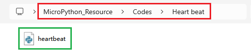

**Method one:**

Open MU and click “**Load**” to open the file you need.

Loaded:

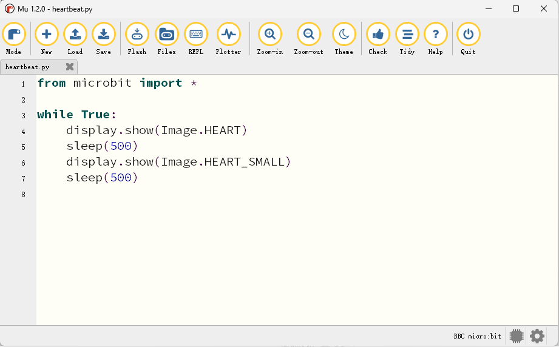

**Method two:**

There is a much simpler way to load code.

Open MU and click  , select “**heartbeat\.py**” and drag it into MU:

Loaded:

## 4.6 Download Code to Mciro:bit

⚠️ **Note:** After uploading a code to the micro:bit board, the original content will be overwritten, so it needs to be re-imported the next time you use it.

Connect micro:bit board to computer via USB cable.

Click “**Flash**” to load the code to micro:bit board.

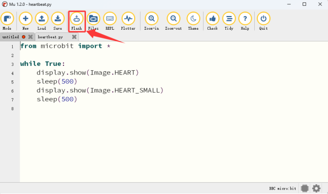

After downloading, **power on via micro USB cable**, and the on-board 5×5 LED matrix shows  and  in a loop.

⚠️ **Note:** If the code includes errors, it can also be downloaded to micro: bit, but it does not work properly.

For example, when sleep() is wrongly written to sleeps(), click “**Flash**” to download the code to the board, and the 5×5 LED matrix may show error message and incorrect line number.

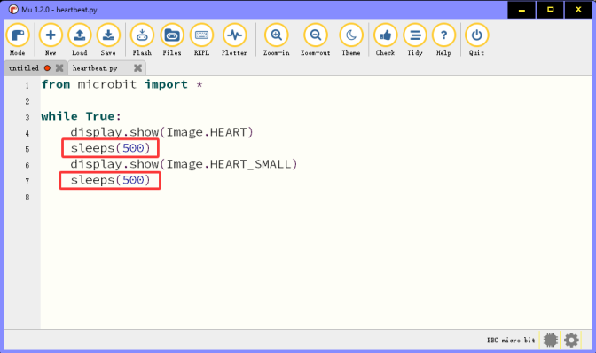

Click “**REPL**” and the reset button (**on the back of micro:bit board, not A/B button**), and the error message will be displayed in the REPL.

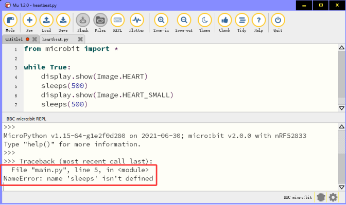

Click “**REPL**” again to close it. After correcting the error, click “**Flash**” to re-download the code.

After writing the code, click “**Check**” to ensure the code is correct. For instance, click “**Check**” and the MU will point out errors.

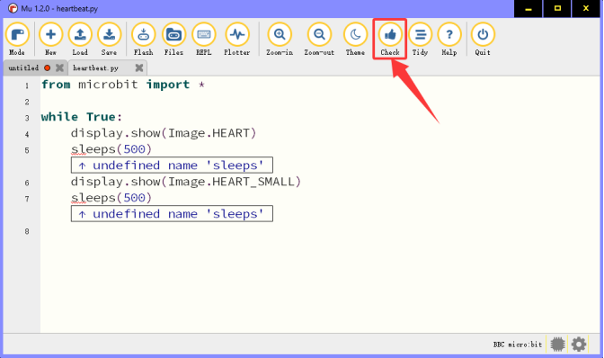

Modify the code according to the prompt, and then click “**Check**” to ensure the code is now correct.

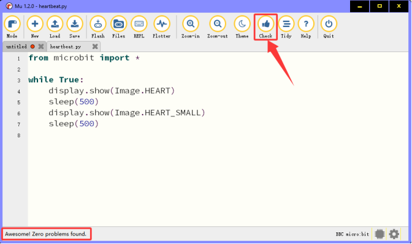

For more tutorials of MU, please visit: [https://codewith.mu/en/tutorials/](https://codewith.mu/en/tutorials/)

