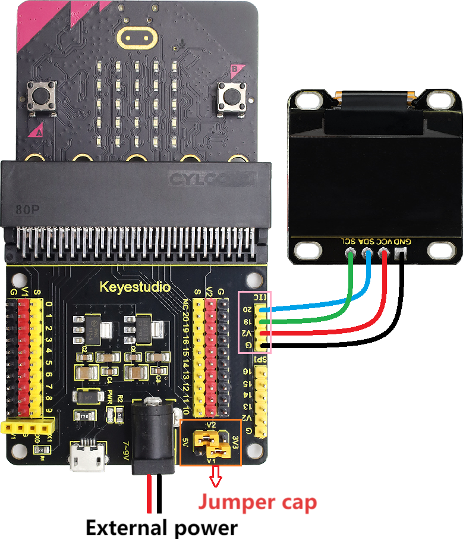
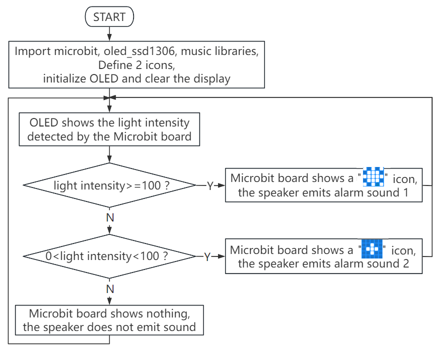
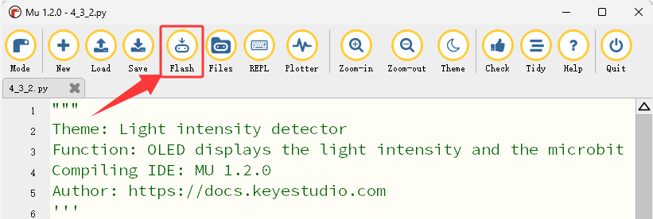

### 4.3.2 Light Intensity Detector

#### 4.3.2.1 Overview


The light intensity detector, also known as the illuminance meter or Lux meter, is a specialized instrument used to measure the total amount of light (i.e., illuminance) that shines on a surface. It works mainly based on the photoelectric effect.

In this project, the brightness detected by the light sensor will be displayed in real time on the OLED. When it exceeds a certain value, the speaker on the board will alarm to serve as a warning and reminder.

Light intensity detectors are widely used in almost all situations that require the quantification of “light”, such as outdoor and road lighting, indoor lighting design and acceptance, photography and video production, architecture and health, etc.


#### 4.3.2.2 Component Knowledge


**Microbit Light Sensor**


Since the micro:bit board does not contains its own photoresistor, the LED matrix will shoulder this job. The light signal will convert into input, and the voltage decay time is sampled so that the detected light intensity is a relative value. (**Note**: the light brightness is output to the serial port, and it is a relative value.)

**Microbit Speaker**


Micro: Bit board boasts an built-in speaker, which makes sound to the programs easier. It is also able to make sound such as utter giggles, greetings and yawning as well as all kinds of tones, notes and beats. For example, it can play the song *Ode to Joy*.


#### 4.3.2.3 Required Components

| |   | |
| :--: | :--: | :--: |
|    micro:bit V2 main board ×1    |         micro:bit shield ×1         |         OLED display ×1         |
| |||
|        micro USB cable ×1        | 4 pin wire ×1 |        battery holder ×1        |
|| | |
|AA battery(**self-prepared**) ×6| | |

#### 4.3.2.4 Wiring Diagram

⚠️ **When wiring, please pay attention to the wire color.**

| OLED display | wire color | micro:bit shield pin | micro:bit board pin |
| :----------: | :--------: | :------------------: | :-----------------: |
|     GND      |   black    |          G           |          G          |
|     VCC      |    red     |          V2          |          V          |
|     SDA      |    blue    |          20          |         P20         |
|     SCL      |   green    |          19          |         P19         |



#### 4.3.2.5 Code Flow



#### 4.3.2.6 Test Code

⚠️ **<span style="color: rgb(255, 76, 65);">Tip 1: Before downloading the code to the Microbit board, please import the “oled_ssd1306” library refering to </span>** “[Import Library on MU](https://docs.keyestudio.com/projects/KS4050/en/latest/docs/MicroPython/MU_development_environment.html#import-library-on-mu)” .


⚠️ **Tip 2: The threshold in the “if()...elif()...” condition can be modified according to the actual situation.**

**Complete code:**

```Python
'''
Theme: Light intensity detector
Function: OLED displays the light intensity and the microbit light sensor controls the 5*5 dot matrix and speaker
Compiling IDE: MU 1.2.0
Author: https://docs.keyestudio.com
'''
# import related libraries
from microbit import *
from oled_ssd1306 import *
import music

val1 = Image("90909:""09990:""99999:""09990:""90909")  # Set pattern
val2 = Image("00000:""00900:""09990:""00900:""00000")  # Set pattern

# initialize and clear oled
initialize()  # initialize oled
clear_oled()  # clear oled

while True:
    clear_oled()  # clear OLED
    Lightintensity = display.read_light_level() # Read the light intensity detected by the microbit light sensor and assign it to the variable Lightintensity
    add_text(0, 0, 'Lightintensity:')  # Display the character string in the corresponding position of OLED
    add_text(16, 0, str(Lightintensity))  # Display Lightintensity in the corresponding position of OLED
    if Lightintensity >= 100: # when Light intensity > 100
       display.show(val1)   # LED matrix displays the set pattern1
       music.play("C5:1")   # speaker plays C5 tone
       sleep(50)
       music.play("D5:2")   # speaker plays D5 tone
       sleep(50)
       music.play("B5:4")   # speaker plays B5 tone
       sleep(50)
    elif Lightintensity > 0 and Lightintensity < 100:  # when 0 < Light intensity < 100
       display.show(val2)   # LED matrix displays the set pattern2
       music.play("C3:1")   # speaker plays C3 tone
    else: # or
       display.clear()   # Set the brightness of all LEDs to 0 (off)
       music.reset()     # no tone
    sleep(1000)
```


**Brief explanation:**

① Import libraries of microbit, oled_ssd1306 and music.

```Python
# import related libraries
from microbit import *
from oled_ssd1306 import *
import music
```

② Define two patterns.

```Python
val1 = Image("90909:""09990:""99999:""09990:""90909")  # Set pattern
val2 = Image("00000:""00900:""09990:""00900:""00000")  # Set pattern
```

③ Initialize OLED pixels, clear the OLED. 

```Python
initialize()  # initialize oled
clear_oled()  # clear oled
```

④ Read the brightness value by the microbit and display it on the OLED.

```Python
Lightintensity = display.read_light_level() # Read the light intensity detected by the microbit light sensor and assign it to the variable Lightintensity
add_text(0, 0, 'Lightintensity:')  # Display the character string in the corresponding position of OLED
add_text(16, 0, str(Lightintensity))  # Display Lightintensity in the corresponding position of OLED
```

⑤ Judgement statement: if()...elif()...else...

When the detected brightness is greater than or equal to 100, the 5×5LED matrix shows , and the speaker makes the alarm sound 1.

```Python
if Lightintensity >= 100: # when Light intensity > 100
   display.show(val1)   # LED matrix displays the set pattern1
   music.play("C5:1")   # speaker plays C5 tone
   sleep(50)
   music.play("D5:2")   # speaker plays D5 tone
   sleep(50)
   music.play("B5:4")   # speaker plays B5 tone
   sleep(50)
```

If the detected brightness is between 0 and 100, the 5×5LED matrix shows , and the speaker makes the alarm sound 2.

```Python
elif Lightintensity > 0 and Lightintensity < 100:  # when 0 < Light intensity < 100
   display.show(val2)   # LED matrix displays the set pattern2
   music.play("C3:1")   # speaker plays C3 tone
```

Otherwise, the 5×5LED matrix shows nothing and the speaker does not sound.

```Python
else: # or
   display.clear()  # Set the brightness of all LEDs to 0 (off)
   music.reset()    # no tone
```

⑥ Delay 1000ms(1s).

```Python
sleep(1000)
```

#### 4.3.2.7 Test Result


After wiring up and power on by micro USB cable, connect to external power(6 AA batteries) to ensure sufficient power supply, and click “<span style="color: rgb(255, 76, 65);">Flash</span>” to download the code to micro:bit board.



After uploading test code, press the reset button on the back of micro:bit.


The OLED shows the brightness value detected by the light sensor in real time. When the detected brightness is greater than 100, the 5×5 LED matrix shows , and the speaker makes the alarm sound 1 as a high-level warning. If the detected brightness is between 0 and 100, the 5×5 LED matrix shows , and the speaker makes the alarm sound 2 as a low-level warning. Otherwise, the 5×5 LED matrix shows nothing and the speaker does not sound.


⚠️ **Note: The building blocks in the experiment are not included in this kit.**

<span style="color: rgb(0, 209, 0);">(**Tip:** If no result is observed, please press the reset button of the micro:bit board.)</span>


