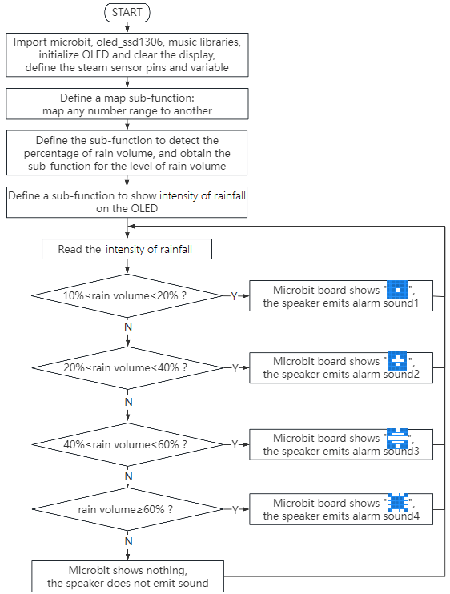
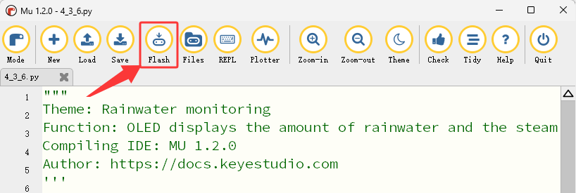

### 4.3.6 Rainwater Monitoring

#### 4.3.6.1 Overview


When the steam sensor detects rain, it sends a signal to the micro:bit board to trigger various actions. For instance, the micro:bit speaker can emit an alarm to alert users that it is raining, and the current amount of rain will be displayed in real time on the OLED. This is particularly useful in outdoor weather or environment, enabling users to take necessary preventive measures. In addition, a rainwater monitoring system, including steam sensor, OLED display and micro:bit board, can detect leaks in roofs or buildings to prevent damage caused by water intrusion. 

Overall, it is a multi-functional and effective tool that can detect the presence of rainwater in various applications.


#### 4.3.6.2 Component Knowledge


**Steam Sensor**


The steam sensor can detect the presence of water so is typically employed in rainwater detection systems. When rainwater comes into contact with the conductive pad (detection area) on the sensor, it will send a signal to the development board (micro:bit, etc.) to trigger various actions. The more water there is in the detection area, the greater the analog value will be.


**Schematic diagram:**


It detects the amount of water by the exposed parallel lines on the circuit board. The more water there is, the more wires will be connected. As the contact area for conduction increases, the voltage output at pin 2 of the sensing area will gradually rise, and the greater the analog value detected at the signal terminal S will be. In addition to water, it can also detect water vapor in the air.

**Parameters:**

- Operating voltage: DC 3.3V~5V
- Operating current: (Max)1.5mA@5V
- Maximum power: 0.075W
- Signal type: Analog signal


#### 4.3.6.3 Required Components

| |   | |
| :--: | :--: | :--: |
|   micro:bit V2 main board ×1   |        micro:bit shield ×1         |           OLED display ×1           |
|| ||
|        steam sensor ×1         |         micro USB cable ×1         | 4 pin wire ×1 |
||||
|         3 pin wire ×1          |         battery holder ×1          |  AA battery(**self-prepared**) ×6   |

#### 4.3.6.4 Wiring Diagram

⚠️ **When wiring, please pay attention to the wire color.**

| OLED display | wire color | micro:bit shield pin | micro:bit board pin |
| :----------: | :--------: | :------------------: | :-----------------: |
|     GND      |   black    |          G           |          G          |
|     VCC      |    red     |          V2          |          V          |
|     SDA      |    blue    |          20          |         P20         |
|     SCL      |   green    |          19          |         P19         |

| steam sensor | wire color | micro:bit shield pin | micro:bit board pin |
| :----------: | :--------: | :------------------: | :-----------------: |
|      G       |   black    |          G           |          G          |
|      V       |    red     |          V1          |          V          |
|      S       |   yellow   |          1           |         P1          |


#### 4.3.6.5 Code Flow



#### 4.3.6.6 Test Code

⚠️ **<span style="color: rgb(255, 76, 65);">Tip 1: Before downloading the code to the Microbit board, please import the library file “oled_ssd1306\.py” refering to </span>** “[Import Library on MU](https://docs.keyestudio.com/projects/KS4050/en/latest/docs/MicroPython/MU_development_environment.html#import-library-on-mu)” .


⚠️ **Tip 2: The threshold in the “if()...elif()...” condition can be modified according to the actual situation.**

**Complete code:**

```Python
'''
Theme: Rainwater monitoring
Function: OLED displays the amount of rainwater and the steam sensor controls the fan and atomization module
Compiling IDE: MU 1.2.0
Author: https://docs.keyestudio.com
'''
from microbit import *
from oled_ssd1306 import *
import math
import music

# Initialize OLED
initialize()
clear_oled()

# Configuration parameters
RAIN_PIN = pin1
WET_VALUE = 1023
DRY_VALUE = 0

def map_value(value, in_min, in_max, out_min, out_max):
    """Linearly map the input values to the output range"""
    if in_max - in_min == 0:
        return out_min
    return (value - in_min) * (out_max - out_min) // (in_max - in_min) + out_min

def get_rain_percentage():
    raw_value = RAIN_PIN.read_analog()
    percentage = map_value(raw_value, DRY_VALUE, WET_VALUE, 0, 100)
    return max(0, min(100, percentage)), raw_value

def get_rain_level(percentage):
    if percentage < 10:
        return "dry", 0
    elif percentage >= 10 and percentage < 20:
        return "slightly wet", 1
    elif percentage >= 20 and percentage < 40:
        return "wet", 2
    elif percentage >= 40 and percentage < 60:
        return "Very wet", 3
    else:
        return "hydrops", 4

def display_rain_info():
    percentage, raw_value = get_rain_percentage()
    level_text, level = get_rain_level(percentage)

    # Display on OLED
    clear_oled()
    add_text(0, 0, "Rainfall Monitor")
    add_text(0, 1, "Analog: {}".format(raw_value))
    add_text(0, 2, "Humidity: {}%".format(percentage))
    add_text(0, 3, "State: {}".format(level_text))
    add_text(0, 4, "Class: {}".format(level))
    draw_screen()

    return percentage, level_text

while True:
    percentage, status = display_rain_info()

    # Display on the LED matrix and speaker plays different tones
    if percentage >= 10 and percentage < 20:
        display.show(Image("00000:00000:00900:00000:00000"))  # dot
        music.play("C3:1")  # speaker plays C3 tone
    elif percentage >= 20 and percentage < 40:
        display.show(Image("00000:00900:09990:00900:00000"))  # small circle
        music.play("C4:1")  # speaker plays C4 tone
    elif percentage >= 40 and percentage < 60:
        display.show(Image("00900:09990:99999:09990:00900"))  # middle circle
        music.play("C5:1")  # speaker plays C5 tone
    elif percentage >= 60:
        display.show(Image("09990:90009:90009:90009:09990"))  # large circle
        music.play("B5:1")  # speaker plays B5 tone
    else:
        display.show(Image("00000:00000:00000:00000:00000"))  # do not display any patterns
        music.reset()  # no tone
    sleep(1000)  # Update every second
```


**Brief explanation:**

① Import libraries microbit, oled_ssd1306, music and math.

```Python
from microbit import *
from oled_ssd1306 import *
import music
import math
```

② Initialize OLED pixels, clear the OLED.

```Python
initialize()  # initialize oled
clear_oled()  # clear oled
```

③ Initialize the pin, maximum and minimum value variables of the steam sensor.

```Python
RAIN_PIN = pin1
WET_VALUE = 1023
DRY_VALUE = 0
```

④ Define a map sub-function (to map any number range to another).

```Python
def map_value(value, in_min, in_max, out_min, out_max):
        """Linearly map the input values to the output range"""
    if in_max - in_min == 0:  
        return out_min
    return (value - in_min) * (out_max - out_min) // (in_max - in_min) + out_min
```

⑤ Define a sub-function to obtain the intensity of rain volume.

```Python
def get_rain_percentage():
    raw_value = RAIN_PIN.read_analog()
    percentage = map_value(raw_value, DRY_VALUE, WET_VALUE, 0, 100)
    return max(0, min(100, percentage)), raw_value 
```

⑥ Define a sub-function to obtain the level of rain volume.

```Python
def get_rain_level(percentage):
    if percentage < 10:
        return "dry", 0
    elif percentage >= 10 and percentage < 20:
        return "slightly wet", 1
    elif percentage >= 20 and percentage < 40:
        return "wet", 2
    elif percentage >= 40 and percentage < 60:
        return "Very wet", 3
    else:
        return "hydrops", 4
```

⑦ Define a sub-function to show information of rain volume on the OLED.

```Python
def display_rain_info():
    percentage, raw_value = get_rain_percentage()
    level_text, level = get_rain_level(percentage)

    # Display on OLED
    clear_oled()
    add_text(0, 0, "Rainfall Monitor")
    add_text(0, 1, "Analog:: {}".format(raw_value))
    add_text(0, 2, "Humidity: {} %".format(percentage))
    add_text(0, 3, "State: {}".format(level_text))
    add_text(0, 4, "Class: {}".format(level))
    draw_screen()

    return percentage, level_text
```

⑧ Assign the values on the OLED to variables percentage and status.

```Python
percentage, status = display_rain_info()
```

⑨ Judgement statement: if()...elif()...elif()...elif()...else...

When the detected rain volume is greater than or equal to 10% but less than 20%, the 5×5LED matrix displays  and the speaker plays C3 flat tone as a warning.

```Pytho
if percentage >= 10 and percentage < 20:
    display.show(Image("00000:00000:00900:00000:00000"))  # dot
    music.play("C3:1")  # speaker plays C3 tone
```

If the detected rain volume is greater than or equal to 20% but less than 40%, the 5×5LED matrix displays  and the speaker plays C4 tone as a warning.

```Python
elif percentage >= 20 and percentage < 40:
    display.show(Image("00000:00900:09990:00900:00000"))  # small circle
    music.play("C4:1")  # speaker plays C4 tone
```

If the detected rain volume is greater than or equal to 40% but less than 60%, the 5×5LED matrix displays , and the speaker plays C5 sharp tone as a warning.

```Python
elif percentage >= 40 and percentage < 60:
    display.show(Image("00900:09990:99999:09990:00900"))  # middle circle
    music.play("C5:1")  # speaker plays C5 tone
```

If the detected rain volume is greater than or equal to 60%, the 5×5LED matrix displays , and the speaker plays B5 sharp tone as a warning.

```Python
elif percentage >= 60:
    display.show(Image("09990:90009:90009:90009:09990"))  # large circle
    music.play("B5:1")  # speaker plays B5 tone
```

Otherwise, the 5×5LED shows nothing with the speaker being quiet.

```Python
display.show(Image("00000:00000:00000:00000:00000"))  # do not display any patterns
music.reset()  # no tone
```

④ Delay 1000ms(1s).

```Python
sleep(1000)  # Update every second
```

#### 4.3.6.7 Test Result


After wiring up and power on by micro USB cable, connect to external power(6 AA batteries) to ensure sufficient power supply, and click “<span style="color: rgb(255, 76, 65);">Flash</span>” to download the code to micro:bit board.



After uploading test code, press the reset button on the back of micro:bit.


The OLED shows the detected rain volume in real time. (**<span style="color: rgb(255, 76, 65);">For example: Use a damp hand to touch the detection area of the steam sensor to simulate rain falling</span>**).

If the detected rain volume is greater than or equal to 10% but less than 20%, the 5×5 LED matrix displays  and the speaker plays C3 flat tone as a warning.

If the detected rain volume is greater than or equal to 20% but less than 40%, the 5×5 LED matrix displays  and the speaker plays C4 tone as a warning.

If the detected rain volume is greater than or equal to 40% but less than 60%, the 5×5 LED matrix displays , and the speaker plays C5 sharp tone as a warning.

If the detected rain volume is greater than or equal to 60%, the 5×5 LED matrix displays , and the speaker plays B5 sharp tone as a warning.

If the detected rain volume is less than 10%, the 5×5 LED shows nothing with the speaker being quiet.


⚠️ **Note: The building blocks in the experiment are not included in this kit.**

<span style="color: rgb(0, 209, 0);">(**Tip:** If no result is observed, please press the reset button of the micro:bit board.)</span>


