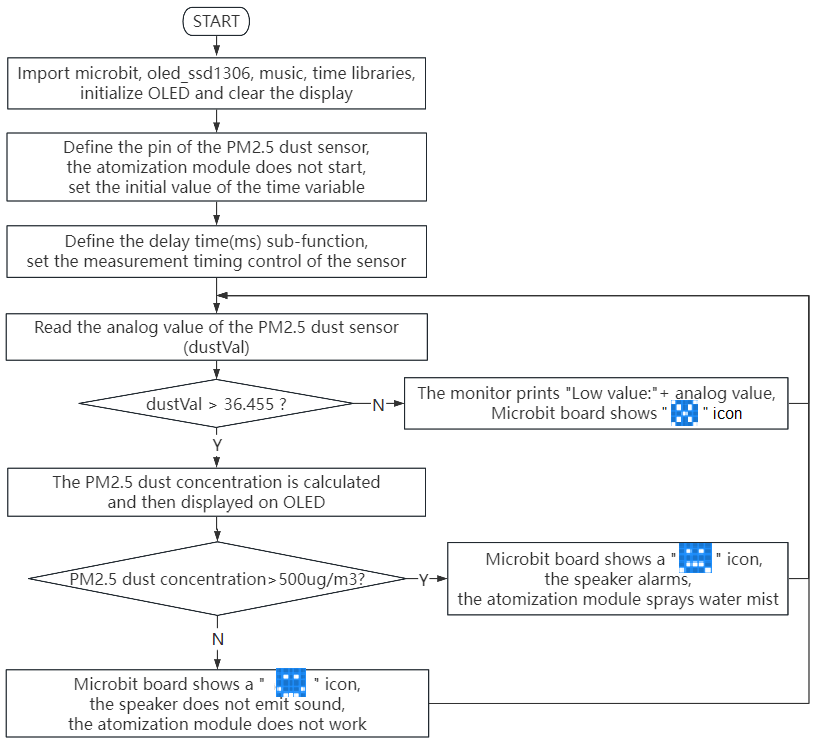
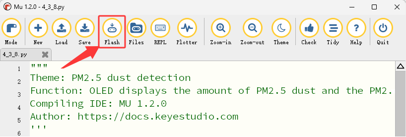
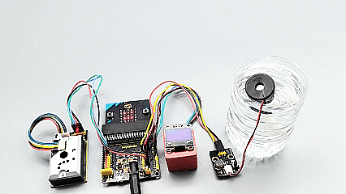

### 4.3.8 PM2.5 Dust Detection

#### 4.3.8.1 Overview


In PM2.5 dust detection, a laser dust meter is used to measure the concentration of PM2.5 in the air. It can continuously monitor the dust concentration while collecting particulate matter and analyzing its components. Particulate matter with an aerodynamic diameter of less than 2.5 micrometers, is what we call PM2.5. If its particle size reduces, the absorption rate of the respiratory system will increase.

In this project, we will build a PM2.5 dust detection system with a micro:bit board, PM2.5 dust sensor, OLED display, atomization module and the on-board speaker. The PM2.5 dust sensor detects PM2.5 particles in the air, and the OLED shows the detected PM2.5 value in real time. When the value reaches a threshold, the speaker alarms, and the atomization module sprays water mist to reduce dust.


#### 4.3.8.2 Component Knowledge


**PM2.5 Dust Sensor**


The PM2.5 dust sensor comes with a GP2Y1014AU0F chip to effectively detect extremely fine particles with a diameter greater than 0.8μm, like cigarette smoke. It also equipped with an infrared LED and a phototransistor arranged diagonally to detect the reflected light of dust in the air. It features ultra-low power consumption (maximum 20mA, typical 11mA), and its analog voltage output varies linearly with the dust density, so it is widely applied in air purifiers, air conditioning air monitors, PM2.5 detectors, etc.

⚠️ **Note: PM2.5 dust sensor with GP2Y1014AU0F chip requires at least 30 seconds to 2 minutes of power-on preheating time to obtains relatively accurate readings.**

**Parameters:**

- Power supply voltage: DC 5 ~ 7V
- Operating current: 20mA(Max)
- Minimum particle detection value: 0.8μm
- Sensitivity: 0.5V/(0.1mg/m³)
- Voltage in clean air: 0.9V (typical)
- Operating temperature: -10℃~65℃


#### 4.3.8.3 Required Components

| |||
| :--: | :--: | :--: |
|     micro:bit V2 main board ×1      |         micro:bit shield ×1         |      atomization module ×1       |
||| |
|        PM2.5 dust sensor ×1         |           OLED display ×1           | AA battery(**self-prepared**) ×6 |
| |||
| 4 pin wire(red-black-blue-green) ×1 | 4 pin wire(black-red-blue-green) ×1 |          3 pin wire ×1           |
|| |  |
|          battery holder ×1          |         micro USB cable ×1          |  |

#### 4.3.8.4 Wiring Diagram

⚠️ **When wiring, please pay attention to the wire color.**

| PM2.5 dust sensor | wire color | micro:bit shield pin | micro:bit board pin |
| :---------------: | :--------: | :------------------: | :-----------------: |
|        VCC        |    red     |          V2          |          V          |
|        GND        |   black    |          G           |          G          |
|        LED        |    blue    |          1           |         P1          |
|        OUT        |   green    |          2           |         P2          |

| OLED display | wire color | micro:bit shield pin | micro:bit board pin |
| :----------: | :--------: | :------------------: | :-----------------: |
|     GND      |   black    |          G           |          G          |
|     VCC      |    red     |          V2          |          V          |
|     SDA      |    blue    |          20          |         P20         |
|     SCL      |   green    |          19          |         P19         |

| Atomization module | wire color | micro:bit shield pin | micro:bit board pin |
| :----------------: | :--------: | :------------------: | :-----------------: |
|         G          |   black    |          G           |          G          |
|         V          |    red     |          V2          |          V          |
|         S          |   yellow   |          16          |         P16         |


#### 4.3.8.5 Code Flow



#### 4.3.8.6 Test Code

⚠️ **<span style="color: rgb(255, 76, 65);">Tip 1: Before downloading the code to the Microbit board, please import the “oled_ssd1306” library refering to “4.4 Import Library on MU”.</span>**

⚠️ **Tip 2: The threshold 500 in the if() condition can be modified according to the actual situation.**

**Complete code:**

```Python
'''
Theme: PM2.5 dust detection
Function: OLED displays the amount of PM2.5 dust and the PM2.5 dust sensor controls the micro:bit 5*5 dot matrix, speaker and atomization module
Compiling IDE: MU 1.2.0
Author: https://docs.keyestudio.com
'''
# import related libraries
from microbit import *
from oled_ssd1306 import *
import music
import time

# initialize and clear oled
initialize()
clear_oled()

# Pin configuration
led_Pin = pin1
out_Pin = pin2

pin16.write_digital(1) # set P16 pin to high level

# Time parameter
delayTime = 280
delayTime2 = 40
offTime = 9680

def microsecond_delay(us):
    """Precise microsecond delay"""
    start = time.ticks_us()
    while time.ticks_diff(time.ticks_us(), start) < us:
        pass

while True:
    # Measurement sequence
    led_Pin.write_digital(0)      # LED OFF
    microsecond_delay(delayTime)   # 280μs

    dustVal = out_Pin.read_analog()  # Read the sensor

    microsecond_delay(delayTime2)  # 40μs
    led_Pin.write_digital(1)      # LED ON
    microsecond_delay(offTime)     # 9680μs

    # Calculation and display
    if dustVal > 36.455:
        # The exact same calculation formula
        voltage = dustVal / 1024.0
        pm25 = (voltage - 0.0356) * 120000 * 0.035

        # OLED displays detailed information
        add_text(0, 0, "PM2.5 dust: ") # Display the value of PM2.5 in the corresponding position of OLED
        add_text(0, 2, str(round(pm25)) + " ug/m3") # Display the value of PM2.5 in the corresponding position of OLED

        # Quality indication
        if pm25  > 500 :    # PM2.5 value > 500
            display.show(Image.SAD) # LED matrix displays a sad pattern
            music.play("E5:4")       # speaker plays E5 tone
            sleep(1000)
            pin16.write_digital(0) # set P16 pin to low level
            sleep(200)
            pin16.write_digital(1) # set P16 pin to high level
            sleep(3000)
            pin16.write_digital(0) # set P16 pin to low level
            sleep(200)
            pin16.write_digital(1) # set P16 pin to high level
            sleep(1000)
        else: # or
            display.show(Image.HAPPY) # LED matrix displays a happy pattern
            music.reset()             # no tone
            pin16.write_digital(1) # set P16 pin to high level
    else:
        print("Low value:", dustVal)
        display.show(Image.NO)

    # delay 0.2s
    sleep(200)
    clear_oled()   # clear OLED
```


**Brief explanation:**

① Import libraries of microbit, oled_ssd1306, music and time.

```Python
from microbit import *
from oled_ssd1306 import *
import music
import time
```

② Initialize OLED pixels, clear the OLED.

```Python
initialize()
clear_oled()
```

③ Initialize the pins of PM2.5 dust sensor.

```Python
led_Pin = pin1
out_Pin = pin2
```

④ Connect the atomization module to pin P16, and set it off initially.

```Python
pin16.write_digital(1)
```
⑤ Set the initial value of the time variable.

```Python
delayTime = 280
delayTime2 = 40
offTime = 9680
```

⑥ Define a sub-function of microsecond delay time.

```Python
def microsecond_delay(us):
    """Precise microsecond delay"""
    start = time.ticks_us()
    while time.ticks_diff(time.ticks_us(), start) < us:
        pass
```

⑦ Set the control of measurement timing of PM2.5 dust sensor, which is mainly used to detect the dust concentration in the air.

```Python
led_Pin.write_digital(0)      # LED OFF
microsecond_delay(delayTime)   # 280μs

dustVal = out_Pin.read_analog()  # Read the sensor

microsecond_delay(delayTime2)  # 40μs
led_Pin.write_digital(1)      # LED ON
microsecond_delay(offTime)     # 9680μs
```

⑧ Judgement statement: if()...else...

When the analog value of PM2.5 dust particles exceeds 36.455, its concentration value can be calculated and displayed on the OLED. 

Otherwise, the serial monitor prints the corresponding dust analog values.

```Python
if dustVal > 36.455:
    # The exact same calculation formula
    voltage = dustVal / 1024.0
    pm25 = (voltage - 0.0356) * 120000 * 0.035

    # OLED displays detailed information
    add_text(0, 0, "PM2.5 dust: ") # Display the value of PM2.5 in the corresponding position of OLED
    add_text(0, 2, str(round(pm25)) + " ug/m3") # Display the value of PM2.5 in the corresponding position of OLED

else:
    print("Low value:", dustVal)
    display.show(Image.NO)
```

⑨ Judgement statement: if()...else...

When the detected concentration of PM2.5 dust particles exceeds 500ug/m³, the 5×5LED matrix shows , and the speaker alarms. After 1 second, the atomization module sprays water mist.

Otherwise, the 5×5LED shows , the speaker does not alarm, and the atomization module does not work.

```Python
if pm25  > 500 :    # PM2.5 value > 500
    display.show(Image.SAD) # LED matrix displays a sad pattern
    music.play("E5:4")       # speaker plays E5 tone
    sleep(1000)
    pin16.write_digital(0) # set P16 pin to low level
    sleep(200)
    pin16.write_digital(1) # set P16 pin to high level
    sleep(3000)
    pin16.write_digital(0) # set P16 pin to low level
    sleep(200)
    pin16.write_digital(1) # set P16 pin to high level
    sleep(1000)
else: # or
    display.show(Image.HAPPY) # LED matrix displays a happy pattern
    music.reset()             # no tone
    pin16.write_digital(1) # set P16 pin to high level
```

#### 4.3.8.7 Test Result


After wiring up and power on by micro USB cable, connect to external power(6 AA batteries) to ensure sufficient power supply, and click “<span style="color: rgb(255, 76, 65);">Flash</span>” to download the code to micro:bit board.



After uploading test code, press the reset button on the back of micro:bit.


Sweep the floor indoors / light matches / burn a small amount of paper safely to produce obvious PM2.5 dust particles, and they will be detected by the PM2.5 dust sensor and then its concentration will be shown on the OLED in real time.

When the detected concentration of PM2.5 dust particles exceeds 500ug/m³, the 5×5LED matrix shows , and the speaker alarms. After 1 second, the atomization module sprays water mist. Otherwise, the 5×5LED shows , the speaker does not alarm, and the atomization module does not work.

| Detected values on OLED | Air quality |
| :---------------------: | :---------: |
|          0-75           |  Excellent  |
|         75-150          |    Great    |
|         150-300         |    Good     |
|        300-1050         |   Normal    |
|        1050-3000        |    Poor     |
|         3000 +          |  Very poor  |



⚠️ **Note: The building blocks in the experiment are not included in this kit.**

<span style="color: rgb(0, 209, 0);">(**Tip:** If no result is observed, please press the reset button of the micro:bit board.)</span>


