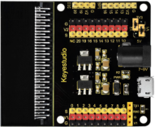
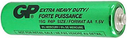
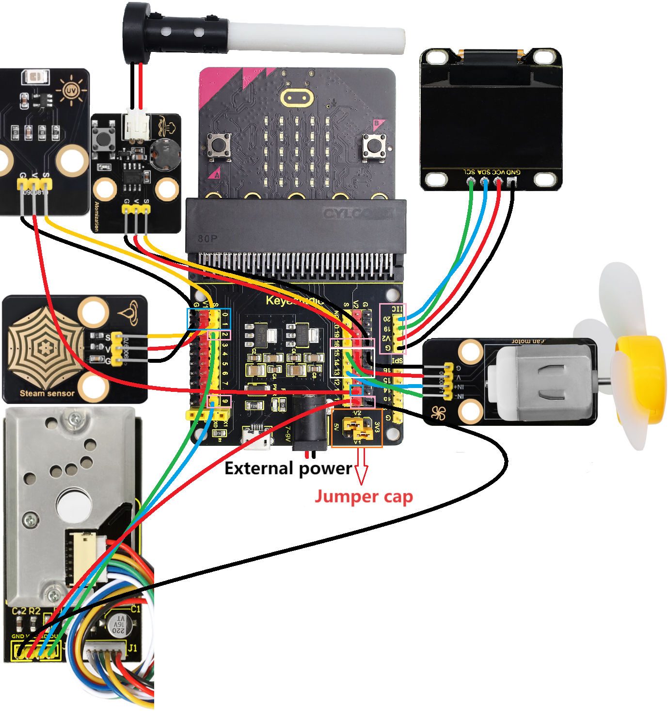
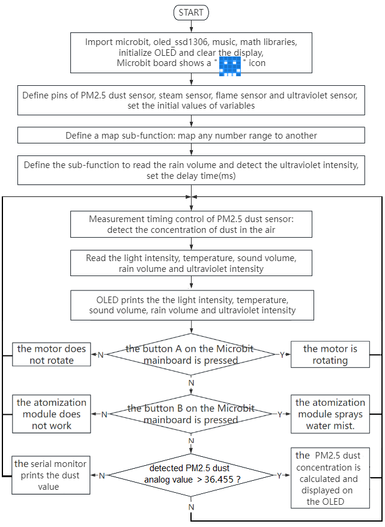
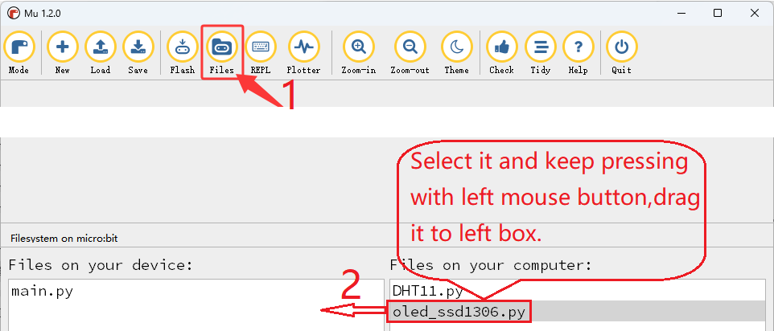
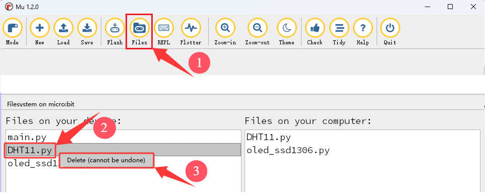

### 4.3.9 Micro:bit Multi-sensor OLED Monitoring Platform

#### 4.3.9.1 Overview


In this project, we take the micro:bit board as a core processing unit to read the values of its built-in sensors (including light sensor, temperature sensor, microphone) as well as external sensors (like PM2.5 dust sensor, steam sensor and solar ultraviolet sensor), and then these values will be displayed in real time on the OLED through I2C interface.

At the same time, the rotation of the fan on the 130 motor module can be controlled by pressing button A on the Micro:bit board, and the water mist spraying from the atomization module can be controlled by pressing button B on the Micro:bit board.


#### 4.3.9.2 Required Components

| |  ||
| :--: | :--: | :--: |
| micro:bit V2 board ×1 | micro:bit shield ×1 |OLED display ×1 |
| |||
| PM2.5 dust sensor ×1 |motor ×1 |steam sensor ×1 |
||| |
|ultraviolet sensor ×1|battery holder ×1|AA battery(**self-prepared**) ×6|
| |||
| micro USB cable ×1|4 pin wire ×3 |3 pin wire ×3 |
| |  |  | 
|atomization module ×1|fan ×1|  |

#### 4.3.9.3 Wiring Diagram

⚠️ **When wiring, please pay attention to the wire color.**

| ultraviolet sensor | wire color | micro:bit shield pin | micro:bit board pin |
| :----------------: | :--------: | :------------------: | :-----------------: |
|         G          |   black    |          G           |          G          |
|         V          |    red     |          V2          |          V          |
|         S          |   yellow   |          0           |         P0          |

| steam sensor | wire color | micro:bit shield pin | micro:bit board pin |
| :----------: | :--------: | :------------------: | :-----------------: |
|      G       |   black    |          G           |          G          |
|      V       |    red     |          V1          |          V          |
|      S       |   yellow   |          1           |         P1          |

| PM2.5 dust sensor | wire color | micro:bit shield pin | micro:bit board pin |
| :---------------: | :--------: | :------------------: | :-----------------: |
|        GND        |   black    |          G           |          G          |
|        VCC        |    red     |          V2          |          V          |
|        LED        |    blue    |          9           |         P9          |
|        OUT        |   green    |          2           |         P2          |

| atomization module | wire color | micro:bit shield pin | micro:bit board pin |
| :----------------: | :--------: | :------------------: | :-----------------: |
|         G          |   black    |          G           |          G          |
|         V          |    red     |          V2          |          V          |
|         S          |   yellow   |          16          |         P16         |

| motor | wire color | micro:bit shield pin | micro:bit board pin |
| :---: | :--------: | :------------------: | :-----------------: |
|   G   |   black    |          G           |          G          |
|   V   |    red     |          V2          |          V          |
|  IN+  |    blue    |          13          |         P13         |
|  IN-  |   green    |          15          |         P15         |

| OLED display | wire color | micro:bit shield pin | micro:bit board pin |
| :----------: | :--------: | :------------------: | :-----------------: |
|     GND      |   black    |          G           |          G          |
|     VCC      |    red     |          V2          |          V          |
|     SDA      |    blue    |          20          |         P20         |
|     SCL      |   green    |          19          |         P19         |



#### 4.3.9.4 Code Flow



#### 4.3.9.5 Test Code

⚠️ **<span style="color: rgb(255, 76, 65);">Tip 1: Before downloading the code to the Microbit board, please import the library file “oled_ssd1306\.py” refering to </span>** “[Import Library on MU](https://docs.keyestudio.com/projects/KS4050/en/latest/docs/MicroPython/MU_development_environment.html#import-library-on-mu)” .



⚠️ **<span style="color: rgb(255, 76, 65);">Tip 2: If the library file "XHT11\.py" has been imported to the micro:bit board before, it needs to be removed from the micro:bit board. Otherwise, it will cause insufficient memory on the Microbit motherboard, resulting in the unsuccessful download of the sample code to the Microbit board. </span>**

Click the "Files" button, then right-click the library file "XHT11\.py" in the left box, the "Delete (cannot be undone)" option appears, click the "Delete (cannot be undone)" option, In this way, the library file "XHT11\.py" was deleted.



**Complete code:**

```Python
'''
Theme: A multi-sensor OLED monitoring platform based on Micro:bit
Function: OLED displays the values of multiple sensors
Compiling IDE: MU 1.2.0
Author: https://docs.keyestudio.com
'''
# import related libraries
from microbit import *
from oled_ssd1306 import *
import math
import time

display.show(Image.HAPPY)  # LED matrix displays a happy pattern

# initialize and clear oled
initialize()
clear_oled()

# Hardware connection: PM2.5 dust sensor
out_Pin = pin2
led_Pin = pin9

# Hardware connection: steam sensor
Steam_PIN = pin1
WET_VALUE = 1023
DRY_VALUE = 0

# Initialize the ADC pin (the ultraviolet sensor is connected to pin0)
uv_sensor = pin0

# Time parameter
delayTime = 280
delayTime2 = 40
offTime = 9680

def map_value(value, in_min, in_max, out_min, out_max):
    """Linearly map the input values to the output range"""
    if in_max - in_min == 0:
        return out_min
    return (value - in_min) * (out_max - out_min) // (in_max - in_min) + out_min

def get_rain_percentage():
    """Read the sensor and return the percentage of rainfall"""
    raw_value = Steam_PIN.read_analog()
    percentage = map_value(raw_value, DRY_VALUE, WET_VALUE, 0, 100)
    return max(0, min(100, percentage))

def read_uv_index():
    raw_value = uv_sensor.read_analog()
    if raw_value > 1023:
        raw_value = 1023
    elif raw_value < 0:
        raw_value = 0
    uvi = raw_value * (15.0 / 1023)
    return round(uvi, 1)

def microsecond_delay(us):
    """Precise microsecond delay"""
    start = time.ticks_us()
    while time.ticks_diff(time.ticks_us(), start) < us:
        pass

while True:
    # Measurement sequence
    led_Pin.write_digital(0)      # LED OFF
    microsecond_delay(delayTime)   # 280μs
    dustVal = out_Pin.read_analog()  # Read the PM2.5 dust sensor
    microsecond_delay(delayTime2)  # 40μs
    led_Pin.write_digital(1)      # LED ON
    microsecond_delay(offTime)     # 9680μs

    Lightintensity = display.read_light_level()
    Temperature = temperature()
    soundLevel = microphone.sound_level()
    rain_percent = get_rain_percentage()
    uv = read_uv_index()
    clear_oled()
    if button_a.is_pressed(): # if button_a.is pressed
        sleep(200)
        pin13.write_digital(1) # the fan is rotating.
        pin15.write_digital(0)
        sleep(200)
    else: # or
        pin13.write_digital(0) # the fan does not rotate.
        pin15.write_digital(0)
    if button_b.is_pressed(): # if button_b.is pressed
        pin16.write_digital(0) # the atomization module sprays water mist.
        sleep(200)
        pin16.write_digital(1)
        sleep(3000)
        pin16.write_digital(0)
        sleep(200)
        pin16.write_digital(1)
        sleep(1000)
    else: # or
        pin16.write_digital(1) # the atomization module does not spray water mist.

    add_text(0, 0, "Temper:")
    add_text(7, 0, str(int(Temperature)) + "C") # Display the Temperature value on the OLED
    add_text(0, 2, "UV:")
    add_text(3, 2, str(int(uv))) # Display the UV value on the OLED
    add_text(5, 2, " | Rain:")
    add_text(13, 2, str(int(rain_percent)) + "%") # Display the percentage of rainfall on the OLED
    add_text(0, 4, "Light:")
    add_text(6, 4, str(Lightintensity)) # Display the light intensity on the OLED
    add_text(9, 4, " | Sound:")
    add_text(18, 4, str(soundLevel)) # Display the noise intensity on the OLED
    # Calculation and display
    if dustVal > 36.455:
        # The exact same calculation formula
        voltage = dustVal / 1024.0
        pm25 = (voltage - 0.0356) * 120000 * 0.035

        # OLED displays detailed PM2.5dust value information.
        add_text(0, 6, "PM2.5dust:")
        add_text(10, 6, str(round(pm25)) + "ug/m3")
    else:
        print("Low value:", dustVal)
    sleep(500)
```


**Brief explanation:**

① Import libraries of microbit, oled_ssd1306, math and time.

```Python
from microbit import *
from oled_ssd1306 import *
import math
import time
```

②  The 5×5LED matrix shows .

```Python
display.show(Image.HAPPY)
```

③ Initialize OLED pixels, clear the OLED.

```Python
initialize()
clear_oled()
```

④ Initialize the pins of the PM2.5 dust sensor.

```Python
out_Pin = pin2
led_Pin = pin9
```

⑤ Initialize the pin and variables of the steam sensor.

```Python
Steam_PIN = pin1
WET_VALUE = 1023
DRY_VALUE = 0
```

⑥ Initialize the pin of the solar ultraviolet sensor.

```Python
uv_sensor = pin0
```

⑦ Set the initial values of time variables.

```Python
delayTime = 280
delayTime2 = 40
offTime = 9680
```

⑧ Define a map sub-function (to map any number range to another).

```Python
def map_value(value, in_min, in_max, out_min, out_max):
    """Linearly map the input values to the output range"""
    if in_max - in_min == 0:  
        return out_min
    return (value - in_min) * (out_max - out_min) // (in_max - in_min) + out_min
```
⑨ Define a sub-function to obtain the value of rainfall volume.

```Python
def get_rain_percentage():
    """Read the sensor and return the percentage of rainfall"""
    raw_value = Steam_PIN.read_analog()
    percentage = map_value(raw_value, DRY_VALUE, WET_VALUE, 0, 100)
    return max(0, min(100, percentage))
```

⑩ Define a sub-function to obtain the value of ultraviolet intensity detected by the solar ultraviolet sensor.

```Python
def read_uv_index():
    raw_value = uv_sensor.read_analog()
    if raw_value > 1023:
        raw_value = 1023
    elif raw_value < 0:
        raw_value = 0
    uvi = raw_value * (15.0 / 1023)
    return round(uvi, 1)
```

⑪ Define a sub-function of microsecond delay time.

```Python
def microsecond_delay(us):
    """Precise microsecond delay"""
    start = time.ticks_us()
    while time.ticks_diff(time.ticks_us(), start) < us:
        pass
```

⑫ Set the control of measurement timing of PM2.5 dust sensor, which is mainly used to detect the dust concentration in the air.

```Python
led_Pin.write_digital(0)       # LED OFF
microsecond_delay(delayTime)   # 280μs
dustVal = out_Pin.read_analog()  # Read the PM2.5 dust sensor
microsecond_delay(delayTime2)  # 40μs
led_Pin.write_digital(1)       # LED ON
microsecond_delay(offTime)     # 9680μs
```

⑬ Read the values of light intensity, temperature, sound volume, rain volume and ultraviolet.

```Python
Lightintensity = display.read_light_level()
Temperature = temperature()
soundLevel = microphone.sound_level()
rain_percent = get_rain_percentage()
uv = read_uv_index()
```

⑭ Judgement statement: if()...else...

Press the button A on the micro:bit board, and the motor will drive the fan to work. Otherwise, the fan will not rotate.

```Python
if button_a.is_pressed(): # if button_a.is pressed
    sleep(200)
    pin13.write_digital(1) # the fan is rotating.
    pin15.write_digital(0)
     sleep(200)
else: # or
    pin13.write_digital(0) # the fan does not rotate.
    pin15.write_digital(0)
```

⑮ Judgement statement: if()...else...

Press the button B on the micro:bit board, and the atomization module will spray water mist. Otherwise, it will not work.

```Python
if button_b.is_pressed(): # if button_b.is pressed
    pin16.write_digital(0) # the atomization module sprays water mist.
    sleep(200)
    pin16.write_digital(1)
    sleep(3000)
    pin16.write_digital(0)
    sleep(200)
    pin16.write_digital(1)
    sleep(1000)
 else: # or
    pin16.write_digital(1) # the atomization module does not spray water mist.
```

⑯ Display the values of ultraviolet, temperature, rain volume, light intensity and sound volume on the OLED.

```Python
add_text(0, 0, "Temper:")
add_text(7, 0, str(int(Temperature)) + "C") # Display the Temperature value on the OLED
add_text(0, 2, "UV:")
add_text(3, 2, str(int(uv))) # Display the UV value on the OLED
add_text(5, 2, " | Rain:")
add_text(13, 2, str(int(rain_percent)) + "%") # Display the percentage of rainfall on the OLED
add_text(0, 4, "Light:")
add_text(6, 4, str(Lightintensity)) # Display the light intensity on the OLED
add_text(9, 4, " | Sound:")
add_text(18, 4, str(soundLevel)) # Display the noise intensity on the OLED
```

⑰ When the analog value of PM2.5 dust particles exceeds 36.455, its concentration value can be calculated and displayed on the OLED. Otherwise, the serial monitor prints the corresponding dust analog values.

```Python
if dustVal > 36.455:
    # The exact same calculation formula
    voltage = dustVal / 1024.0
    pm25 = (voltage - 0.0356) * 120000 * 0.035

    # OLED displays detailed PM2.5dust value information.
    add_text(0, 6, "PM2.5dust:") 
    add_text(10, 6, str(round(pm25)) + "ug/m3") 
else:
    print("Low value:", dustVal)
```

#### 4.3.9.6 Test Result


After wiring up and power on by micro USB cable, connect to external power(6 AA batteries) to ensure sufficient power supply, and click “<span style="color: rgb(255, 76, 65);">Flash</span>” to download the code to micro:bit board.


After uploading test code, press the reset button on the back of micro:bit.


Read the values of its built-in sensors (including light sensor, temperature sensor, microphone) as well as external sensors (like PM2.5 dust sensor, steam sensor and solar ultraviolet sensor), and then it can display the light intensity, temperature, noise intensity, rainfall intensity, ultraviolet intensity of sunlight and PM2.5 dust concentration in real time and intuitively through the OLED display screen with I2C interface.

Blow air (or make a very loud noise) into the microphone on the Microbit board (⚠️ **<span style="color: rgb(255, 76, 65);">special reminder: Blowing air has a more obvious effect</span>**), and the OLED display will show  the intensity of the air blowing (or noise).

When button A on the micro: bit board is pressed, the fan on the motor module rotates. When button B on the board is pressed, the atomization module sprays water mist.

⚠️ <span style="color: rgb(255, 76, 65);">Special reminder:</span> Sometimes the external power supply voltage may be insufficient. In such cases, it might be necessary to press the button twice on the micro: bit board before the fan starts to rotate or the misting module begins to spray water mist.


⚠️ **Note: The building blocks in the experiment are not included in this kit.**

<span style="color: rgb(0, 209, 0);">(**Tip:** If no result is observed, please press the reset button of the micro:bit board.)</span>


