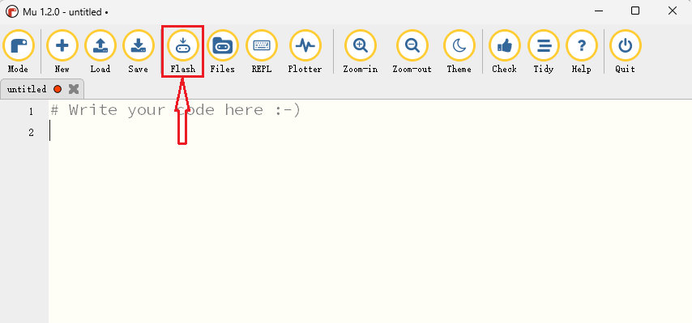
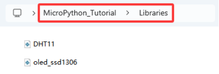
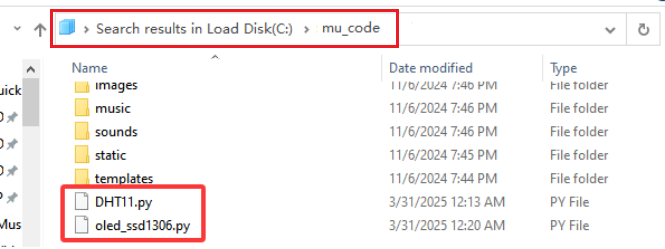
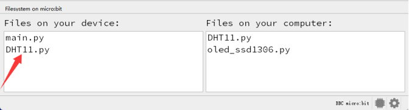
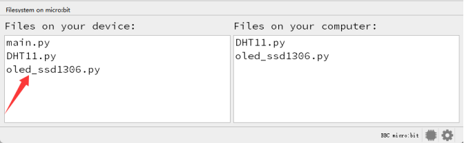
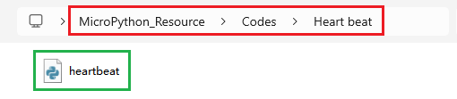
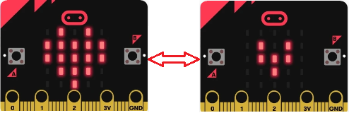
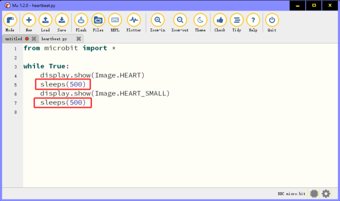

## 4.2.1 Windows系统

打开资源管理器，鼠标右键点击 “**此电脑**” ，并选择 “**属性**”，了解您的Windows系统电脑是32位还是64位。

查看系统类别，类型将显示在操作系统下，64位系统或者32位系统：

⚠️ **特别提醒：** Mu编辑器不再支持32位Windows。目前推荐的版本是Mu 1.2.0，建议你们通过每个支持的操作系统的链接更新到这个版本。

### 4.2.1.1 MU编辑器下载

MU编辑器的下载链接：[https://codewith.mu/en/download](https://codewith.mu/en/download) 。

### 4.2.1.2 MU编辑器安装

**步骤1-运行安装程序：**

找到你刚刚下载的安装程序（它可能在你的下载文件夹中），双击打开安装程序文件。

Windows 10 系统安装时会出现警告： 

Windows Defender将弹出一条警告消息，你应该点击 “**More info**” 链接。

消息将更改，提供有关安装程序的更多信息，并显示 “**Run anyway**” 按钮，请单击 “**Run anyway**” 按钮。

**步骤2-许可协议：**

检查许可证，选择复选框并单击 “**Install**” 。

**步骤3-安装：**

当Mu编辑器在你的电脑上安装时，需要几秒钟。

**步骤4-完成：**

安装已成功完成，请单击 “**Finish**” 关闭安装程序。

**步骤5-启动MU编辑器：**

你可以点击开始菜单中的图标启动Mu编辑器，也可以在搜索框中输入Mu (下面两种方法都有显示)。在第一次启动MU编辑器时，这可能需要一些时间。

Mu编辑器的主界面如下图所示：

你也可以参照MU编辑器的安装说明链接：[https://codewith.mu/en/howto/1.2/install_windows](https://codewith.mu/en/howto/1.2/install_windows)  。

## 4.2.2 MacOSX系统

### 4.2.2.1 MU编辑器下载

MU编辑器的下载链接：[https://codewith.mu/en/download](https://codewith.mu/en/download) 。

### 4.2.2.2 MU编辑器安装

MU编辑器的安装说明链接：[https://codewith.mu/en/howto/1.2/install_macos](https://codewith.mu/en/howto/1.2/install_macos) 

## 4.2.3 Linux系统

### 4.2.3.1 MU编辑器下载

MU编辑器的下载链接：[https://codewith.mu/en/download](https://codewith.mu/en/download) 。

### 4.2.3.2 MU编辑器安装

MU编辑器的安装说明链接：[https://codewith.mu/en/howto/1.2/install_linux](https://codewith.mu/en/howto/1.2/install_linux) 

## 4.3 MU编辑器设置以及工具栏介绍

⚠️ **特别提醒：** 这里以Windows系统为例（MacOSX和Linux系统类似，可以参考）.

第一次使用时需要设置 “**Mode**” 为 BBC micro:bit .

打开Mu编辑器，点击菜单栏中的 “**Mode**” 按钮，并在弹出对话框中选择 “**BBC micro：bit**”，之后单击 “**OK**” 。

Mu编辑器的操作页面请参考官方的介绍：[https://codewith.mu/en/tutorials/1.1/start](https://codewith.mu/en/tutorials/1.1/start)

更多有关使用Mu编辑器的教程，请参阅：[https://codewith.mu/en/tutorials/](https://codewith.mu/en/tutorials/)

## 4.4 Mu编辑器如何给micro:bit主板导入库文件(重要)

⚠️ **特别提醒：** 导入库文件前需要给Micro:bit主板上传一个.py代码（空代码也是可以的），这里我们是以导入一个空代码为例。

通过micro USB线连接micro:bit主板和电脑，打开Mu编辑器，点击 “**New**” 按钮，新建 .py代码（空代码），然后点击 “**Flash**” 按钮，即可成功将 .py代码（空代码）上传至Micro:bit主板。

在本教程的代码中，使用了OLED显示屏和XHT11温湿度传感器，因此需要导入 “**oled_ssd1306\.py**” 和 “**DHT11\.py**” 库文件到micro:bit主板。

Mu编辑器保存文件的默认目录是 “**mu_code**” ，它位于用户目录的根目录中。参考文献链接：[https://codewith.mu/en/tutorials/1.0/files](https://codewith.mu/en/tutorials/1.0/files)。

**库文件的导入步骤如下：**

1\. 在计算机的C盘上搜索 “**mu_code**”，找到 “**mu_code**” 文件夹。

2\. 双击 “**mu_code**” 进入文件夹。

3\. 将 “**Libraries**” 文件夹中的库文件 “**oled_ssd1306\.py**” 和 “**DHT11\.py**” 从以下路径拷贝到 “**mu_code**” 目录下。

4\. 复制粘贴成功后，在 “**mu_code**” 目录下，可以看到库文件 “**oled_ssd1306\.py**” 和 “**DHT11\.py**” 。如下图所示：

5\. 打开Mu编辑器，点击 “**Files**” 按钮。这里我们以 “**DHT11\.py**” 库文件为例，拖动 “**DHT11\.py**” 库文件到micro:bit中。

6\. “**DHT11\.py**” 库文件成功导入后，您将在左侧方框中看到它。

7\. “**oled_ssd1306\.py**” 库文件的导入方法与上面的 “**DHT11\.py**” 库文件导入方法相同，你可以参照 “**DHT11\.py**” 库文件导入的方法。

⚠️ **特别提醒: 将库文件成功导入到Micro:bit主板之后，然后点击 “**Flash**” 按钮将.py代码文件下载到Micro:bit主板。如果Micro:bit主板上的5*5LED点阵提示一些错误信息和错误的行号，那么需要参照上面的方法将库文件重新导入到Micro:bit主板。**

## 4.5 如何添加代码到Mu编辑器

这里我们以 “**heartbeat\.py**” 文件为例，教程附带的资源文件夹中，在 “**Heart beat**” 文件夹找到 “**heartbeat\.py**” 文件。

**方法一：**

打开Mu编辑器，点击 “**Load**” 按钮，导航到你下载的示例代码所保存的位置。

成功加载，如下图所示：

方法二：

除了上述Mu编辑器加载（导入）示例代码方法之外，还有一种更简单的加载代码方法：

先打开Mu编辑器，点击，然后选中 “**heartbeat\.py**” 文件，并继续按下鼠标左键，将选中的文件拖动到Mu编辑器中。如下图所示：

成功加载如下所示：

**添加其他的代码到Mu编辑器中的方法是一样的。**

## 4.6 如何下载代码到mciro:bit主板

⚠️ **特别注意:** 上传其他代码文件到micro:bit主板后，将覆盖原有内容，下次使用它时需要重新导入它。

通过micro USB线连接micro：bit主板和电脑。

点击 “**Flash**” 按钮将示例代码下载到micro：bit主板。

将示例代码下载到micro:bit主板后，**利用micro USB数据线上电**，可以看到micro:bit主板上的5×5 LED点阵先显示图案，再显示图案。循环进行！

⚠️ **特别提醒：** 如果您的代码中有错误，您也可能能够成功地将其代码下载到micro:bit主板，但它将无法正常工作。具体详解如下：

例如，函数sleep()在代码中被写成sleeps()。点击 “**Flash**” 按钮，即可成功上传代码至Micro:bit主板。但是，下载完成后，micro:bit主板上的5×5 LED点阵提示一些错误信息和错误的行号。

点击 “**REPL**” 按钮，再按一下micro：bit主板的重置按钮（**micro：bit主板背面的复位按钮，不是A、B按键**），错误信息将显示在REPL框中，如下图所示：

再次单击 “**REPL**” 按钮，您将关闭REPL模式。修改错误之后，然后你可以单击 “**Flash**” 按钮下载代码至micro：bit主板。

为确保代码正确，完成编写代码之后，点击 “**Check**” 按钮检查代码是否有错误。如下图所示，点击 “**Check**” 按钮，然后Mu编辑器会指出代码的错误。

根据错误提示修改代码，然后再次点击 “**Check**” 按钮，Mu编辑器在下面的栏中没有显示错误。

有关使用Mu的更多教程，请参阅：[https://codewith.mu/en/tutorials/](https://codewith.mu/en/tutorials/)

