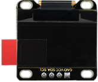
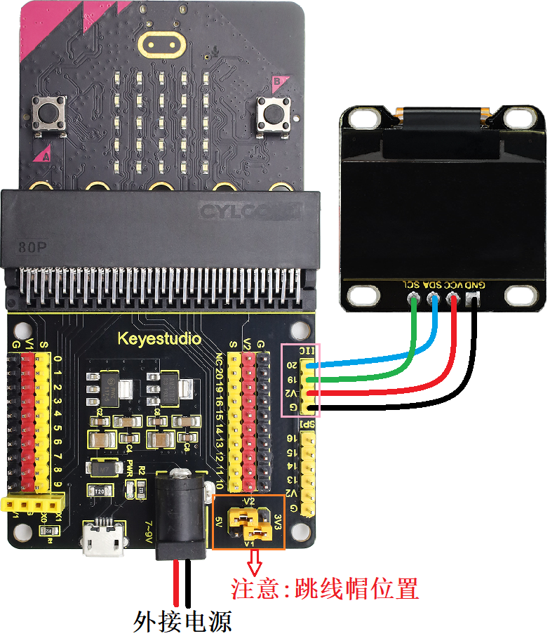

### 4.3.2 光照强度检测仪 

#### 4.3.2.1 简介


光照强度检测仪，也叫照度计、勒克斯计（Lux Meter），是一种用于测量照射在表面上的光的总量（即照度）的专用仪器。光照强度检测仪的工作原理主要基于光电效应。

本项目实验是OLED显示屏上会实时显示会实时显示Microbit光敏传感器检测的光线亮度级别值，并且光线亮度级别值超过一定值时，Microbit主板的扬声器发出警报声，起到警示提醒作用。

光照强度检测仪的应用极其广泛，几乎所有需要定量化“光”的场合都会用到它，例如：户外与道路照明、室内照明设计与验收、摄影与影视制作和建筑与健康 等等。


#### 4.3.2.2 元件知识


**Microbit光线传感器**


micro:bit主板并不自带光敏传感器，它对外界光照强度的检测是通过LED屏幕屏进行的。LED屏幕被用来感知周围的光，并反复地将光照强度转换成值输入，并采样电压衰减时间，这样检测出来的光照强度是一个相对值。（**注意：** 将光线亮度级别输出至串口，输出的是一个相对值。）

**Microbit扬声器**


micro:bit主板有内置扬声器，这使得在你的项目中添加声音变得非常容易。你可以用扬声器发出咯咯笑、问候你、打哈欠或悲伤等等，还可以编写一首歌曲，你的micro:bit主板可以通过编程制作各种各样的声音——从单个音符、音调和节拍到你自己的音乐作品，例如：歌曲《欢乐颂》，让扬声器播放出来。


#### 4.3.2.3 所需组件

| |   | | 
| :--: | :--: | :--: |
| micro:bit主板 *1 | micro:bit传感器扩展板 *1 |OLED显示屏 *1 |
| |||
| micro USB 线 *1|4 pin 线材 *1 |电池盒 *1|
|| | |
|AA电池(**自备**) *6| | |

#### 4.3.2.4 接线图

⚠️ **特别注意：接线时，请注意区分线材颜色。**

| OLED显示屏 | 线材颜色 | micro:bit传感器扩展板引脚 |micro:bit主板引脚 |
| :--: | :--: | :--: | :--: |
| GND | 黑线 | G | G |
| VCC | 红线 | V2 | V |
| SDA | 蓝线 | 20 | P20 |
| SCL | 绿线 | 19 | P19 |



#### 4.3.2.5 实验代码

⚠️ **特别注意：下面示例代码中，if...elif...判断语句中的阈值是可以根据实际情况加以修改的**

**完整代码：**

```Python
'''
Theme: Light intensity detector
Function: OLED displays the light intensity and the microbit light sensor controls the 5*5 dot matrix and speaker
Compiling IDE: MU 1.2.0
Author: https://docs.keyestudio.com
'''
# import related libraries
from microbit import *
from oled_ssd1306 import *
import music

val1 = Image("90909:""09990:""99999:""09990:""90909")  # Set pattern
val2 = Image("00000:""00900:""09990:""00900:""00000")  # Set pattern

# initialize and clear oled
initialize()  # initialize oled
clear_oled()  # clear oled

while True:
    clear_oled()  # clear OLED
    Lightintensity = display.read_light_level() # Read the light intensity detected by the microbit light sensor and assign it to the variable Lightintensity
    add_text(0, 0, 'Lightintensity:')  # Display the character string in the corresponding position of OLED
    add_text(16, 0, str(Lightintensity))  # Display Lightintensity in the corresponding position of OLED
    if Lightintensity >= 100: # when Light intensity > 100
       display.show(val1)   # LED matrix displays the set pattern1
       music.play("C5:1")   # speaker plays C5 tone
       sleep(50)
       music.play("D5:2")   # speaker plays D5 tone
       sleep(50)
       music.play("B5:4")   # speaker plays B5 tone
       sleep(50)
    elif Lightintensity > 0 and Lightintensity < 100:  # when 0 < Light intensity < 100
       display.show(val2)   # LED matrix displays the set pattern2
       music.play("C3:1")   # speaker plays C3 tone
    else: # or
       display.clear()   # Set the brightness of all LEDs to 0 (off)
       music.reset()     # no tone
    sleep(1000)
```


**简单说明：**

① 导入microbit，oled_ssd1306和music等库文件。

```Python
# import related libraries
from microbit import *
from oled_ssd1306 import *
import music
```

② 定义两个图案。

```Python
val1 = Image("90909:""09990:""99999:""09990:""90909")  # Set pattern
val2 = Image("00000:""00900:""09990:""00900:""00000")  # Set pattern
```

③ 初始化OLED和OLED清屏。

```Python
initialize()  # initialize oled
clear_oled()  # clear oled
```

④ 读取microbit光线传感器检测的光线亮度级别值，并且在OLED显示屏的对应位置显示光线亮度级别值。

```Python
Lightintensity = display.read_light_level() # Read the light intensity detected by the microbit light sensor and assign it to the variable Lightintensity
add_text(0, 0, 'Lightintensity:')  # Display the character string in the corresponding position of OLED
add_text(16, 0, str(Lightintensity))  # Display Lightintensity in the corresponding position of OLED
```

⑤ 这是if()...elif()...else...的判断语句。

如果检测到的光线亮度级别大于等于100时，Microbit主板上的5*5LED点阵显示大的太阳光图案，同时Microbit主板上的扬声器发出几种警报声。

```Python
if Lightintensity >= 100: # when Light intensity > 100
   display.show(val1)   # LED matrix displays the set pattern1
   music.play("C5:1")   # speaker plays C5 tone
   sleep(50)
   music.play("D5:2")   # speaker plays D5 tone
   sleep(50)
   music.play("B5:4")   # speaker plays B5 tone
   sleep(50)
```

否则如果检测到的光线亮度级别大于0小于100时，Microbit主板上的5*5LED点阵显示小的太阳光图案，同时Microbit主板上的扬声器发出一种声音。

```Python
elif Lightintensity > 0 and Lightintensity < 100:  # when 0 < Light intensity < 100
   display.show(val2)   # LED matrix displays the set pattern2
   music.play("C3:1")   # speaker plays C3 tone
```

否则，Microbit主板上的5*5LED点阵不显示任何图案，扬声器也不发声。

```Python
else: # or
   display.clear()  # Set the brightness of all LEDs to 0 (off)
   music.reset()    # no tone
```

⑥ 延时1000ms(即：1s)。

```Python
sleep(1000)
```

#### 4.3.2.6 实验结果


点击 “<span style="color: rgb(255, 76, 65);">Flash</span>” 按钮将示例代码下载到micro：bit主板。


将示例代码下载到micro:bit主板后，利用micro USB数据线上电，同时还需要外接电源(6个AA电池安装到电池盒，保证电源充足)，然后按下microbit主板上背面的复位按钮。

。

OLED显示屏上会实时显示Microbit光线传感器检测的光线亮度级别值，当光线亮度级别值超过100时，Microbit主板上的5×5LED点阵显示大的太阳光图案，同时扬声器发出几种警报声，起到警示提醒作用；当光线亮度级别值大于0小于100时，Microbit主板上的5×5LED点阵显示小的太阳光图案，同时扬声器发出一种警报声，起到警示提醒作用；否则，Microbit主板上的5*5LED点阵不显示任何图案，扬声器也不发声。

<span style="color: rgb(0, 209, 0);">（**特别提示：** 如果未看到实验现象，请用手按下micro:bit主板上背面的复位按钮，）</span>


