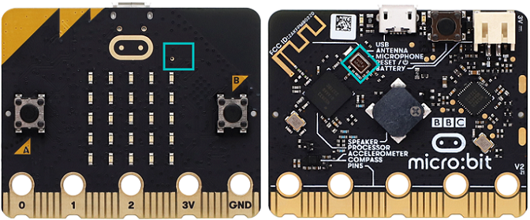
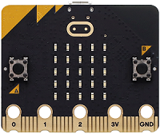
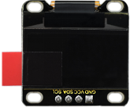
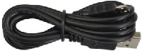
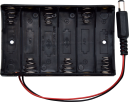
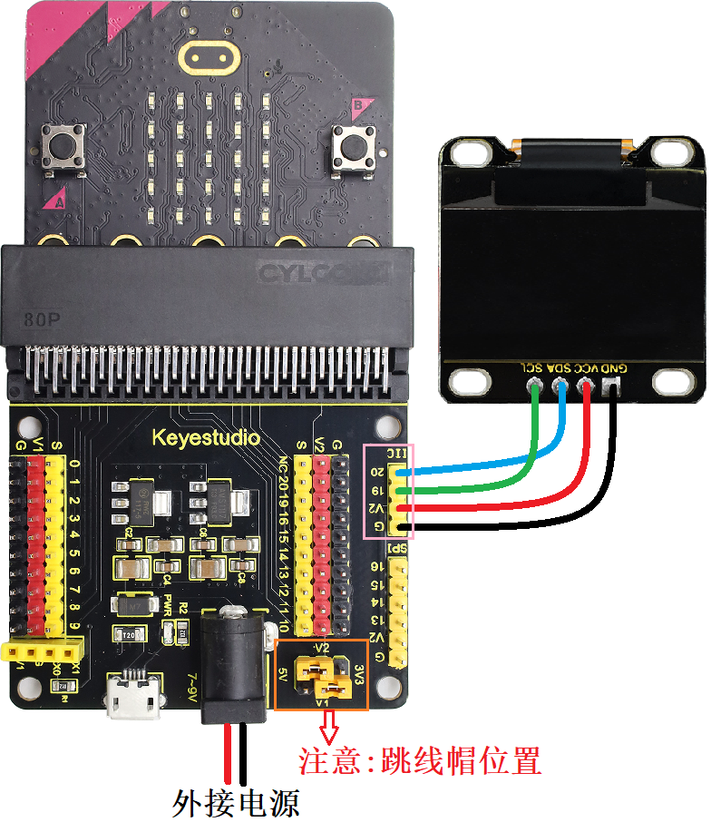
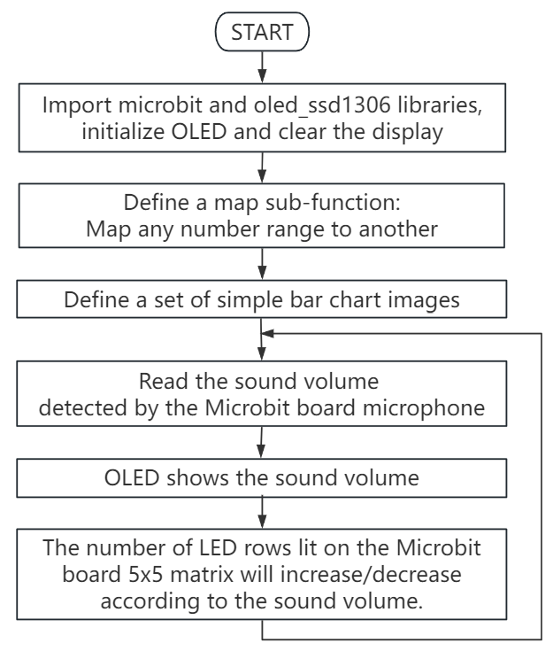
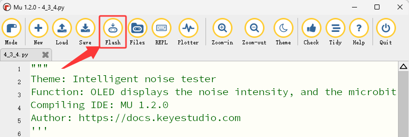
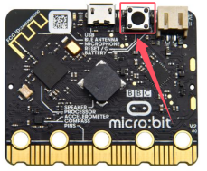

### 4.3.4 智能噪音测试仪 

#### 4.3.4.1 简介


智能噪音测试仪，也称为智能声级计或分贝仪，具有噪音检测功能，其测量单位是分贝（dB）。

将噪音分为不同的等级，micro:bit的内置麦克风会实时检测环境中的噪音强度。根据噪音强度的高低，micro:bit将其划分为若干个等级。

在本项目实验中，OLED显示屏上会实时显示当前噪音的等级信息，让用户直观地了解噪音的大小。同时，microbit5×5LED点阵屏也会根据噪音等级，5×5LED点阵屏点亮的LED灯也会增多或减少的效果。

智能噪音测试仪大大降低了噪音监测的技术门槛和成本，使其应用变得非常广泛，例如：环境噪音监测、职业健康与安全、建筑工地和娱乐活动场所 等等。


#### 4.3.4.2 元件知识


**Microbit麦克风**



micro:bit V2主板上集成了一个高质量的数字麦克风，可以用于检测声音和音频信号，位于主板的正面上方。用于控制和处理麦克风的芯片位于主板的背面。

麦克风的位置可以通过观察板子正面上方的一个小圆孔来识别。这个小孔就是麦克风的收音口，方便捕捉周围的声音信号，使用时只需将 micro:bit V2主板正面朝上放置即可。小孔旁边紧挨着麦克风LED指示灯。


当micro:bit V2主板在麦克风测量声音级别时，麦克风LED指示灯就会亮起来。


#### 4.3.4.3 所需组件

| |   | | 
| :--: | :--: | :--: |
| micro:bit主板 ×1 | micro:bit传感器扩展板 ×1 |OLED显示屏 ×1 |
| |||
| micro USB 线 ×1|4 pin 线材(黑红蓝绿) ×1 |电池盒 ×1|
|| | |
|AA电池(**自备**) ×6| | |

#### 4.3.4.4 接线图

⚠️ **特别注意：接线时，请注意区分线材颜色。**

| OLED显示屏 | 线材颜色 | micro:bit传感器扩展板引脚 |micro:bit主板引脚 |
| :--: | :--: | :--: | :--: |
| GND | 黑线 | G | G |
| VCC | 红线 | V2 | V |
| SDA | 蓝线 | 20 | P20 |
| SCL | 绿线 | 19 | P19 |



#### 4.3.4.5 代码流程图



#### 4.3.4.6 实验代码

**完整代码：**

```Python
'''
Theme: Intelligent noise tester
Function: OLED displays the noise intensity, and the microbit microphone controls the number of 5*5 dot matrix on
Compiling IDE: MU 1.2.0
Author: https://docs.keyestudio.com
'''
# import related libraries
from microbit import *
from oled_ssd1306 import *

# initialize and clear oled
initialize()  # initialize oled
clear_oled()  # clear oled

# function to map any range of numbers to another range
def map(value, fromMin, fromMax, toMin, toMax):
    fromRange = fromMax - fromMin
    toRange = toMax - toMin
    valueScaled = float(value - fromMin) / float(fromRange)
    return toMin + (valueScaled * toRange)

# set of images for simple bar chart
graph5 = Image("99999:"
               "99999:"
               "99999:"
               "99999:"
               "99999")
graph4 = Image("00000:"
               "99999:"
               "99999:"
               "99999:"
               "99999")
graph3 = Image("00000:"
               "00000:"
               "99999:"
               "99999:"
               "99999")
graph2 = Image("00000:"
               "00000:"
               "00000:"
               "99999:"
               "99999")
graph1 = Image("00000:"
               "00000:"
               "00000:"
               "00000:"
               "99999")
graph0 = Image("00000:"
               "00000:"
               "00000:"
               "00000:"
               "00000")
allGraphs = [graph0, graph1, graph2, graph3, graph4, graph5]

# ignore first sound level reading
soundLevel = microphone.sound_level()
sleep(200)

while True:
    clear_oled()      # clear OLED
    soundLevel = microphone.sound_level() # Read the sound intensity detected by the microphone on the microbit board
    add_text(0, 0, "Acoustic Sound Level:")  # Display the character string in the corresponding position of OLED
    add_text(0, 2, str(soundLevel))  # Display soundLevel in the corresponding position of OLED
    # map sound levels from range 0-255 to range 0-5 for choosing graph image
    soundLevel1 = int(map(soundLevel, 0, 255, 0, 5))
    display.show(allGraphs[soundLevel1])
    sleep(1000)
```


**简单说明：**

① 导入microbit和oled_ssd1306等库文件。

```Python
from microbit import *
from oled_ssd1306 import *
```

② 初始化OLED和OLED清屏。

```Python
initialize()  # initialize oled
clear_oled()  # clear oled
```

③ 定义一个映射(将任何一个数字范围映射到另一个数字范围)子函数。

```Python
def map(value, fromMin, fromMax, toMin, toMax):
    fromRange = fromMax - fromMin
    toRange = toMax - toMin
    valueScaled = float(value - fromMin) / float(fromRange)
    return toMin + (valueScaled * toRange)
```

④ 定义一组简单的条形图图像集。

```Python
graph5 = Image("99999:"
               "99999:"
               "99999:"
               "99999:"
               "99999")
graph4 = Image("00000:"
               "99999:"
               "99999:"
               "99999:"
               "99999")
graph3 = Image("00000:"
               "00000:"
               "99999:"
               "99999:"
               "99999")
graph2 = Image("00000:"
               "00000:"
               "00000:"
               "99999:"
               "99999")
graph1 = Image("00000:"
               "00000:"
               "00000:"
               "00000:"
               "99999")
graph0 = Image("00000:"
               "00000:"
               "00000:"
               "00000:"
               "00000")
allGraphs = [graph0, graph1, graph2, graph3, graph4, graph5]
```
⑤ 忽略第一个噪音强度读数。 

```Python
soundLevel = microphone.sound_level()
sleep(200)
```

⑥ 读取microbit主板上的麦克风检测的噪音强度，并且在OLED显示屏的对应位置显示噪音强度。

```Python
soundLevel = microphone.sound_level() # Read the sound intensity detected by the microphone on the microbit board
add_text(0, 0, "Acoustic Sound Level:")  # Display the character string in the corresponding position of OLED
add_text(0, 2, str(soundLevel))  # Display soundLevel in the corresponding position of OLED
```

⑦ 将噪音强度的0-255范围映射到选择图形图像的0-5范围。

```Python
soundLevel1 = int(map(soundLevel, 0, 255, 0, 5))
display.show(allGraphs[soundLevel1])
```

#### 4.3.4.7 实验结果


点击 “<span style="color: rgb(255, 76, 65);">Flash</span>” 按钮将示例代码下载到micro：bit主板。



示例代码成功下载到micro:bit主板之后，利用micro USB数据线上电，同时还需要外接电源(6个AA电池安装到电池盒，保证电源充足)，然后按一下micro:bit主板上背面的复位按钮。



OLED显示屏会实时显示当前噪音强度相关信息，让用户直观地了解噪音的大小。同时，Microbit主板上的5×5LED点阵屏也会根据噪音强度，5×5LED点阵屏上点亮的LED灯行数也会逐渐增多或减少，达到提醒噪音强度的效果。

<span style="color: rgb(0, 209, 0);">（**特别提示：** 如果未看到实验现象，请用手按下micro:bit主板上背面的复位按钮，）</span>


