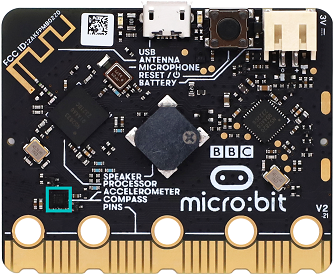
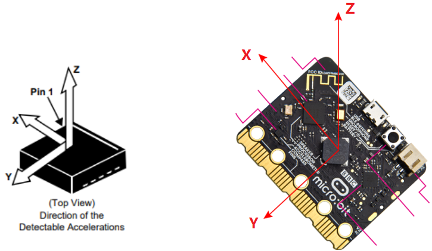
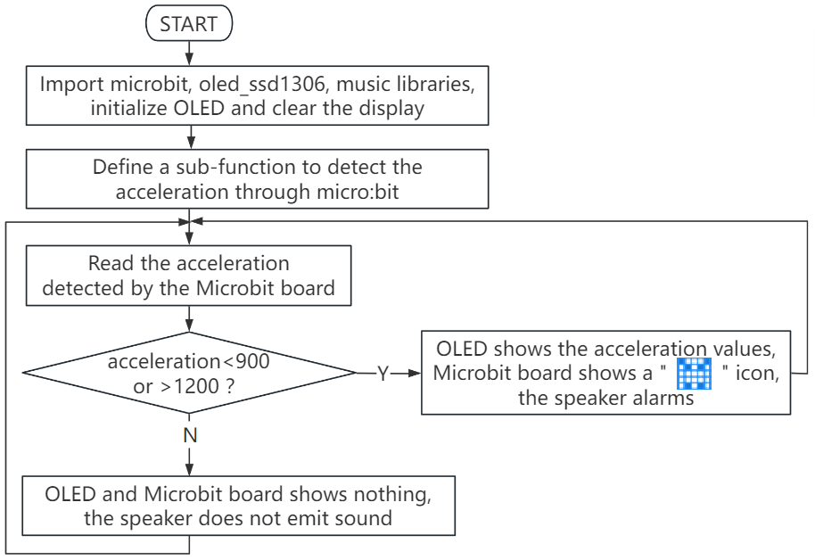
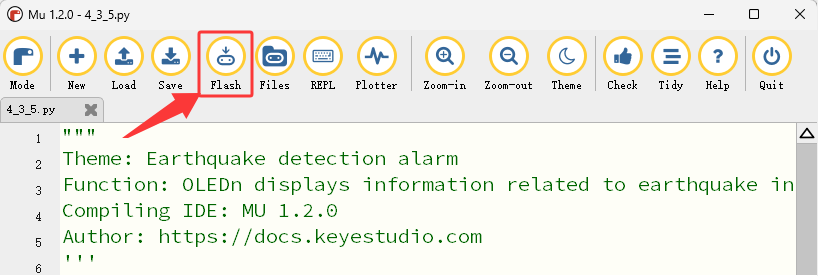

### 4.3.5 地震检测报警器

#### 4.3.5.1 简介


地震检测报警器是通过检测地震波或机械振动触发声光警报的装置，主要用于地震初期避险预警。

在本项目实验中，OLED显示屏上会实时显示micro:bit加速度传感器检测到的值，当micro:bit主板的加速度传感器检测到倾斜或轻微摇晃时，micro:bit主板的扬声器会响起，同时microbit点阵显示警报图案，达到警示提醒的效果。

地震检测报警器（特指地震预警接收终端）的应用场景非常广泛，其核心价值在于“抢时间”，主要应用场所包括学校、家庭、公共场所及地质灾害监测区域 等等。


#### 4.3.5.2 元件知识


**Microbit加速度计**



LSM303AGR 是一款集成在Micro:bit主板中的超低功耗高性能加速度计，主要用于三维(X轴、Y轴、Z轴)运动检测。它集成了数字线性加速度计和磁力计，可实现精确的姿态测量‌。该传感器的核心特性包括：

‌通信接口‌：支持I2C串行总线接口（兼容标准、快速模式、快速模式 plus 和高速模式，最高速率达100kHz、400kHz、1MHz 和 3.4MHz）以及SPI串行标准接口，方便与微控制器或其他外设连接‌。

‌分辨率‌：可配置为 8-bit、10-bit 或 12-bit 输出，具体取决于工作模式（例如: 低功耗模式下为 8-bit，高分辨率模式下为 12-bit）‌。

‌量程设置‌：加速度量程可编程为±2g、±4g、±8g 或 ±16g，适应不同应用场景的灵敏度需求‌。

加速度计对应的X、Y、Z三个方向如下图所示：




#### 4.3.5.3 所需组件

| || | 
| :--: | :--: | :--: |
| micro:bit主板 *1 | micro:bit传感器扩展板 *1 |OLED显示屏 *1 |
| |||
| micro USB 线 *1|4 pin 线材 *1 |电池盒 *1|
|| | |
|AA电池(**自备**) *6| | |

#### 4.3.5.4 接线图

⚠️ **特别注意：接线时，请注意区分线材颜色。**

| OLED显示屏 | 线材颜色 | micro:bit传感器扩展板引脚 |micro:bit主板引脚 |
| :--: | :--: | :--: | :--: |
| GND | 黑线 | G | G |
| VCC | 红线 | V2 | V |
| SDA | 蓝线 | 20 | P20 |
| SCL | 绿线 | 19 | P19 |


#### 4.3.5.5 代码流程图



#### 4.3.5.6 实验代码

**特别注意：下面示例代码中，if条件中的阈值 900 和 1200 可以根据实际情况加以修改的**

**完整代码：**

```Python
'''
Theme: Earthquake detection alarm
Function: OLEDn displays information related to earthquake intensity and the microbit accelerometer controls a 5*5 dot matrix and speaker.
Compiling IDE: MU 1.2.0
Author: https://docs.keyestudio.com
'''
# import related libraries
from microbit import *
from oled_ssd1306 import *
import music

# initialize and clear oled
initialize()  # initialize oled
clear_oled()  # clear oled

def get_acceleration_strength():
    """
    Read the combined acceleration intensity of the accelerometer
    Return the magnitude of the total acceleration rate (unit: mg, milli-g)
    """
    # Read the three-axis acceleration values
    x = accelerometer.get_x()
    y = accelerometer.get_y()
    z = accelerometer.get_z()

    # Calculate the synthetic acceleration (vector modulus)
    strength = (x**2 + y**2 + z**2) ** 0.5

    return strength

while True:
    strenght = get_acceleration_strength()  # Read the intensity detected by the accelerometer on the microbit board
    if strenght < 900 or strenght > 1200:    # When the intensity detected by the accelerometer is less than 900 or greater than 1200
       clear_oled()   # clear OLED
       add_text(0, 0, 'Earthquake Warning')  # Display the character string in the corresponding position of OLED
       add_text(0, 2, 'Earthquake Level: ')  # Display the character string in the corresponding position of OLED
       add_text(0, 4, str(int(strenght)))  # Display the value of strength in the corresponding position of OLED
       music.play("C4:1")   # speaker plays C4 tone
       display.show(Image.GHOST) # LED matrix displays a ghost pattern
    else: # or
       clear_oled()  # clear OLED
       display.clear() # Set the brightness of all LEDs to 0 (off)
       music.reset()  # no tone
    sleep(500)
```


**简单说明：**

① 导入microbit，oled_ssd1306 和 music等库文件。

```Python
from microbit import *
from oled_ssd1306 import *
import music
```

② 初始化OLED和OLED清屏。

```Python
initialize()  # initialize oled
clear_oled()  # clear oled
```

③ 定义micro:bit加速度计检测加速度强度的子函数。

```Python
def get_acceleration_strength():
    """
    Read the combined acceleration intensity of the accelerometer
    Return the magnitude of the total acceleration rate (unit: mg, milli-g)
    """
    # Read the three-axis acceleration values
    x = accelerometer.get_x()
    y = accelerometer.get_y()
    z = accelerometer.get_z()

    # Calculate the synthetic acceleration (vector modulus)
    strength = (x**2 + y**2 + z**2) ** 0.5

    return strength
```

④ 将读取的Microbit加速度计的加速度强度值赋给于变量strength。

```Python
strenght = get_acceleration_strength()  # Read the intensity detected by the accelerometer on the microbit board
```
 
⑤ 这是if()...else...的判断语句。

当检测到的加速度强度值小于900 或者 大于1200时，OLED显示字符串和加速度强度值，同时Microbit主板上的5×5LED点阵显示图案，扬声器发出警报声；否则，OLED不显示，5×5LED点阵也不显示图案，扬声器也不发声。

```Python
if strenght < 900 or strenght > 1200:    # When the intensity detected by the accelerometer is less than 900 or greater than 1200
   clear_oled()   # clear OLED
   add_text(0, 0, 'Earthquake Warning')  # Display the character string in the corresponding position of OLED
   add_text(0, 2, 'Earthquake Level: ')  # Display the character string in the corresponding position of OLED
   add_text(0, 4, str(int(strenght)))  # Display the value of strength in the corresponding position of OLED
   music.play("C4:1")   # speaker plays C4 tone
   display.show(Image.GHOST) # LED matrix displays a ghost pattern
else: # or
   clear_oled()  # clear OLED
   display.clear() # Set the brightness of all LEDs to 0 (off)
   music.reset()  # no tone
```

#### 4.3.5.7 实验结果


点击 “<span style="color: rgb(255, 76, 65);">Flash</span>” 按钮将示例代码下载到micro：bit主板。



示例代码成功下载到micro:bit主板之后，利用micro USB数据线上电，同时还需要外接电源(6个AA电池安装到电池盒，保证电源充足)，然后按一下micro:bit主板上背面的复位按钮。


OLED显示屏上会实时显示micro:bit加速度计检测到的地震水平值等相关信息。当检测到的加速度强度值小于900 或者 大于1200时，OLED显示字符串和加速度强度值，同时Microbit主板上的5×5LED点阵显示图案，扬声器发出警报声；否则，OLED不显示任何信息，5×5LED点阵也不显示图案，扬声器也不发声。

<span style="color: rgb(0, 209, 0);">（**特别提示：** 如果未看到实验现象，请用手按下micro:bit主板上背面的复位按钮，）</span>


