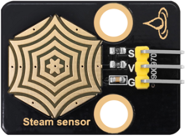
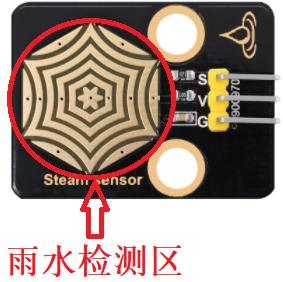
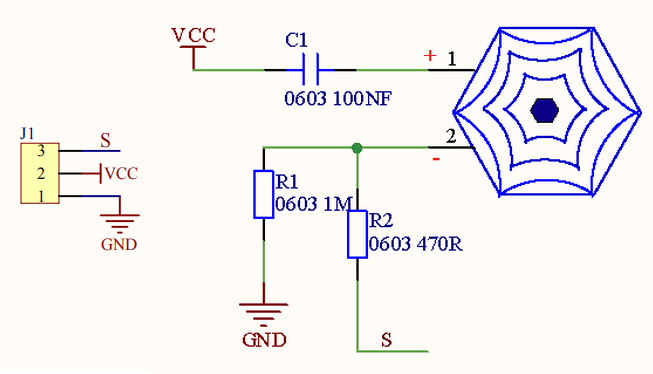
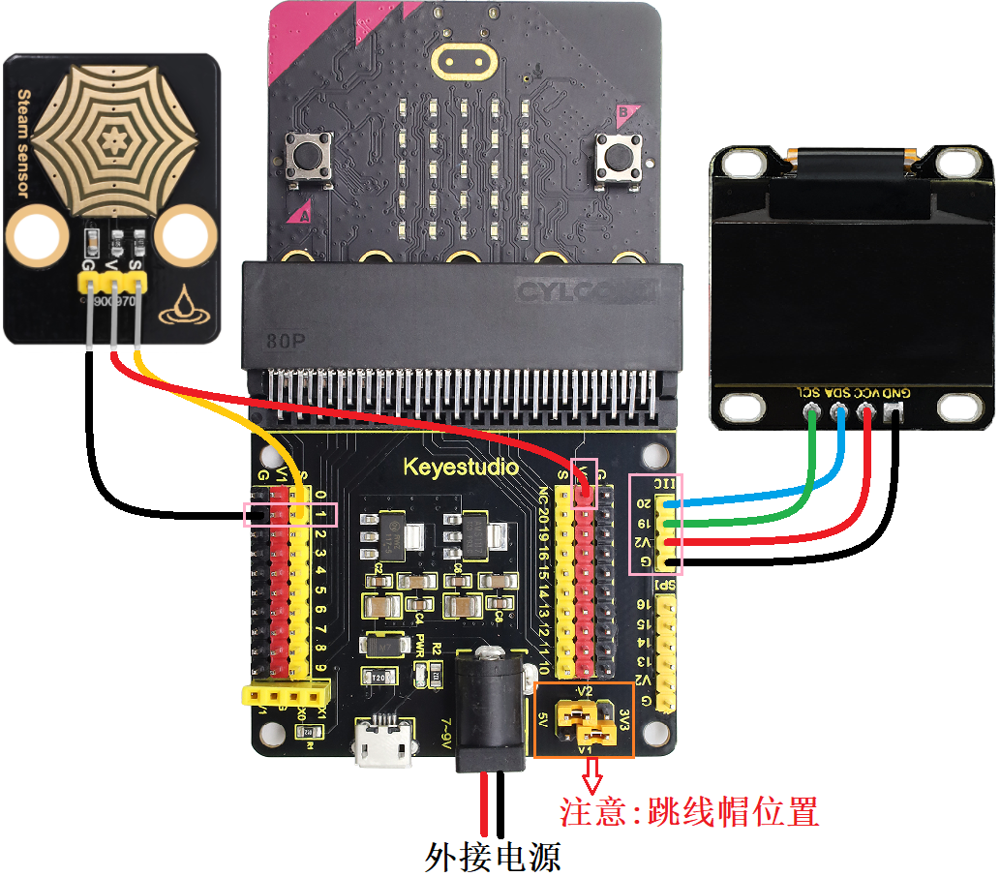
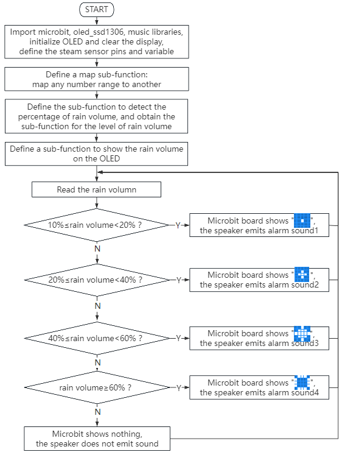
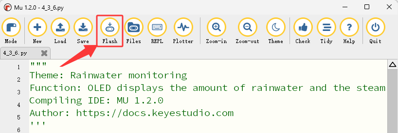

### 4.3.6 雨水监测

#### 4.3.6.1 简介


当水滴传感器检测到雨水时，它会向Micro:bit主板发送一个信号，可以触发各种动作。例如，可以用Micro:bit扬声器发出警报声，提醒用户正在下雨，同时在OLED显示屏上会实时显示当前雨水量。这一功能对户外天气或环境特别有用，使用户能够采取必要的预防措施。

此外，使用水滴传感器、OLED显示屏和Micro:bit主板的雨水监测系统也可用于检测屋顶或建筑物的漏水情况，帮助防止水入侵造成的损害。总的来说，水滴传感器是一个多功能的有效工具，可以在各种应用中检测雨水的存在。


#### 4.3.6.2 元件知识


**水滴传感器**



水滴传感器是一种可用于检测水存在的传感器，它通常用于雨水检测系统。当雨水接触到传感器上的导电垫（检测区）时，它会向开发板(例如：Micro:bit主板等)发送信号，以触发各种动作。检测区上的水量越多，模拟值越大。



**原理图：**



水滴传感器通过电路板上裸露的印刷平行线检测水量的大小。水量越多，就会有更多的导线被联通，随着导电的接触面积增大，雨滴感应区 2 脚输出的电压就会逐步上升。信号端 S 检测到的模拟值就越大。除了可以检测水量的大小，它还可以检测空气中的水蒸气。

**参数：**

- 工作电压: DC 3.3V~5V
- 工作电流: (Max)1.5mA@5V
- 最大功率: 0.075W
- 信号类型: 模拟信号


#### 4.3.6.3 所需组件

| |   | | 
| :--: | :--: | :--: |
| micro:bit主板 ×1 | micro:bit传感器扩展板 ×1 |OLED显示屏 ×1 |
|| ||
| 水滴传感器 ×1|micro USB 线 ×1|4 pin 线材(黑红蓝绿) ×1 |
||||
|3 pin 线材 ×1 |电池盒 ×1|AA电池(**自备**) ×6| 

#### 4.3.6.4 接线图

⚠️ **特别注意：接线时，请注意区分线材颜色。**

| OLED显示屏 | 线材颜色 | micro:bit传感器扩展板引脚 |micro:bit主板引脚 |
| :--: | :--: | :--: | :--: |
| GND | 黑线 | G | G |
| VCC | 红线 | V2 | V |
| SDA | 蓝线 | 20 | P20 |
| SCL | 绿线 | 19 | P19 |

|水滴传感器| 线材颜色 | micro:bit传感器扩展板引脚 |micro:bit主板引脚 |
| :--: | :--: | :--: | :--: |
| G | 黑线 | G | G |
| V | 红线 | V1 | V |
| S | 黄线 | 1 | P1 |



#### 4.3.6.5 代码流程图



#### 4.3.6.6 实验代码

⚠️ **特别注意：下面示例代码中，if()...elif()...判断语句中的阈值是可以根据实际情况加以修改的**

**完整代码：**

```Python
'''
Theme: Rainwater monitoring
Function: OLED displays the amount of rainwater and the staem sensor controls the fan and atomization module
Compiling IDE: MU 1.2.0
Author: https://docs.keyestudio.com
'''
# import related libraries
from microbit import *
from oled_ssd1306 import *
import math
import music

# initialize and clear oled
initialize()  # initialize oled
clear_oled()  # clear oled

# Configuration parameters
RAIN_PIN = pin1
WET_VALUE = 1023
DRY_VALUE = 0

def map_value(value, in_min, in_max, out_min, out_max):
        """Linearly map the input values to the output range"""
    if in_max - in_min == 0:  # Prevent division by zero errors
        return out_min
    return (value - in_min) * (out_max - out_min) // (in_max - in_min) + out_min

def get_rain_percentage():
    raw_value = RAIN_PIN.read_analog()
    percentage = map_value(raw_value, DRY_VALUE, WET_VALUE, 0, 100)
    return max(0, min(100, percentage)), raw_value

def get_rain_level(percentage):
    if percentage < 10:
        return "dry", 0
    elif percentage >= 10 and percentage < 20:
        return "slightly wet", 1
    elif percentage >= 20 and percentage < 40:
        return "wet", 2
    elif percentage >= 40 and percentage < 60:
        return "Very wet", 3
    else:
        return "hydrops", 4

def display_rain_info():
    percentage, raw_value = get_rain_percentage()
    level_text, level = get_rain_level(percentage)

    # Display on OLED
    clear_oled()
    add_text(0, 0, "Rainfall Monitor")
    add_text(0, 1, "Analog val: {}".format(raw_value))
    add_text(0, 2, "Humidity: {} %".format(percentage))
    add_text(0, 3, "State: {}".format(level_text))
    add_text(0, 4, "Class: {}".format(level))
    draw_screen()

    return percentage, level_text

while True:
    percentage, status = display_rain_info()

    # Display on the LED matrix and speaker plays different tones
    if percentage >= 10 and percentage < 20:
        display.show(Image("00000:00000:00900:00000:00000"))  # dot
        music.play("C3:1")  # speaker plays C3 tone
    elif percentage >= 20 and percentage < 40:
        display.show(Image("00000:00900:09990:00900:00000"))  # small circle
        music.play("C4:1")  # speaker plays C4 tone
    elif percentage >= 40 and percentage < 60:
        display.show(Image("00900:09990:99999:09990:00900"))  # middle circle
        music.play("C5:1")  # speaker plays C5 tone
    elif percentage >= 60:
        display.show(Image("09990:90009:90009:90009:09990"))  # large circle
        music.play("B5:1")  # speaker plays B5 tone
    else:
        display.show(Image("00000:00000:00000:00000:00000"))  # do not display any patterns
        music.reset()  # no tone
    sleep(1000)  # Update every second
```


**简单说明：**

① 导入microbit，oled_ssd1306，music和math等库文件。

```Python
from microbit import *
from oled_ssd1306 import *
import music
import math
```

② 初始化OLED和OLED清屏。

```Python
initialize()  # initialize oled
clear_oled()  # clear oled
```

③ 初始化水滴传感器的引脚、最大值与最小值变量。

```Python
RAIN_PIN = pin1
WET_VALUE = 1023
DRY_VALUE = 0
```

④ 定义一个映射(将任何数字范围映射到另一个范围)子函数

```Python
def map_value(value, in_min, in_max, out_min, out_max):
        """Linearly map the input values to the output range"""
    if in_max - in_min == 0:  # Prevent division by zero errors
        return out_min
    return (value - in_min) * (out_max - out_min) // (in_max - in_min) + out_min
```

⑤ 定义获取雨水量强度的子函数。

```Python
def get_rain_percentage():
    raw_value = RAIN_PIN.read_analog()
    percentage = map_value(raw_value, DRY_VALUE, WET_VALUE, 0, 100)
    return max(0, min(100, percentage)), raw_value 
```

⑥ 定义获取雨水量水平的子函数。

```Python
def get_rain_level(percentage):
    if percentage < 10:
        return "dry", 0
    elif percentage >= 10 and percentage < 20:
        return "slightly wet", 1
    elif percentage >= 20 and percentage < 40:
        return "wet", 2
    elif percentage >= 40 and percentage < 60:
        return "Very wet", 3
    else:
        return "hydrops", 4
```

⑦ 定义OLED显示屏显示雨水量相关信息的子函数。

```Python
def display_rain_info():
    percentage, raw_value = get_rain_percentage()
    level_text, level = get_rain_level(percentage)

    # Display on OLED
    clear_oled()
    add_text(0, 0, "Rainfall Monitor")
    add_text(0, 1, "Original val: {}".format(raw_value))
    add_text(0, 2, "Humidity: {} %".format(percentage))
    add_text(0, 3, "State: {}".format(level_text))
    add_text(0, 4, "Class: {}".format(level))
    draw_screen()

    return percentage, level_text
```

⑧ 将OLED显示屏显示雨水量相关信息赋给于变量percentage和status。

```Python
percentage, status = display_rain_info()
```

⑨ 这是if()...elif()...elif()...elif()...else的判断语句。

如果检测到的雨水量强度大于等于10%小于20%时，Microbit主板上的5×5LED点阵屏显示图案，同时Microbit主板上的扬声器发出C3低音警报声。

```Pytho
if percentage >= 10 and percentage < 20:
    display.show(Image("00000:00000:00900:00000:00000"))  # dot
    music.play("C3:1")  # speaker plays C3 tone
```

否则如果检测到的雨水量强度大于等于20%小于40%时，Microbit主板上的5×5LED点阵屏显示图案，同时Microbit主板上的扬声器发出C4中音警报声。

```Python
elif percentage >= 20 and percentage < 40:
    display.show(Image("00000:00900:09990:00900:00000"))  # small circle
    music.play("C4:1")  # speaker plays C4 tone
```

否则如果检测到的雨水量强度大于等于40%小于60%时，Microbit主板上的5×5LED点阵屏显示图案，同时Microbit主板上的扬声器发出C5高音警报声。

```Python
elif percentage >= 40 and percentage < 60:
    display.show(Image("00900:09990:99999:09990:00900"))  # middle circle
    music.play("C5:1")  # speaker plays C5 tone
```

否则如果检测到的雨水量强度大于等于60%时，Microbit主板上的5×5LED点阵屏显示图案，同时Microbit主板上的扬声器发出B5高音警报声。

```Python
elif percentage >= 60:
    display.show(Image("09990:90009:90009:90009:09990"))  # large circle
    music.play("B5:1")  # speaker plays B5 tone
```

否则，Microbit主板上的5×5LED点阵屏不显示任何图案，扬声器也不发声。

```Python
display.show(Image("00000:00000:00000:00000:00000"))  # do not display any patterns
music.reset()  # no tone
```

④ 延时1000ms(即：1s)。

```Python
sleep(1000)  # Update every second
```

#### 4.3.6.7 实验结果


点击 “<span style="color: rgb(255, 76, 65);">Flash</span>” 按钮将示例代码下载到micro：bit主板。



示例代码成功下载到micro:bit主板之后，利用micro USB数据线上电，同时还需要外接电源(6个AA电池安装到电池盒，保证电源充足)，然后按一下micro:bit主板上背面的复位按钮。


OLED显示屏上会实时显示水滴传感器检测到的雨水量百分数，当检测到的雨水量百分数值大于等于10小于20时，Microbit主板上的5×5LED点阵屏显示图案，同时Microbit主板上的扬声器发出C3低音警报声；

当检测到的雨水量强度大于等于20%小于40%时，Microbit主板上的5×5LED点阵屏显示图案，同时Microbit主板上的扬声器发出C4中音警报声。

当检测到的雨水量强度大于等于40%小于60%时，Microbit主板上的5×5LED点阵屏显示图案，同时Microbit主板上的扬声器发出C5高音警报声；

当检测到的雨水量强度大于等于60%时，Microbit主板上的5×5LED点阵屏显示图案，同时Microbit主板上的扬声器发出B5高音警报声。

当检测到的雨水量强度小于10%时，Microbit主板上的5×5LED点阵屏不显示任何图案，扬声器也不发声。

<span style="color: rgb(0, 209, 0);">（**特别提示：** 如果未看到实验现象，请用手按下micro:bit主板上背面的复位按钮，）</span>


