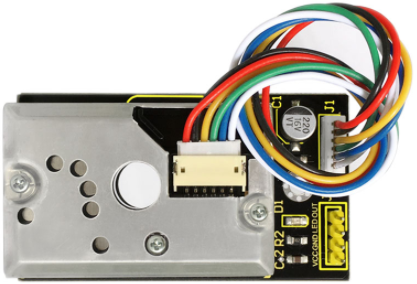
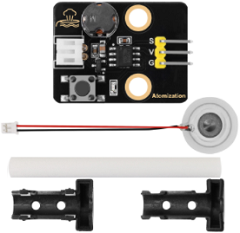
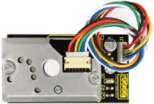
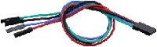
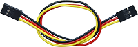
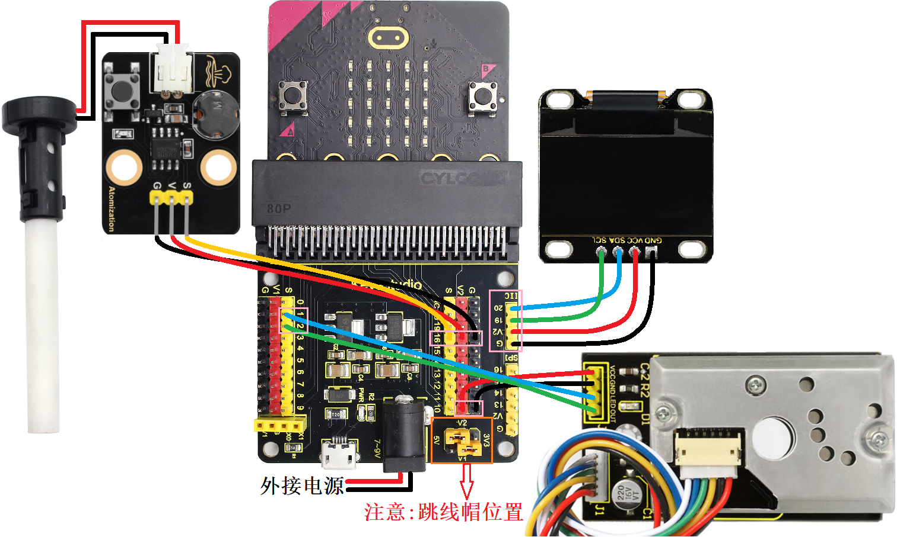
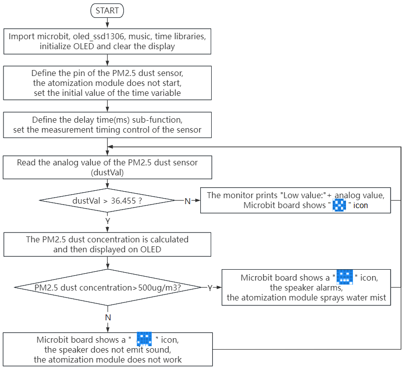
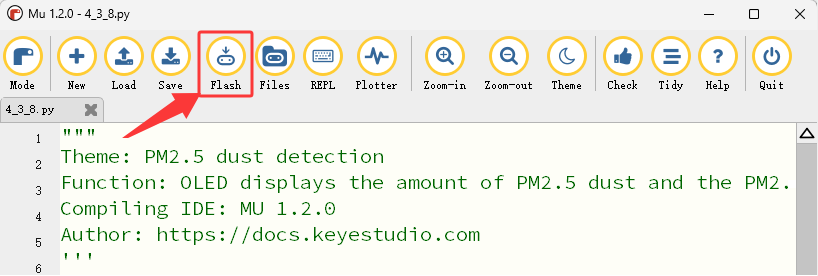

### 4.3.8 PM2.5粉尘检测

#### 4.3.8.1 简介


PM2.5 粉尘检测是用于检测空气中PM2.5浓度的激光粉尘仪，能够连续监测粉尘浓度的同时可收集颗粒物并分析成分。PM2.5指空气动力学直径小于2.5微米的颗粒物，其粒径减小会提高呼吸系统吸收率。

在本项目教程中，将介绍如何使用Micro:bit主板、PM2.5粉尘传感器、OLED显示屏、雾化模块和Micro:bit主板上的扬声器，构建一个PM2.5 粉尘检测系统。PM2.5粉尘传感器检测空气中的PM2.5颗粒物，OLED显示屏上实时显示PM2.5值，当PM2.5值达到一定值时，Micro:bit主板上的扬声器发出警报声，同时雾化模块喷出水雾，达到降粉尘的作用。


#### 4.3.8.2 元件知识


**PM2.5 粉尘传感器**



PM2.5 粉尘传感器搭载GP2Y1014AU0F芯片，可以很好地检测直径大于0.8μm的极细颗粒，甚至像香烟烟雾一样。它也有一个红外LED和光电晶体管，将它们对角排列，可以探测空气中灰尘的反射光。超低功耗（最大20mA，典型11mA），模拟电压输出随粉尘密度线性变化。常应用于空气净化器、空调空气监测仪、PM2.5探测器等。

⚠️ **特别提醒：搭载GP2Y1014AU0F芯片的PM2.5 粉尘传感器需要至少30秒到2分钟的上电预热时间才能获得相对比较准确的读数。**

**参数：**

- 电源电压：DC 5 ~ 7V  
- 工作电流：20mA(Max) 
- 最小颗粒检出值：0.8μm 
- 灵敏度：0.5V/(0.1mg/m3) 
- 清洁空气中的电压：0.9V（典型）
- 工作温度：-10℃~65℃ 


#### 4.3.8.3 所需组件

| ||| 
| :--: | :--: | :--: |
| micro:bit V2 主板 ×1 | micro:bit传感器扩展板 ×1 |雾化模块 ×1|
||| |
|PM2.5粉尘传感器 ×1|OLED显示屏 ×1 |AA电池(**自备**) ×6|
| |||
|4 pin 线材(红黑蓝绿) ×1|4 pin 线材(黑红蓝绿) ×1 |3 pin 线材 ×1 |
|| |  |
|电池盒 ×1|  micro USB 线 ×1|  |

#### 4.3.8.4 接线图

⚠️ **特别注意：接线时，请注意区分线材颜色。**

| PM2.5粉尘传感器 | 线材颜色 | micro:bit传感器扩展板引脚 |micro:bit主板引脚 |
| :--: | :--: | :--: | :--: |
| VCC | 红线 | V2 | V |
| GND | 黑线 | G  | G |
| LED | 蓝线 | 1  | P1 |
| OUT | 绿线 | 2  | P2 |

| OLED显示屏 | 线材颜色 | micro:bit传感器扩展板引脚 |micro:bit主板引脚 |
| :--: | :--: | :--: | :--: |
| GND | 黑线 | G  | G |
| VCC | 红线 | V2 | V |
| SDA | 蓝线 | 20 | P20 |
| SCL | 绿线 | 19 | P19 |

| 雾化模块 | 线材颜色 | micro:bit传感器扩展板引脚 |micro:bit主板引脚 |
| :--: | :--: | :--: | :--: |
| G | 黑线 | G  | G |
| V | 红线 | V2 | V |
| S | 黄线 | 16 | P16 |



#### 4.3.8.5 代码流程图



#### 4.3.8.6 实验代码

⚠️ **特别注意：下面示例代码中，if()条件中的阈值 500 可以根据实际情况加以修改的**

**完整代码：**

```Python
'''
Theme: PM2.5 dust detection
Function: OLED displays the amount of PM2.5 dust and the PM2.5 dust sensor controls the micro:bit 5*5 dot matrix, speaker and atomization module
Compiling IDE: MU 1.2.0
Author: https://docs.keyestudio.com
'''
# import related libraries
from microbit import *
from oled_ssd1306 import *
import music
import time

# initialize and clear oled
initialize()
clear_oled()

# Pin configuration
led_Pin = pin1
out_Pin = pin2

pin16.write_digital(1) # set P16 pin to high level

# Time parameter
delayTime = 280
delayTime2 = 40
offTime = 9680

def microsecond_delay(us):
    """Precise microsecond delay"""
    start = time.ticks_us()
    while time.ticks_diff(time.ticks_us(), start) < us:
        pass

while True:
    # Measurement sequence
    led_Pin.write_digital(0)      # LED OFF
    microsecond_delay(delayTime)   # 280μs

    dustVal = out_Pin.read_analog()  # Read the sensor

    microsecond_delay(delayTime2)  # 40μs
    led_Pin.write_digital(1)      # LED ON
    microsecond_delay(offTime)     # 9680μs

    # Calculation and display
    if dustVal > 36.455:
        # The exact same calculation formula
        voltage = dustVal / 1024.0
        pm25 = (voltage - 0.0356) * 120000 * 0.035

        # OLED displays detailed information
        add_text(0, 0, "PM2.5 dust: ") # Display the value of PM2.5 in the corresponding position of OLED
        add_text(0, 2, str(round(pm25)) + " ug/m3") # Display the value of PM2.5 in the corresponding position of OLED

        # Quality indication
        if pm25  > 500 :    # PM2.5 value > 500
            display.show(Image.SAD) # LED matrix displays a sad pattern
            music.play("E5:4")       # speaker plays E5 tone
            sleep(1000)
            pin16.write_digital(0) # set P16 pin to low level
            sleep(3000)
            pin16.write_digital(1) # set P16 pin to high level
            sleep(1000)
            pin16.write_digital(0) # set P16 pin to low level
            sleep(3000)
            pin16.write_digital(1) # set P16 pin to high level
            sleep(1000)
        else: # or
            display.show(Image.HAPPY) # LED matrix displays a happy pattern
            music.reset()             # no tone
            pin16.write_digital(1) # set P16 pin to high level
    else:
        print("Low value:", dustVal)
        display.show(Image.NO)

    # delay 0.2s
    sleep(200)
    clear_oled()   # clear OLED
```


**简单说明：**

① 导入microbit，oled_ssd1306，music和time等库文件。

```Python
from microbit import *
from oled_ssd1306 import *
import music
import time
```

② 初始化OLED和OLED清屏。

```Python
initialize()
clear_oled()
```

③ 初始化PM2.5粉尘传感器的引脚。

```Python
led_Pin = pin1
out_Pin = pin2
```

④ 设置接到P16引脚的雾化模块不启动。

```Python
pin16.write_digital(1)
```
⑤ 设置时间变量初始值。

```Python
delayTime = 280
delayTime2 = 40
offTime = 9680
```

⑥ 定义微秒延时时间子函数。

```Python
def microsecond_delay(us):
    """Precise microsecond delay"""
    start = time.ticks_us()
    while time.ticks_diff(time.ticks_us(), start) < us:
        pass
```

⑦ PM2.5粉尘传感器的测量时序控制，主要作用是检测空气中的粉尘浓度。

```Python
led_Pin.write_digital(0)      # LED OFF
microsecond_delay(delayTime)   # 280μs

dustVal = out_Pin.read_analog()  # Read the sensor

microsecond_delay(delayTime2)  # 40μs
led_Pin.write_digital(1)      # LED ON
microsecond_delay(offTime)     # 9680μs
```

⑧ 这是if()...else...的判断语句。

当PM2.5粉尘传感器检测到的粉尘模拟值大于36.455时，通过公式计算得到PM2.5粉尘浓度值，并且OLED显示PM2.5粉尘浓度值；否则，串口打印对应的粉尘模拟值。

```Python
if dustVal > 36.455:
    # The exact same calculation formula
    voltage = dustVal / 1024.0
    pm25 = (voltage - 0.0356) * 120000 * 0.035

    # OLED displays detailed information
    add_text(0, 0, "PM2.5 dust: ") # Display the value of PM2.5 in the corresponding position of OLED
    add_text(0, 2, str(round(pm25)) + " ug/m3") # Display the value of PM2.5 in the corresponding position of OLED

else:
    print("Low value:", dustVal)
    display.show(Image.NO)
```

⑨ 这是if()...else...的判断语句。

当PM2.5粉尘传感器检测到的粉尘颗粒浓度值大于500ug/m3时，Microbit主板上的5×5LED点阵屏显示图案，扬声器发出警报声，1s时间后启动雾化模块喷出水雾；否则，5×5LED点阵屏显示图案，扬声器不发声，雾化模块未启动。

```Python
if pm25  > 500 :    # PM2.5 value > 500
    display.show(Image.SAD) # LED matrix displays a sad pattern
    music.play("E5:4")       # speaker plays E5 tone
    sleep(1000)
    pin16.write_digital(0) # set P16 pin to low level
    sleep(3000)
    pin16.write_digital(1) # set P16 pin to high level
    sleep(1000)
    pin16.write_digital(0) # set P16 pin to low level
    sleep(3000)
    pin16.write_digital(1) # set P16 pin to high level
    sleep(1000)
else: # or
    display.show(Image.HAPPY) # LED matrix displays a happy pattern
    music.reset()             # no tone
    pin16.write_digital(1) # set P16 pin to high level
```

#### 4.3.8.7 实验结果


按照接线图接好线，利用micro USB数据线上电，同时还需要外接电源(6个AA电池安装到电池盒，保证电源充足)，然后点击 “<span style="color: rgb(255, 76, 65);">Flash</span>” 按钮将示例代码下载到micro：bit主板。



示例代码成功下载到micro:bit主板之后，然后按一下micro:bit主板上背面的复位按钮。


室内扫地/点燃火柴/少量纸张安全燃烧(这几种方法会产生明显的PM2.5粉尘颗粒)，PM2.5粉尘传感器检测空气中的PM2.5粉尘颗粒物，同时OLED显示屏上实时显示PM2.5粉尘浓度值。

当PM2.5粉尘浓度值大于500ug/m3时，Microbit主板上的5×5LED点阵屏显示图案，扬声器发出警报声，1s时间后启动雾化模块喷出水雾，达到降粉尘的作用；否则，5×5LED点阵屏显示图案，扬声器不发声，雾化模块未启动。

|OLED显示测试得到的数据| 空气质量对照 |
| :--: | :--: |
|0-75 | 非常好 | 
|75-150 | 很好 | 
|150-300 | 好 | 
|300-1050 | 一般 | 
|1050-3000| 差 |
|3000 + | 很差 |


