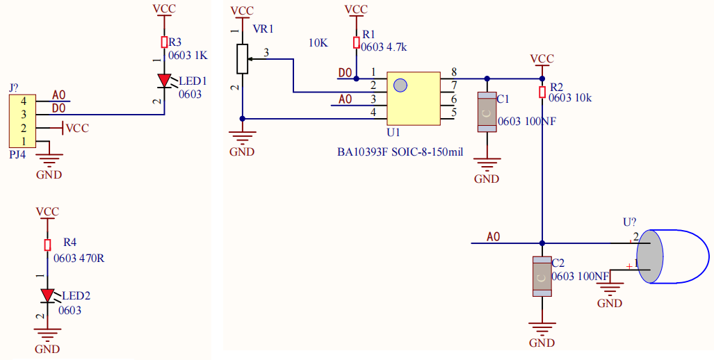

### 4.3.9 火灾检测报警

#### 4.3.9.1 简介


火灾检测报警‌，是预防家庭火灾的重要设备。它的主要作用是在探测到火源时触发报警，从而提醒人们采取措施防止火灾的发生或扩散。

在本项目教程中，将介绍如何使用Micro:bit主板、火焰传感器、130电机模块和Micro:bit主板上的扬声器与点阵，构建一个火灾检测报警系统。火焰传感器检测有火源时，Micro:bit主板上的扬声器发出警报，同时Micro:bit主板上的点阵显示提示图案，然后启动风扇转动，达到灭火的效果。


#### 4.3.9.2 元件知识


**火焰传感器**


火焰传感器上有一个远红外火焰探头，起着非常重要的作用，它可以检测火焰或者波长在760纳米～1100纳米范围内的光源，它的探测角度为60度左右，它对火焰光谱特别灵敏并且灵敏度可调，性能稳定，是救火机器人必备部件。该传感器有两个信号输出端，分别可输出数字信号与模拟信号。

此外，上电后，传感器上的一个指示灯亮红灯，还可以通过调节蓝色的电位器(**使用一字螺丝刀调节**)，使另一个指示灯(亮红灯)介于不亮与亮之间的临界点时，灵敏度最高。

**原理图：**



**参数：**

- 工作电压: DC 3.3V~5V
- 工作电流: 1.2mA
- 最大功率: 0.006W
- 输出信号：模拟信号和数字信号
- 工作温度：-10°C ~ +50°C


#### 4.3.9.3 所需组件

| |   || 
| :--: | :--: | :--: |
| micro:bit主板 *1 | micro:bit传感器扩展板 *1 |火焰传感器 *1 |
| | ||
|130电机模块 *1| micro USB 线 *1|4 pin 线材 *2 |
| || |
|风扇叶 *1|电池盒 *1|AA电池(**自备**) *6|

#### 4.3.9.4 接线图

⚠️ **特别注意：接线时，请注意区分线材颜色。**

| OLED显示屏 | 线材颜色 | micro:bit传感器扩展板引脚 |micro:bit主板引脚 |
| :--: | :--: | :--: | :--: |
| GND | 黑线 | G | G |
| VCC | 红线 | V2 | V |
| SDA | 蓝线 | 20 | P20 |
| SCL | 绿线 | 19 | P19 |

| 130电机模块 | 线材颜色 | micro:bit传感器扩展板引脚 |micro:bit主板引脚 |
| :--: | :--: | :--: | :--: |
| G | 黑线 | G | G |
| V | 红线 | V2 | V |
| IN+ | 蓝线 | 2 | P2 |
| IN- | 绿线 | 16 | P16 |

| 火焰传感器 | 线材颜色 | micro:bit传感器扩展板引脚 |micro:bit主板引脚 |
| :--: | :--: | :--: | :--: |
| G | 黑线 | G | G |
| V | 红线 | V1 | V |
| D | 蓝线 | 9 | P9 |
| A | 绿线 | 2 | P2 |


#### 4.3.9.5 代码流程图


#### 4.3.9.6 实验代码

**特别注意：下面示例代码中，if条件中的阈值 10 可以根据实际情况加以修改的**

**完整代码：**

```Python
'''
Theme: Fire detection and alarm
Function: OLED displays information related to whether a fire has occurred, and the flame sensor controls the speaker, fan, etc
Compiling IDE: MU 1.2.0
Author: https://docs.keyestudio.com
'''
# import related libraries
from oled_ssd1306 import *
from microbit import *
import math
import music

# initialize and clear oled
initialize()  # initialize oled
clear_oled()  # clear oled

# Configuration parameters
FIRE_A_PIN = pin1  # Connect the A pin of the flame sensor to P1 (analog input)
FIRE_D_PIN = pin9  # Connect the D pin of the flame sensor to P9 (digital input)
BIG_FIRE_VALUE = 0  # The minimum ADC value in the flame state
FIRELESS_VALUE = 1023  # The maximum ADC value in a flameless state

def map_value(value, in_min, in_max, out_min, out_max):
    """Linearly map the input values to the output range"""
    if in_max - in_min == 0:  # Prevent division by zero errors
        return out_min
    return (value - in_min) * (out_max - out_min) // (in_max - in_min) + out_min

def get_fire_percentage():
    """Read the sensor and return the flame intensity"""
    raw_value = FIRE_A_PIN.read_analog()
    percentage = map_value(raw_value, FIRELESS_VALUE, BIG_FIRE_VALUE, 0, 100)
    return max(0, min(100, percentage)) # It is limited within the range of 0 to 100

while True:
    fire_percent = get_fire_percentage()  # Read the flame intensity and limit it within the range of 0 to 100
    D_val = FIRE_D_PIN.read_digital() # Read the digital value connected to pin9, and assign it to D_val
    clear_oled()
    if D_val == 0:  # if a flame is detected
       add_text(0, 0, "Have a fire")   # Display the character string on the OLED
       add_text(0, 2, "Fire Val: " + str(fire_percent) + "%") # Display the flame intensity on the OLED
       display.show(Image.SAD) # LED matrix displays a sad pattern
       music.play("E5:8")      # speaker plays E5 tone
       sleep(1000)
       pin2.write_analog(500) # set P2 pin to analog 500
       pin16.write_digital(0) # set P16 pin to digital 0
    else: # or
       add_text(0, 0, "No fire")
       sleep(200)
       display.show(Image.HAPPY)  # LED matrix displays a happy pattern
       music.reset()  # no tone
       pin2.write_analog(0)
       pin16.write_digital(0)
```


**简单说明：**

① 导入microbit，oled_ssd1306，math和music等库文件。

```Python
from oled_ssd1306 import *
from microbit import *
import math
import music
```

② 初始化OLED和OLED清屏。

```Python
initialize()
clear_oled()
```

③ 初始化火焰传感器的引脚和变量值。

```Python
FIRE_A_PIN = pin1  # Connect the A pin of the flame sensor to P1 (analog input)
FIRE_D_PIN = pin9  # Connect the D pin of the flame sensor to P9 (digital input)
BIG_FIRE_VALUE = 0  # The minimum ADC value in the flame state
FIRELESS_VALUE = 1023  # The maximum ADC value in a flameless state
```

④ 定义一个映射(将任何一个数字范围映射到另一个数字范围)子函数。

```Python
def map_value(value, in_min, in_max, out_min, out_max):
    """Linearly map the input values to the output range"""
    if in_max - in_min == 0:  # Prevent division by zero errors
        return out_min
    return (value - in_min) * (out_max - out_min) // (in_max - in_min) + out_min
```
⑤ 定义读取火焰传感器模拟值并返回火焰强度的子函数。

```Python
def get_fire_percentage():
    """Read the sensor and return the flame intensity"""
    raw_value = FIRE_A_PIN.read_analog()
    percentage = map_value(raw_value, FIRELESS_VALUE, BIG_FIRE_VALUE, 0, 100)
    return max(0, min(100, percentage)) # It is limited within the range of 0 to 100
```

⑥ 将火焰传感器检测的火焰强度赋给于变量fire_percent，数字信号赋给于变量D_val。

```Python
fire_percent = get_fire_percentage()  # Read the flame intensity and limit it within the range of 0 to 100
D_val = FIRE_D_PIN.read_digital() # Read the digital value connected to pin9, and assign it to D_val
```

⑦ 这是if()...else...的判断语句。

当火焰传感器检测到火焰时，OLED显示字符串 “Have a fire” 和火焰强度，Microbit主板上的5×5LED点阵显示图案，扬声器发出警报声，1s时间后启动风扇转动；否则，OLED显示字符串 “No fire”，Microbit主板上的5×5LED点阵显示图案，扬声器不发声，风扇不转动。

```Python
if D_val == 0:  # if a flame is detected
    add_text(0, 0, "Have a fire")   # Display the character string on the OLED
    add_text(0, 2, "Fire Val: " + str(fire_percent) + "%") # Display the flame intensity on the OLED
    display.show(Image.SAD) # LED matrix displays a sad pattern
    music.play("E5:8")      # speaker plays E5 tone
    sleep(1000)
    pin2.write_analog(500) # set P2 pin to analog 500
    pin16.write_digital(0) # set P16 pin to digital 0
else: # or
    add_text(0, 0, "No fire")
    sleep(200)
    display.show(Image.HAPPY)  # LED matrix displays a happy pattern
    music.reset()  # no tone
    pin2.write_analog(0)
    pin16.write_digital(0)
```

#### 4.3.9.7 实验结果


点击 “<span style="color: rgb(255, 76, 65);">Flash</span>” 按钮将示例代码下载到micro：bit主板。


示例代码成功下载到micro:bit主板之后，利用micro USB数据线上电，同时还需要外接电源(6个AA电池安装到电池盒，保证电源充足)，然后按一下micro:bit主板上背面的复位按钮。


当火焰传感器检测到火焰(可以使用打火机打火)时，OLED显示字符串 “Have a fire” 和火焰强度，Microbit主板上的5×5LED点阵显示图案，扬声器发出警报声，1s时间后启动风扇转动，达到灭火的效果；否则，OLED显示字符串 “No fire”，Microbit主板上的5×5LED点阵显示图案，扬声器不发声，风扇不转动。


