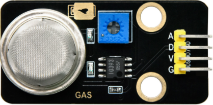
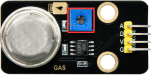
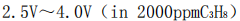
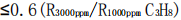
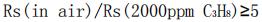
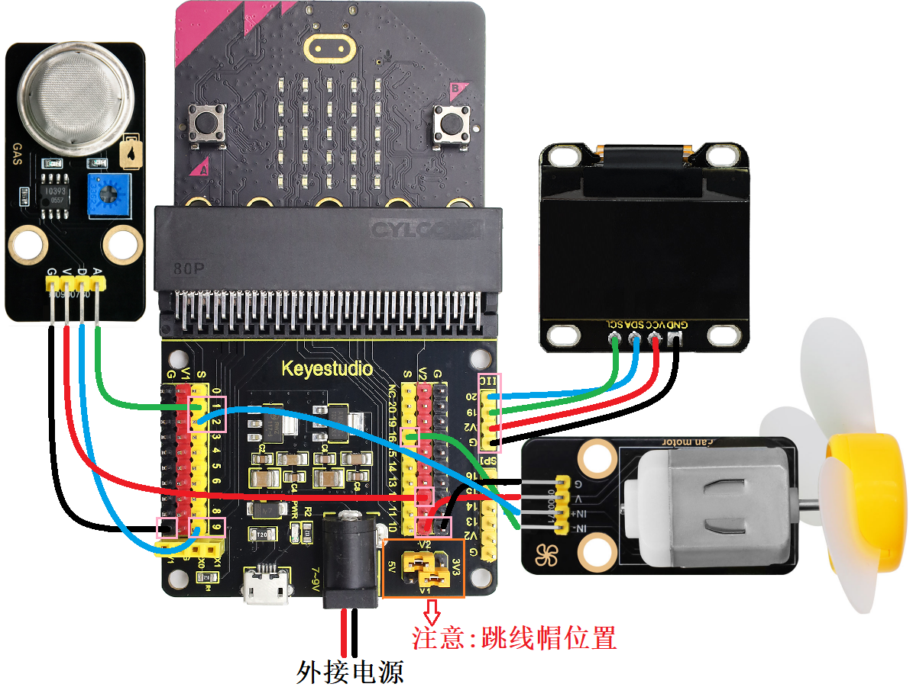
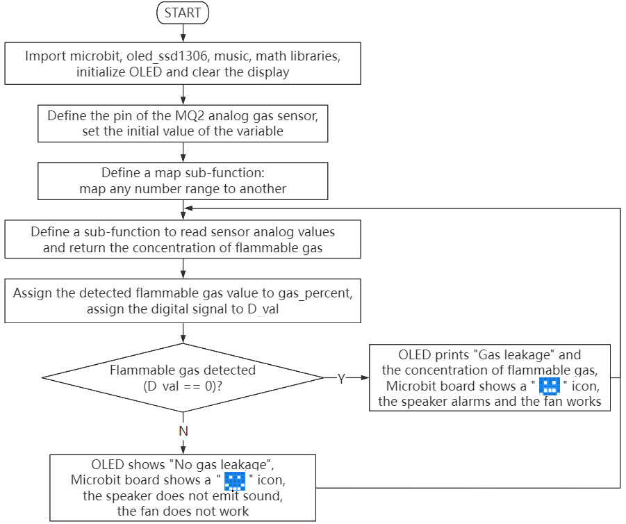
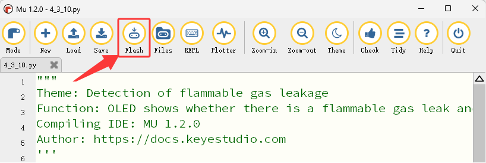

### 4.3.10 可燃性气体泄露检测

#### 4.3.10.1 简介


如今很多家庭都安装有液化气灶或天然气灶，很容易发生可燃性气体泄漏事故。当可燃性气体泄露并且浓度逐渐增加，超过报警设定值时，报警指示灯闪烁，报警器鸣响，同时启动排风扇转动，将可燃性气体及时排出，降低在空气中的浓度，消除气体中毒和发生爆炸的可能性。

在本项目教程中，将介绍如何使用Micro:bit主板、MQ-2模拟气体传感器、130电机模块和Micro:bit主板上的扬声器与点阵，构建一个可燃性气体泄露检测报警系统。MQ-2模拟气体传感器检测到可燃性气体时，Micro:bit主板上的扬声器发出警报，同时Micro:bit主板上的5×5LED点阵屏显示提示图案，提醒人们可燃性气体发生泄漏事故。并且启动风扇转动，使室内的可燃性气体及时排出，降低可燃性气体中毒或发生爆炸的可能性。


#### 4.3.10.2 元件知识  


**MQ-2模拟气体传感器**



MQ-2模拟气体传感器所使用的气敏材料是在清洁空气中电导率较低的二氧化锡(SnO2)。当传感器所处环境中存在可燃气体时，传感器的电导率随空气中可燃气体浓度的增加而增大。使用简单的电路即可将电导率的变化转换为与该气体浓度相对应的输出信号。

MQ-2模拟气体传感器对丙烷、烟雾的灵敏度高，对天然气和其它可燃蒸气的检测也很理想。这种传感器可检测多种可燃性气体，是一款适合多种应用的低成本传感器。

广泛适用于家庭用气体泄漏报警器、工业用可燃气体报警器以及便携式气体检测仪器。

此外，上电后，传感器模块上的一个指示灯亮绿灯，可以通过调节蓝色的电位器(**使用一字螺丝刀调节**)使另一个指示灯(亮红灯)介于不亮与亮之间的临界点时，灵敏度最高。



⚠️ **特别提醒：MQ-2模拟气体传感器在使用之前必须加热一段时间，这样输出的电阻和电压较准确。但是加热电压不宜过高，否则会导致内部的信号线熔断。**

**原理图：**


**参数：**

- 工作电压：DC 5V
- 工作电流：150mA(DC5V)
- 工作温度：0°C ~ 40°C
- 检测气体：可燃性气体、烟雾
- 控制接口：数字、模拟输出
- 输出电压：
- 检测浓度：300-10000ppm(可燃气体)
- 浓度斜率：
- 灵敏度：


#### 4.3.10.3 所需组件

| |   || 
| :--: | :--: | :--: |
| micro:bit V2 主板 ×1 | micro:bit传感器扩展板 ×1 |MQ-2模拟气体传感器 ×1 |
| | ||
|130电机模块 ×1| micro USB 线 ×1|4 pin 线材(黑红蓝绿) ×2 |
| || |
|风扇叶 ×1|电池盒 ×1|AA电池(**自备**) ×6|

#### 4.3.10.4 接线图

⚠️ **特别注意：接线时，请注意区分线材颜色。**

| OLED显示屏 | 线材颜色 | micro:bit传感器扩展板引脚 |micro:bit主板引脚 |
| :--: | :--: | :--: | :--: |
| GND | 黑线 | G | G |
| VCC | 红线 | V2 | V |
| SDA | 蓝线 | 20 | P20 |
| SCL | 绿线 | 19 | P19 |

| 130电机模块 | 线材颜色 | micro:bit传感器扩展板引脚 |micro:bit主板引脚 |
| :--: | :--: | :--: | :--: |
| G | 黑线 | G | G |
| V | 红线 | V2 | V |
| IN+ | 蓝线 | 2 | P2 |
| IN- | 绿线 | 16 | P16 |

| MQ-2模拟气体传感器 | 线材颜色 | micro:bit传感器扩展板引脚 |micro:bit主板引脚 |
| :--: | :--: | :--: | :--: |
| G | 黑线 | G | G |
| V | 红线 | V2 | V |
| D | 蓝线 | 9 | P9 |
| A | 绿线 | 1 | P1 |



#### 4.3.10.5 代码流程图



#### 4.3.10.6 实验代码

**完整代码：**

```Python
'''
Theme: Detection of flammable gas leakage
Function: OLED shows whether there is a flammable gas leak and the MQ2 analog gas sensor controls the speaker, fan, etc
Compiling IDE: MU 1.2.0
Author: https://docs.keyestudio.com
'''
# import related libraries
from oled_ssd1306 import *
from microbit import *
import math
import music

# initialize and clear oled
initialize()  # initialize oled
clear_oled()  # clear oled

# Configuration parameters
Gas_A_PIN = pin1  # Connect the A pin of the MQ2 analog gas sensor to P1 (analog input)
Gas_D_PIN = pin9  # Connect the D pin of the MQ2 analog gas sensor to P9 (digital input)
GAS_VALUE = 1023  # The maximum ADC value in the presence of flammable gas (max amount of flammable gas)
GASLESS_VALUE = 0  # The minimum ADC value in the absence of flammable gas (non-flammable gas)

def map_value(value, in_min, in_max, out_min, out_max):
    """Linearly map the input values to the output range"""
    if in_max - in_min == 0:  # Prevent division by zero errors
        return out_min
    return (value - in_min) * (out_max - out_min) // (in_max - in_min) + out_min

def get_gas_percentage():
    """Read the sensor and return the concentration of the analog gas MQ2"""
    raw_value = Gas_A_PIN.read_analog()
    percentage = map_value(raw_value, GASLESS_VALUE, GAS_VALUE, 0, 100)
    return max(0, min(100, percentage)) # It is limited within the range of 0 to 100

while True:
    gas_percent = get_gas_percentage() # Read the gas concentration and limit it within the range of 0 to 100
    D_val = Gas_D_PIN.read_digital() # Read the digital value connected to pin9, and assign it to D_val
    clear_oled()
    if D_val == 0:  # If gas is detected
       add_text(0, 0, "Gas leakage")   # Display the character string on the OLED
       add_text(0, 2, "Gas Val: " + str(gas_percent) + "%") # Display the gas concentration on the OLED
       display.show(Image.SAD) # LED matrix displays a sad pattern
       music.play("E5:8")      # speaker plays E5 tone
       sleep(1000)
       pin2.write_analog(500) # set P2 pin to analog 500
       pin16.write_digital(0) # set P16 pin to digital 0
    else: # or
       add_text(0, 0, "No gas leakage")
       sleep(200)
       display.show(Image.HAPPY)  # LED matrix displays a happy pattern
       music.reset()  # no tone
       pin2.write_analog(0)
       pin16.write_digital(0)
```


**简单说明：**

① 导入microbit，oled_ssd1306，math和music等库文件。

```Python
from oled_ssd1306 import *
from microbit import *
import math
import music
```

② 初始化OLED和OLED清屏。

```Python
initialize()
clear_oled()
```

③ 初始化MQ2模拟气体传感器的引脚和变量值。

```Python
Gas_A_PIN = pin1  # Connect the A pin of the MQ2 analog gas sensor to P1 (analog input)
Gas_D_PIN = pin9  # Connect the D pin of the MQ2 analog gas sensor to P9 (digital input)
GAS_VALUE = 1023  # The maximum ADC value in the presence of flammable gas (max amount of flammable gas)
GASLESS_VALUE = 0  # The minimum ADC value in the absence of flammable gas (non-flammable gas)
```

④ 定义一个映射(将任何一个数字范围映射到另一个数字范围)子函数。

```Python
def map_value(value, in_min, in_max, out_min, out_max):
    """Linearly map the input values to the output range"""
    if in_max - in_min == 0:  # Prevent division by zero errors
        return out_min
    return (value - in_min) * (out_max - out_min) // (in_max - in_min) + out_min
```
⑤ 定义读取MQ2模拟气体传感器模拟值并返回可燃性气体浓度的子函数。

```Python
def get_gas_percentage():
    """Read the sensor and return the concentration of the analog gas MQ2"""
    raw_value = Gas_A_PIN.read_analog()
    percentage = map_value(raw_value, GASLESS_VALUE, GAS_VALUE, 0, 100)
    return max(0, min(100, percentage)) # It is limited within the range of 0 to 100
```

⑥ 将MQ2模拟气体传感器检测到的可燃性气体浓度值赋给于变量gas_percent，数字信号赋给于变量D_val。

```Python
gas_percent = get_gas_percentage() # Read the gas concentration and limit it within the range of 0 to 100
D_val = Gas_D_PIN.read_digital() # Read the digital value connected to pin9, and assign it to D_val
```

⑦ 这是if()...else...的判断语句。

当MQ2模拟气体传感器检测到可燃性气体时，OLED显示字符串 “Gas leakage” 和可燃性气体浓度，Microbit主板上的5×5LED点阵屏显示图案，扬声器发出警报声，1s时间后启动风扇转动；否则，OLED显示字符串 “No gas leakage”，Microbit主板上的5×5LED点阵屏显示图案，扬声器不发声，风扇不转动。

```Python
if D_val == 0:  # If gas is detected
    add_text(0, 0, "Gas leakage")   # Display the character string on the OLED
    add_text(0, 2, "Gas Val: " + str(gas_percent) + "%") # Display the gas concentration on the OLED
    display.show(Image.SAD) # LED matrix displays a sad pattern
    music.play("E5:8")      # speaker plays E5 tone
    sleep(1000)
    pin2.write_analog(500) # set P2 pin to analog 500
    pin16.write_digital(0) # set P16 pin to digital 0
else: # or
    add_text(0, 0, "No gas leakage")
    sleep(200)
    display.show(Image.HAPPY)  # LED matrix displays a happy pattern
    music.reset()  # no tone
    pin2.write_analog(0)
    pin16.write_digital(0)
```

#### 4.3.10.7 实验结果


按照接线图接好线，利用micro USB数据线上电，同时还需要外接电源(6个AA电池安装到电池盒，保证电源充足)，然后点击 “<span style="color: rgb(255, 76, 65);">Flash</span>” 按钮将示例代码下载到micro：bit主板。



示例代码成功下载到micro:bit主板之后，然后按一下micro:bit主板上背面的复位按钮。


当MQ-2模拟气体传感器检测到空气中的可燃性气体(使用打火机，轻轻按压打火处使气体喷出，但不要打出火来。但为了安全起见，也可以嘴对着传感器呼气)时，OLED显示字符串 “Gas leakage” 和可燃性气体浓度，Microbit主板上的5×5LED点阵屏显示图案，扬声器发出警报声，1s时间后启动风扇转动，达到吹散可燃性气体来降低浓度；否则，OLED显示字符串 “No gas leakage”，Microbit主板上的5×5LED点阵屏显示图案，扬声器不发声，风扇不转动。


