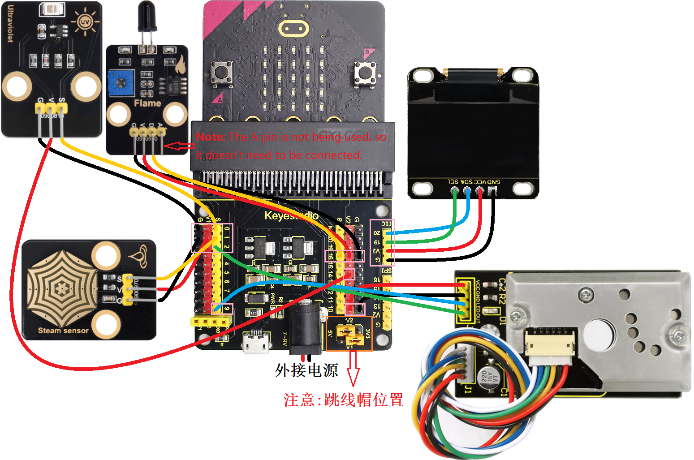
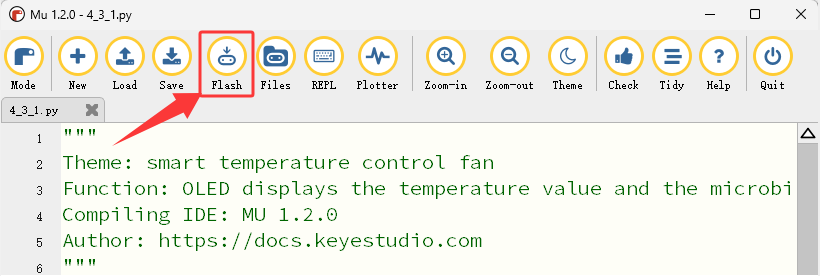

### 4.3.11 基于Micro:bit的多传感器OLED监控平台

#### 4.3.11.1 简介


在本项目实验中，利用Micro:bit主板作为核心处理单元，读取其内置传感器(例如：Micro:bit光线传感器，Micro:bit温度传感器和Micro:bit麦克风)及外接传感器(例如：PM2.5粉尘传感器、水滴传感器、火焰传感器和太阳紫外线传感器)的数据，并通过I2C接口的OLED显示屏进行实时、直观的显示。


#### 4.3.11.2 所需组件

| |  || 
| :--: | :--: | :--: |
| micro:bit主板 *1 | micro:bit传感器扩展板 *1 |OLED显示屏 *1 |
| |||
| PM2.5粉尘传感器 *1|火焰传感器 *1 |水滴传感器 *1 |
||| |
|太阳紫外线传感器 *1|电池盒 *1|AA电池(**自备**) *6|
| |||
|4 pin 线材(红黑蓝绿) *1|4 pin 线材(黑红蓝绿) *1 |3 pin 线材 *3 |
| | | |
| micro USB 线 *1| | |

#### 4.3.11.3 接线图

⚠️ **特别注意：接线时，请注意区分线材颜色。**

|太阳紫外线传感器| 线材颜色 | micro:bit传感器扩展板引脚 |micro:bit主板引脚 |
| :--: | :--: | :--: | :--: |
| G | 黑线 | G | G |
| V | 红线 | V2 | V |
| S | 黄线 | 0 | P0 |

| 火焰传感器 | 线材颜色 | micro:bit传感器扩展板引脚 |micro:bit主板引脚 |
| :--: | :--: | :--: | :--: |
| G | 黑线 | G | G |
| V | 红线 | V2 | V |
| D | 黄线 | 16 | P16 |

|水滴传感器| 线材颜色 | micro:bit传感器扩展板引脚 |micro:bit主板引脚 |
| :--: | :--: | :--: | :--: |
| G | 黑线 | G | G |
| V | 红线 | V1 | V |
| S | 黄线 | 1 | P1 |

| PM2.5粉尘传感器 | 线材颜色 | micro:bit传感器扩展板引脚 |micro:bit主板引脚 |
| :--: | :--: | :--: | :--: |
| VCC | 红线 | V2 | V |
| GND | 黑线 | G | G |
| LED | 蓝线 | 9 | P9 |
| OUT | 绿线 | 2| P2 |

| OLED显示屏 | 线材颜色 | micro:bit传感器扩展板引脚 |micro:bit主板引脚 |
| :--: | :--: | :--: | :--: |
| GND | 黑线 | G | G |
| VCC | 红线 | V2 | V |
| SDA | 蓝线 | 20 | P20 |
| SCL | 绿线 | 19 | P19 |



#### 4.3.11.4 实验代码

**完整代码：**

```Python
'''
Theme: A multi-sensor OLED monitoring platform based on Micro:bit
Function: OLED displays the values of multiple sensors
Compiling IDE: MU 1.2.0
Author: https://docs.keyestudio.com
'''
# import related libraries
from microbit import *
from oled_ssd1306 import *
import math
import time

display.show(Image.HAPPY)  # LED matrix displays a happy pattern

# initialize and clear oled
initialize()
clear_oled()

# Hardware connection: PM2.5 dust sensor
out_Pin = pin2
led_Pin = pin9

# Hardware connection: steam sensor
Steam_PIN = pin1
WET_VALUE = 1023
DRY_VALUE = 0

# Hardware connection: fire sensor
FIRE_D_PIN = pin16

# Initialize the ADC pin (the ultraviolet sensor is connected to pin0)
uv_sensor = pin0

# Time parameter
delayTime = 280
delayTime2 = 40
offTime = 9680

def map_value(value, in_min, in_max, out_min, out_max):
    """Linearly map the input values to the output range"""
    if in_max - in_min == 0:
        return out_min
    return (value - in_min) * (out_max - out_min) // (in_max - in_min) + out_min

def get_rain_percentage():
    """Read the sensor and return the percentage of rainfall"""
    raw_value = Steam_PIN.read_analog()
    percentage = map_value(raw_value, DRY_VALUE, WET_VALUE, 0, 100)
    return max(0, min(100, percentage))

def read_uv_index():
    raw_value = uv_sensor.read_analog()
    if raw_value > 1023:
        raw_value = 1023
    elif raw_value < 0:
        raw_value = 0
    uvi = raw_value * (15.0 / 1023)
    return round(uvi, 1)

def microsecond_delay(us):
    """Precise microsecond delay"""
    start = time.ticks_us()
    while time.ticks_diff(time.ticks_us(), start) < us:
        pass

while True:
    # Measurement sequence
    led_Pin.write_digital(0)      # LED OFF
    microsecond_delay(delayTime)   # 280μs
    dustVal = out_Pin.read_analog()  # Read the PM2.5 dust sensor
    microsecond_delay(delayTime2)  # 40μs
    led_Pin.write_digital(1)      # LED ON
    microsecond_delay(offTime)     # 9680μs

    Lightintensity = display.read_light_level()
    Temperature = temperature()
    soundLevel = microphone.sound_level()
    rain_percent = get_rain_percentage()
    uv = read_uv_index()
    D_val = FIRE_D_PIN.read_digital() 
    clear_oled()
    if D_val == 0:  # if a flame is detected
       add_text(0, 0, "Have a fire") # Display the character string on the OLED
    else: # or
       add_text(0, 0, "No fire")
    add_text(11, 0, " | UV:")
    add_text(17, 0, str(int(uv))) # Display the UV value on the OLED
    add_text(0, 2, "Temper:")
    add_text(7, 2, str(int(Temperature)) + "C") # Display the Temperature value on the OLED
    add_text(10, 2, " | Rain:")
    add_text(18, 2, str(int(rain_percent)) + "%") # Display the percentage of rainfall on the OLED
    add_text(0, 4, "Light:")
    add_text(6, 4, str(Lightintensity)) # Display the light intensity on the OLED
    add_text(9, 4, " | Sound:")
    add_text(18, 4, str(soundLevel)) # Display the noise intensity on the OLED
    # Calculation and display
    if dustVal > 36.455:
        # The exact same calculation formula
        voltage = dustVal / 1024.0
        pm25 = (voltage - 0.0356) * 120000 * 0.035

        # OLED displays detailed PM2.5dust value information.
        add_text(0, 6, "PM2.5dust:") 
        add_text(10, 6, str(round(pm25)) + "ug/m3")
    else:
        print("Low value:", dustVal)
    sleep(500)
```


**简单说明：**

① 导入microbit，oled_ssd1306，math和time等库文件。

```Python
from microbit import *
from oled_ssd1306 import *
import math
import time
```

②  Microbit主板上的5×5LED点阵显示图案。

```Python
display.show(Image.HAPPY)
```

③ 初始化OLED和OLED清屏。

```Python
initialize()
clear_oled()
```

④ 初始化PM2.5粉尘传感器的引脚。

```Python
out_Pin = pin2
led_Pin = pin9
```

⑤ 初始化水滴传感器的引脚和变量。

```Python
Steam_PIN = pin1
WET_VALUE = 1023
DRY_VALUE = 0
```

⑥ 初始化火焰传感器的数字引脚。

```Python
FIRE_D_PIN = pin16
```

⑦ 初始化太阳光紫外线传感器的引脚。

```Python
uv_sensor = pin0
```

⑧ 设置时间变量初始值。

```Python
delayTime = 280
delayTime2 = 40
offTime = 9680
```

⑨ 定义一个映射(将任何一个数字范围映射到另一个数字范围)子函数。

```Python
def map_value(value, in_min, in_max, out_min, out_max):
    """Linearly map the input values to the output range"""
    if in_max - in_min == 0:  # Prevent division by zero errors
        return out_min
    return (value - in_min) * (out_max - out_min) // (in_max - in_min) + out_min
```
⑩ 定义获取雨水量百分比的子函数。

```Python
def get_rain_percentage():
    """Read the sensor and return the percentage of rainfall"""
    raw_value = Steam_PIN.read_analog()
    percentage = map_value(raw_value, DRY_VALUE, WET_VALUE, 0, 100)
    return max(0, min(100, percentage))
```

⑪ 定义太阳光紫外线传感器检测紫外线强度等级的子函数。

```Python
def read_uv_index():
    raw_value = uv_sensor.read_analog()
    if raw_value > 1023:
        raw_value = 1023
    elif raw_value < 0:
        raw_value = 0
    uvi = raw_value * (15.0 / 1023)
    return round(uvi, 1)
```

⑫ 定义微秒延时时间子函数。

```Python
def microsecond_delay(us):
    """Precise microsecond delay"""
    start = time.ticks_us()
    while time.ticks_diff(time.ticks_us(), start) < us:
        pass
```

⑬ PM2.5粉尘传感器的测量时序控制，主要作用是检测空气中的粉尘浓度。

```Python
led_Pin.write_digital(0)      # LED OFF
microsecond_delay(delayTime)   # 280μs
dustVal = out_Pin.read_analog()  # Read the PM2.5 dust sensor
microsecond_delay(delayTime2)  # 40μs
led_Pin.write_digital(1)      # LED ON
microsecond_delay(offTime)     # 9680μs
```

⑭ 读取光线强度，温度，噪音强度，雨水量的百分数和太阳光紫外线强度。

```Python
Lightintensity = display.read_light_level()
Temperature = temperature()
soundLevel = microphone.sound_level()
rain_percent = get_rain_percentage()
uv = read_uv_index()
```

⑮ 将火焰传感器检测到的数字信号赋给于变量D_val。

```Python
D_val = FIRE_D_PIN.read_digital() 
```

⑯ 这是if()...else...的判断语句。

当火焰传感器检测到火焰时，OLED显示字符串 “Have a fire” ；否则，OLED显示字符串 “No fire”。

```Python
if D_val == 0:  # if a flame is detected
    add_text(0, 0, "Have a fire") # Display the character string on the OLED
else: # or
    add_text(0, 0, "No fire")
```

⑰ OLED显示屏显示太阳光紫外线强度，温度，雨水量的百分数，光线强度和噪音强度。

```Python
add_text(11, 0, " | UV:")
add_text(17, 0, str(int(uv))) # Display the UV value on the OLED
add_text(0, 2, "Temper:")
add_text(7, 2, str(int(Temperature)) + "C") # Display the Temperature value on the OLED
add_text(10, 2, " | Rain:")
add_text(18, 2, str(int(rain_percent)) + "%") # Display the percentage of rainfall on the OLED
add_text(0, 4, "Light:")
add_text(6, 4, str(Lightintensity)) # Display the light intensity on the OLED
add_text(9, 4, " | Sound:")
add_text(18, 4, str(soundLevel)) # Display the noise intensity on the OLED
```

⑱ 当PM2.5粉尘传感器检测到的粉尘模拟值大于36.455时，通过公式计算得到PM2.5粉尘浓度值，并且OLED显示PM2.5粉尘浓度值；否则，串口打印对应的粉尘模拟值

```Python
if dustVal > 36.455:
    # The exact same calculation formula
    voltage = dustVal / 1024.0
    pm25 = (voltage - 0.0356) * 120000 * 0.035

    # OLED displays detailed PM2.5dust value information.
    add_text(0, 6, "PM2.5dust:") 
    add_text(10, 6, str(round(pm25)) + "ug/m3") 
else:
    print("Low value:", dustVal)
```

#### 4.3.11.5 实验结果


点击 “<span style="color: rgb(255, 76, 65);">Flash</span>” 按钮将示例代码下载到micro：bit主板。



将示例代码下载到micro:bit主板后，利用micro USB数据线上电，同时还需要外接电源(6个AA电池安装到电池盒，保证电源充足)，然后按下microbit主板上背面的复位按钮。


读取Micro:bit主板内置传感器(例如：Micro:bit光线传感器，Micro:bit温度传感器和Micro:bit麦克风)及外接传感器(例如：PM2.5粉尘传感器、水滴传感器、火焰传感器和太阳紫外线传感器)的数据，并通过I2C接口的OLED显示屏进行实时、直观的显示。


