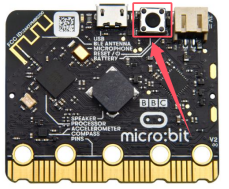

## 故障排除

1\. 上传代码后 micro:bit 板载5*5点阵显示哭脸，然后滚动显示错误信息。

2\. 如果是上传的代码时是否有不小心增加或者删除了代码中的字符，可以点击进行检查，但是这个检查，它有一些是没有错误的只是警告。

3\. 如果上传的代码是带有库文件的，那就先检查是否有给micro:bit主板导入相应库文件，请参考 “**Mu软件如何给mciro:bit导入库文件(重要）**” 进行导入库文件。

4\. 上传代码后点击不显示打印的数据，需要按下Micro:bit主板上背面的复位按键。

