# 1. Product Introduction

## 1.1 Product Safety

1\. This product contains small parts. Please keep it out of reach of children alone.

2\. Please operate strictly in accordance with the tutorial to avoid product damage, and pay attention to electrical safety.

---------------

## 1.2 Introduction

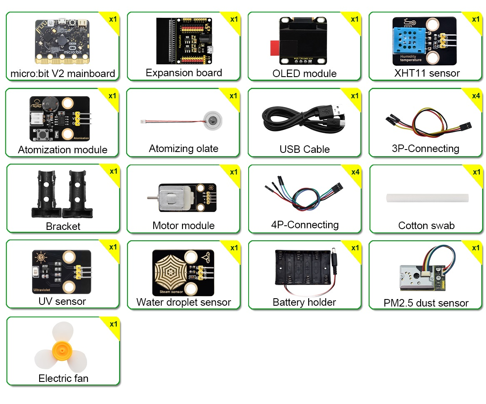

This environment monitoring learning kit is based on Micro:bit board and integrates multiple sensors and electronic components. You can build various fun and interesting DIY projects with it to have an intuitive and vivid learning experience. 

It not only enables students to experience the joy of innovation in practical operations, but also effectively cultivates their logical thinking ability, while fully demonstrating the practical and educational significance of technological applications.

---------------

## 1.3 Kit List

If any components are missing, please contact our sales staff immediately.

| # | NAME | QTY | PIC |
| :--: | :--: | :--: | :--: |
| 1 | micro:bit V2.0 main board | 1 | |
| 2 |micro:bit shield (sensor expansion board)| 1 | |
| 3 | XHT11 temperature and humidity sensor (DHT11 compatible) | 1 |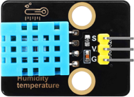|
| 4 | steam sensor | 1 ||
| 5 | PM2.5 dust sensor | 1 |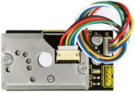|
| 6 |atomization module| 1 |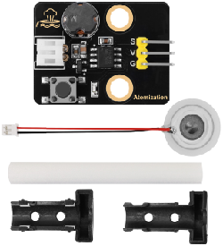|
| 7 |130 motor| 1 |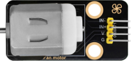|
| 8 |fan| 1 |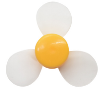|
| 9 |solar ultraviolet sensor| 1 ||
| 10 |OLED module| 1 |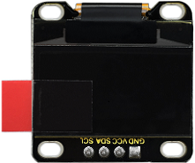|
| 11 |battery holder| 1 ||
| 12 |USB cable|1|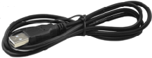|
| 13 |3 pin wire| 4 ||
| 14 |4 pin wire (black-red-blue-green)| 4 ||
| 15 |AA battery (**not included; self-prepared**)|6||

---------------

## 1.4 Parameters

- Operating voltage: DC 3.3V ~ 5V

- Battery voltage: DC 7V ~ 9V

- Maximum output current: ≤1.5A

- Maximum dissipation power: ≤10W

- Operating temperature: -10 to +65 degrees Celsius

- Product weight: 277.4g±1% (packaging included)

- Packaging size: 230mm×105mm×50mm(±1%)

---------------

## 1.5 Micro:bit Shield

### 1.5.1 Introduction

In the education market, micro:bit control boards are becoming increasingly popular. However, a single micro:bit is not easy to test with other sensor modules. So we specially design this keyestudio sensor expansion board for it.

It splits all IO ports on the micro:bit board into 3-pin interfaces (GND, VCC, Signal), making it very convenient to connect the board and other sensor modules.

In addition, it also extends some commonly used serial communication interfaces to pins or female headers with a spacing of 2.54mm, including I2C and SPI communication pins. Therefore, it enables communication between the micro:bit and other communication devices.

The micro:bit can be powered through the black DC port(DC 7-9V) or the micro USB port(DC 5V) on the expansion board.

When powering the sensor, the supply voltage can be selected as 3.3V or 5V by the jumper caps V1 and V2.

⚠️ **Attention:**

When external sensors are connected to the board, the working current of the AMS1117-3.3V and NCP1117ST50T3G chips will be very large to cause overheating. Please pay attention to avoiding contact them to prevent them from being burned out.

### 1.5.2 Parameters

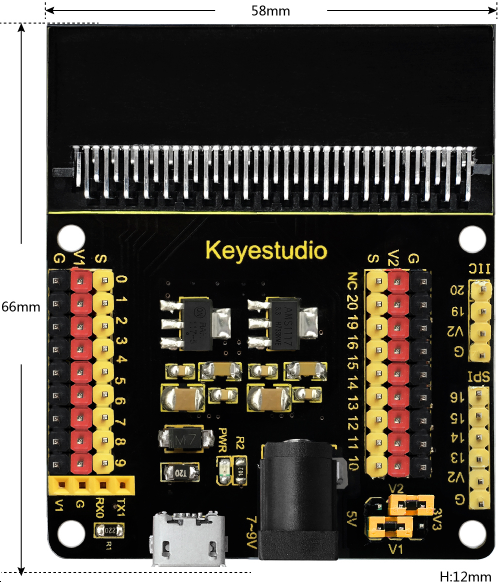

- Input voltage: Black DC port (DC 7-9V) or micro USB port (DC 5V)
- Output voltage: 3.3V/5V via jumper caps V1/V2
- A power indicator
- Splits the IO ports of the micro:bit board into 3-pin interfaces
- Serial communication pin
- I2C communication pin
- SPI communication pin
- Dimensions: 66mm x 58mm x 12mm
- Weight: 31 g

### 1.5.3 Pin-out

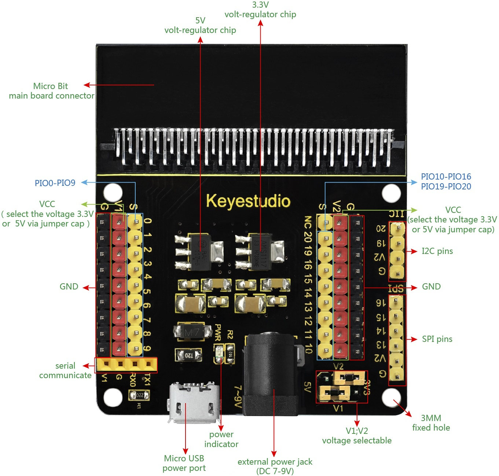

|    PIC         |     V1 voltage/V     |    V2 voltage/V    |
| :---------------: | :--------------------: | :--------------------: |
|  | 3.3                    | 3.3               |
| 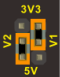 | 3.3                    | 5                 |
|  | 5                      | 5                 |
| 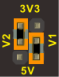 | 5                      | 3.3               |

---------------

## 1.6 About Micro:bit

### 1.6.1 What is Micro:bit?

Micro:bit is a microcomputer development board used for programming education among teenagers, which is launched by the British Broadcasting Corporation (BBC).

Though it is just the size of a credit card, the Micro:bit V2.0 board is equipped with loads of components,including a 5*5 LED dot matrix, 2 programmable buttons, an accelerometer, a compass, a thermometer, a touch-sensitive logo and a MEMS microphone, a Bluetooth module of low energy, and a buzzer and others. Thus, it also boasts multiple functions. The buzzer built in the other side of the board plays all kinds of sounds without any external equipment. Moreover, this board has a sleeping mode to lower power consumption of batteries when users long-press the Reset & Power button on the back. 

### 1.6.2 Micro:bit V2 Board

### 1.6.3 Micro:bit V2 Pin-out

The functions of the micro:bit pins are shown in the following table:

| Function | Pin |
| :--: | :--- |
| GPIO | P0，P1，P2，P3，P4，P5，P6，P7，P8，P9，P10，P11，P12，P13，P14，P15，P16，P19，P20 |
| ADC/DAC | P0，P1，P2，P3，P4，P10 |
| IIC | P19（SCL），P20（SDA）|
| SPI | P13（SCK），P14（MISO），P15（MOSI） |
| PWM (Commonly used) |P0，P1，P2，P3，P4，P10|
|Occupied|P5(Button A)，P6(LED Col4)，P7(LED Col2)，P10(LED Col5)，P11(Button B)|

For detailed information, please refer to these official websites:

- [https://tech.microbit.org/hardware/edgeconnector/](https://tech.microbit.org/hardware/edgeconnector/)

- [https://microbit.org/](https://microbit.org/)

- [https://microbit.org/get-started/features/overview/](https://microbit.org/get-started/features/overview/)

- [https://microbit.org/guide/hardware/pins/](https://microbit.org/guide/hardware/pins/)

- [https://microbit.org/projects/make-it-code-it/](https://microbit.org/projects/make-it-code-it/)

- [https://microbit.org/get-started/what-is-the-microbit/](https://microbit.org/get-started/what-is-the-microbit/)

### 1.6.4 Notes for Application

1\. It is recommended to cover it with a silicone protector to prevent short circuit for it has a lot of sophisticated electronic components.

2\. Its IO port is very weak in driving since it can merely handle current less than 300mA. Therefore, do not connect it with devices operating in large current, such as servo MG995 and DC motor or it will get burnt. Furthermore, you must figure out the current requirements of the devices before you use them and it is generally recommended to use the board together with a Micro:bit shield.

3\. It is recommended to power the main board via the USB interface or via the battery of 3V. The IO port of this board is 3V3, so it does not support sensors of 5V. If you need to connect sensors of 5V, a micro:bit shield is required.

4\. When using pins(P3, P4, P6, P7 and P10) shared with the LED dot matrix, blocking them from the matrix or the LEDs may display randomly and the data about sensors connected maybe wrong.

5\. **Pin 19 and 20 can not be used as IO ports** though the Makecode shows they can. They can only be used as I2C communication.

6\. The battery port of 3V cannot be connected with battery more than 3.3V or the main board will be damaged.

7\. Forbid to operate it on metal products to avoid short circuit.

To put it simple, micro:bit board is like a microcomputer which has made programming at our fingertips and enhanced digital innovation.

---------------

