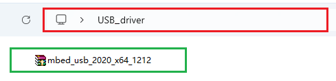

# 2. USB Driver Installation (Optional)

*This is not a required reading part. Miro:bit can be driven without a USB driver. Yet if your computer cannot recognize the micro:bit board, you need to install a micro:bit driver according to the following steps.*

## 2.1 USB Driver Download

Click to download the [USB driver](./USB_driver.7z).

## 2.2 Driver Installation

⚠️ **ATTENTION:** Please install the driver on the Windows system according to these steps. They can be a referance for that on the MacOS system.

1\. Connect the micro:bit board to the computer through a micro USB cable.

2\. In the folder **USB driver**, open the driver file to “**Install**”.

3\. “**Install**” and “**Next**”.

4\. “**Install**” and “**Finish**”.

5\. After that, “**Computer**” —> “**Properties**” —> “**Device manager**” and you will see:

