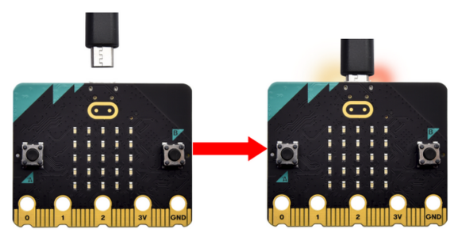

# 2. USB驱动安装（选读部分）

*本部分非必读部分。miro:bit是可以免安装USB驱动的。如果你的电脑识别不了micro:bit主板，则需要按照以下驱动安装步骤来安装一下micro:bit驱动。*

## 2.1 USB驱动下载

USB驱动下载：[USB驱动](./USB_driver.7z)

## 2.2 驱动安装步骤

⚠️ **特别提醒:** 以下驱动安装步骤是以Windows系统为例，MacOS系统大同小异，可以参考。

1\. 首先将micro:bit主板用micro USB数据线连接到电脑上。

2\. 在 **USB driver** 文件夹中找到驱动文件，然后鼠标左键双击驱动文件，点击 “**Install**”。

3\. 继续点击 “**Install**”，然后点击 “**Next**”，安装驱动。

4\. 先点击 “**Install**”，再点击 “**Finish**”，安装完成。

5\. 安装完成后，点击 “**Computer**” —> “**Properties**” —> “**Device manager**”, 可以看到如下图所示。

