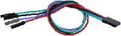
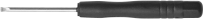
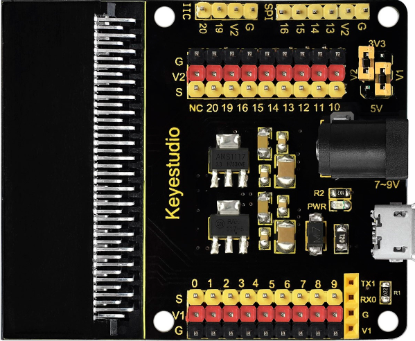
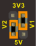

# 1. 产品介绍

## 1.1 产品安全 

1\. 本产品含细小零件，请避免儿童独自接触。

2\. 请严格按照教程操作，避免产品损坏，注意用电安全。

---------------

## 1.2 产品简介

这是一款基于Microbit主板的环境监测主题学习套件，通过集成多种传感器和电子元器件，搭建各种好玩有趣的DIY小项目，为用户提供直观生动的学习体验。该套件不仅能让学生和初学者在实践操作中领略科技创新的乐趣，更能有效培养其逻辑思维能力，同时充分展现科技应用的实用价值与教育意义。

---------------

## 1.3 产品清单

如果发现有缺失的配件，请立即联系我们的销售人员。

| 序号 | 规格 | 数量| 图片 |
| :--: | :--: | :--: | :--: |
| 1 | micro:bit V2.0 主板 | 1 | |
| 2 |micro:bit传感器扩展板| 1 | |
| 3 | 火焰传感器|1 | |
| 4 | XHT11温湿度传感器(兼容DHT11)| 1 ||
| 5 | 水滴传感器 | 1 ||
| 6 |模拟气体传感器| 1 ||
| 7 | PM2.5 粉尘传感器| 1 ||
| 8 |雾化模块| 1 ||
| 9 |130电机模块| 1 ||
| 10 |风扇叶| 1 ||
| 11 |太阳光紫外线传感器| 1 ||
| 12 |OLED模块| 1 ||
| 13 |电池盒| 1 ||
| 14 |USB线|1||
| 15 |3 pin 线材| 4 ||
| 16 |4 pin 线材(黑红蓝绿)| 4 ||
| 17 |4 pin 线材(红黑蓝绿)| 2 ||
| 18 |一字型螺丝刀| 1 ||
| 19 |AA电池(**不提供, 自备**)|6||

---------------

## 1.4 产品参数

- 工作电压：DC 3.3V ~ 5V

- 电池电压：DC 7V ~ 9V

- 最大输出电流：≤1.5A

- 最大耗散功率：≤10W

- 工作温度：–10至+65摄氏度

- 产品重量：1020.3g±1%（增加包装后的重量）

- 包装尺寸：285mm*206mm\*60mm±1%

---------------

## 1.5 传感器扩展板介绍

### 1.5.1 简介

在教育市场，micro:bit控制板越来越受欢迎。然而，单个micro:bit控制板不容易与其他传感器模块进行测试。我们特别设计了这款keyestudio传感器扩展板，用于micro:bit控制板。

传感器扩展板将micro:bit控制板上的所有IO口拆分为3PIN接口(GND, VCC, Signal)，非常方便地连接micro:bit控制板和其他传感器模块。

此外，它还将一些常用的串行通信接口扩展为引脚间距为2.54mm的引脚或母头，例如I2C和SPI通信引脚。因此，这个扩展板可以使micro:bit控制板和其他通信设备之间通信。

您可以通过扩展板上的黑色DC插孔(DC 7~9V)或micro USB端口(DC 5V)为micro:bit控制板供电。

当给传感器供电时，可以通过跳线帽V1和V2选择供电电压3.3V或5V。

⚠️ **特别注意:**

当外部传感器模块连接到扩展板上工作时，AMS1117-3.3V和NCP1117ST50T3G芯片的工作电流太大，容易发热。要特别注意避免接触这两个芯片以免烧坏。

### 1.5.2 特点

- 输入电压：黑色DC插孔(DC 7~9V) 或 micro USB接口(DC 5V)
- 输出电压：通过跳线帽V1/V2选择3.3V或5V
- 自带电源指示灯
- 将micro:bit控制板的IO口拆分为3PIN接口
- 串口通信引脚
- I2C通信引脚
- SPI通信引脚
- 外形尺寸: 66mm x 58mm x 12mm
- 重量: 31 g

### 1.5.3 引脚分配

|    图片           |       V1 接口电压/V     |       V2 接口电压/V    |
| ----------------- | ---------------------- | ---------------------- |
|  | 3.3                    | 3.3               |
|  | 3.3                    | 5                 |
|  | 5                      | 5                 |
|  | 5                      | 3.3               |

---------------

## 1.6 Micro:bit快速掌握

### 1.6.1 Micro:bit是什么？

micro:bit 是一款由英国广播电视公司（BBC）推出的专为青少年编程教育设计的微型电脑开发板。

micro:bit主板只有信用卡一半大小，但功能非常强大。micro:bit V2.0主板拥有丰富的板资源，搭载了5×5可编程LED点阵、2颗可编程按键、加速度计、电子罗盘、温度计、可触摸感应的Logo、MEMS麦克风、低功耗蓝牙等电子模块，背面还有一个蜂鸣器，可以在没有外部设备的情况下也可以播放各种声音。此外，micro:bit主板还支持休眠模式，用户可以长按micro:bit主板后面的复位&电源按钮，使进入睡眠模式，降低电池功耗。

### 1.6.2 Micro:bit V2主板硬件介绍

### 1.6.3 Micro:bit V2引脚配置介绍

Micro:bit引出的引脚中，其引脚功能分类如下表所示：

| 功能 | 引脚 |
| :--: | :--: | 
| GPIO | P0，P1，P2，P3，P4，P5，P6，P7，P8，P9，P10，P11，P12，P13，P14，P15，P16，P19，P20 |
| ADC/DAC | P0，P1，P2，P3，P4，P10 |
| IIC | P19（SCL），P20（SDA）|
| SPI | P13（SCK），P14（MISO），P15（MOSI） |
| PWM（常用） |P0，P1，P2，P3，P4，P10|
|已占用|P5(Button A)，P6(LED Col4)，P7(LED Col2)，P10(LED Col5)，P11(Button B)|

详细信息请参考官方网站：

- [https://tech.microbit.org/hardware/edgeconnector/](https://tech.microbit.org/hardware/edgeconnector/)

- [https://microbit.org/](https://microbit.org/)

- [https://microbit.org/get-started/features/overview/](https://microbit.org/get-started/features/overview/)

- [https://microbit.org/guide/hardware/pins/](https://microbit.org/guide/hardware/pins/)

- [https://microbit.org/projects/make-it-code-it/](https://microbit.org/projects/make-it-code-it/)

- [https://microbit.org/get-started/what-is-the-microbit/](https://microbit.org/get-started/what-is-the-microbit/)

### 1.6.4 Micro:bit V2主板注意事项

1\. Micro:bit主板上有很多精密的电子元件，建议戴上硅胶保护套进行使用，防止短路。

2\. Micro:bit主板的IO口驱动能力很弱，IO口电流不足300mA，请勿接大电流器件（例如大舵机MG995、直流电机），否则会烧坏micro:bit主板，使用前必须完全了解清楚你所使用的器件电流情况，一般建议配搭micro:bit扩展板进行使用。

3\. 供电建议从Micro:bit主板的USB口进行供电，或者micro:bit主板上的3V电池座接口。Micro:bit主板本身IO口是3V3电平，所以是不支持5V传感器的，如需支持5V传感器需要使用 Micro:bit扩展板。

4\. 使用与Micro:bit主板LED点阵的共用引脚（如P3、P4、P6、P7、P10），记得在代码中把LED点阵禁用掉，否则会有LED点阵乱亮的现象。

5\. **不要使用P19、P20 IO 口，P19和P20是不能当做IO口来使用的，** 虽然makecode软件上显示可以使用，实际是用不了的！只能用于I2C通讯。

6\. 3V电池座接口上不能使用超过3.3V电池，插上去很容易会把micro:bit主板烧坏。

7\. 禁止放在金属制品上使用，以免发生短路。

**总之：** micro:bit主板就像是一台微型计算机，它使编程变得有形，并促进数字创造力。

---------------

